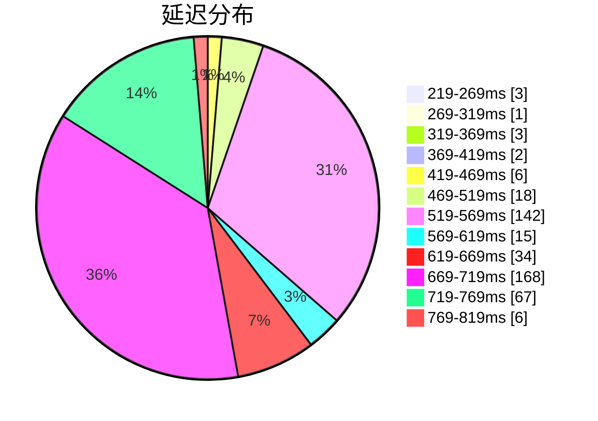
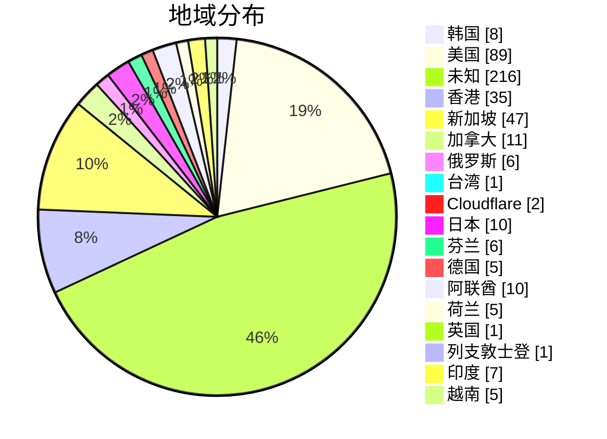
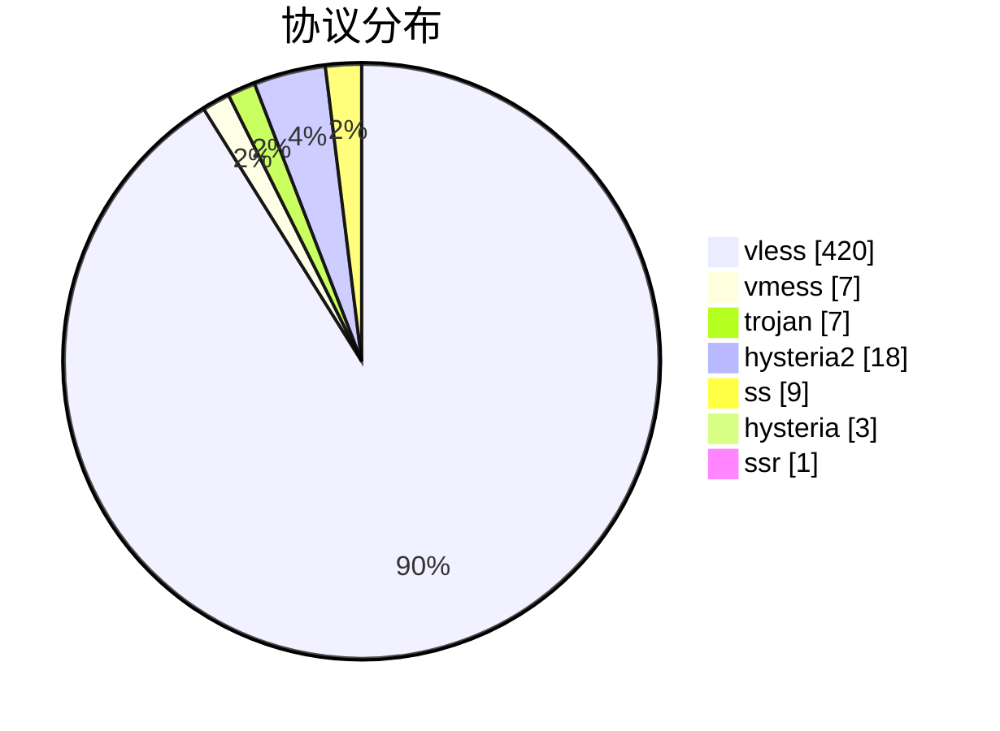

```mermaid
pie showData
title 延迟分布
"219-269ms" : 3
"269-319ms" : 1
"319-369ms" : 3
"369-419ms" : 2
"419-469ms" : 6
"469-519ms" : 18
"519-569ms" : 142
"569-619ms" : 15
"619-669ms" : 34
"669-719ms" : 168
"719-769ms" : 67
"769-819ms" : 6
```

```mermaid
pie showData
title 地域分布
"韩国" : 8
"美国" : 89
"未知" : 216
"香港" : 35
"新加坡" : 47
"加拿大" : 11
"俄罗斯" : 6
"台湾" : 1
"Cloudflare" : 2
"日本" : 10
"芬兰" : 6
"德国" : 5
"阿联酋" : 10
"荷兰" : 5
"英国" : 1
"列支敦士登" : 1
"印度" : 7
"越南" : 5
```

```mermaid
pie showData
title 协议分布
"vless" : 420
"vmess" : 7
"trojan" : 7
"hysteria2" : 18
"ss" : 9
"hysteria" : 3
"ssr" : 1
```