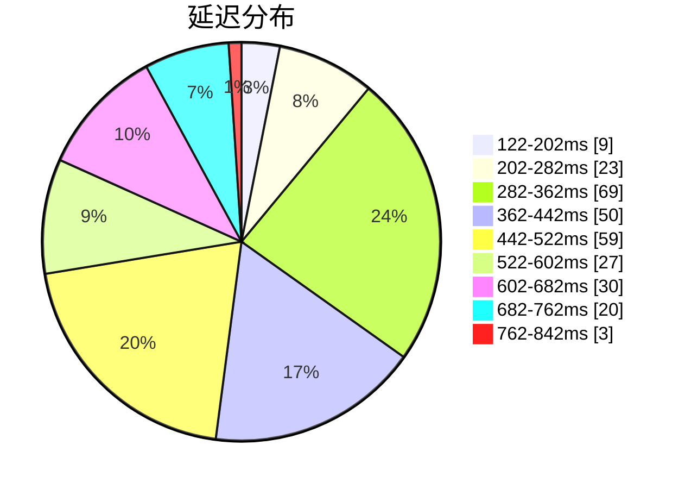
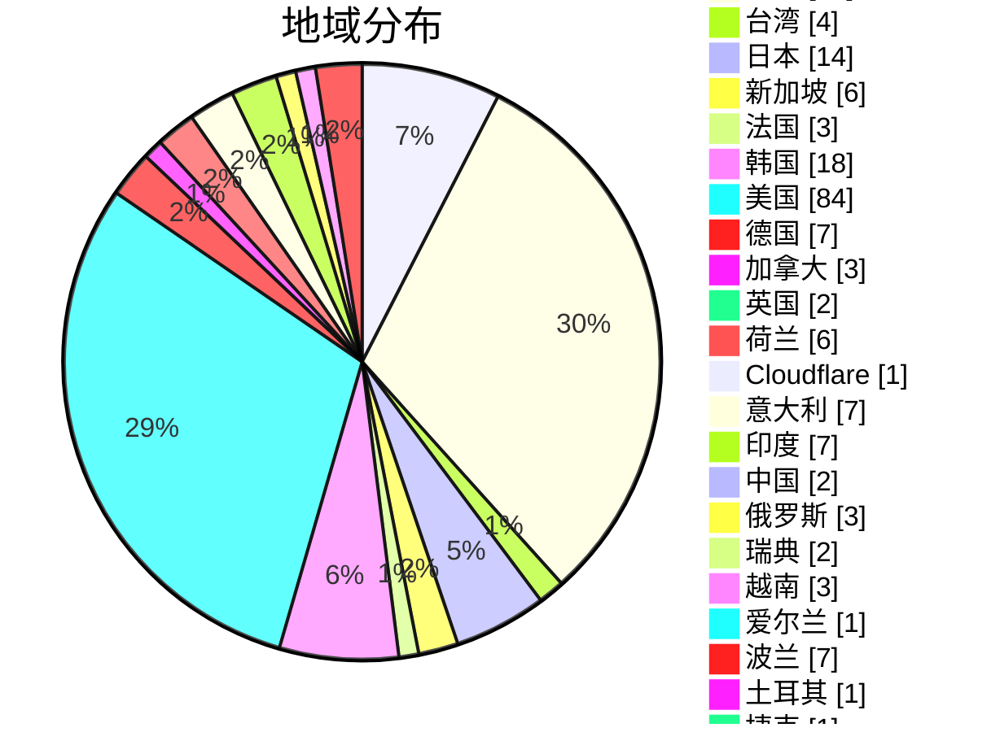
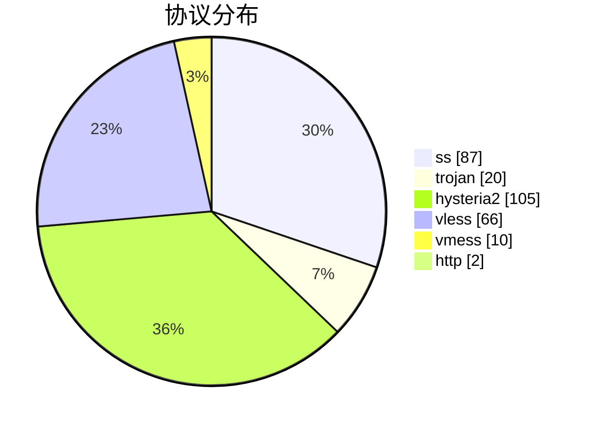

```mermaid
pie showData
title 延迟分布
"122-202ms" : 9
"202-282ms" : 23
"282-362ms" : 69
"362-442ms" : 50
"442-522ms" : 59
"522-602ms" : 27
"602-682ms" : 30
"682-762ms" : 20
"762-842ms" : 3
```

```mermaid
pie showData
title 地域分布
"香港" : 21
"未知" : 86
"台湾" : 4
"日本" : 14
"新加坡" : 6
"法国" : 3
"韩国" : 18
"美国" : 84
"德国" : 7
"加拿大" : 3
"英国" : 2
"荷兰" : 6
"Cloudflare" : 1
"意大利" : 7
"印度" : 7
"中国" : 2
"俄罗斯" : 3
"瑞典" : 2
"越南" : 3
"爱尔兰" : 1
"波兰" : 7
"土耳其" : 1
"捷克" : 1
"塞浦路斯" : 1
```

```mermaid
pie showData
title 协议分布
"ss" : 87
"trojan" : 20
"hysteria2" : 105
"vless" : 66
"vmess" : 10
"http" : 2
```