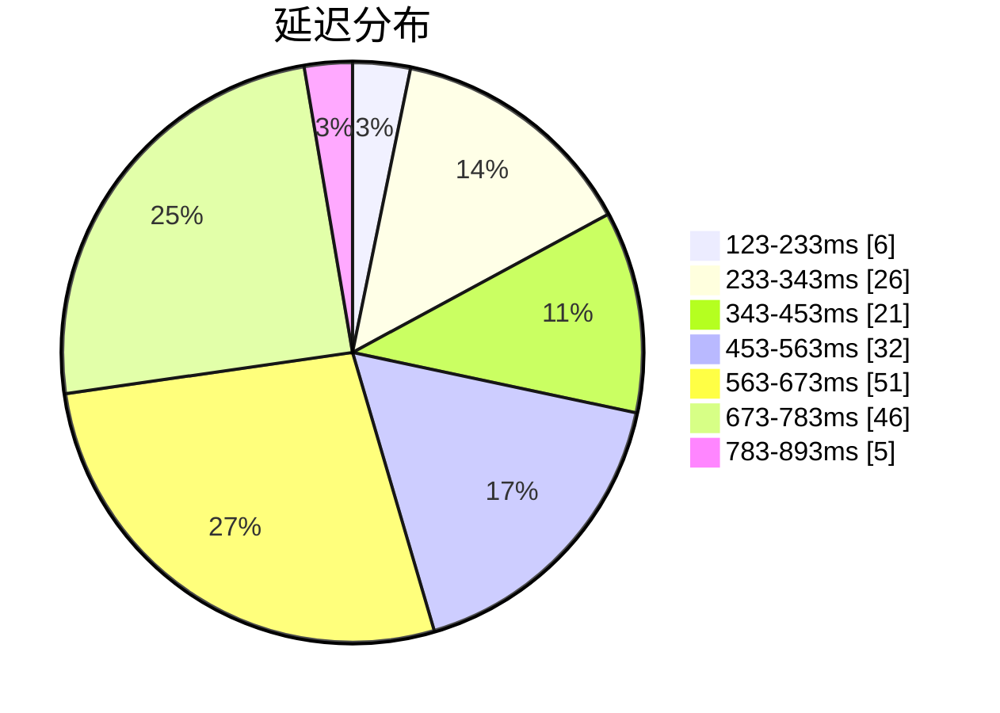
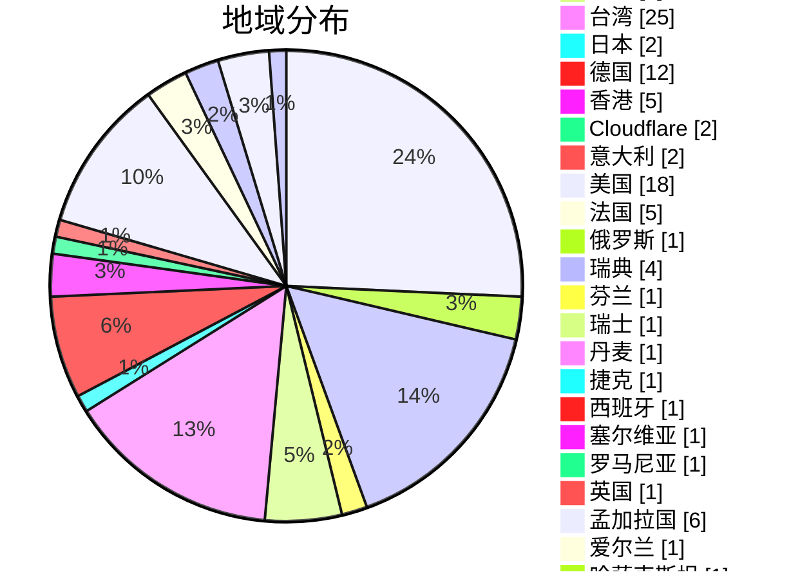
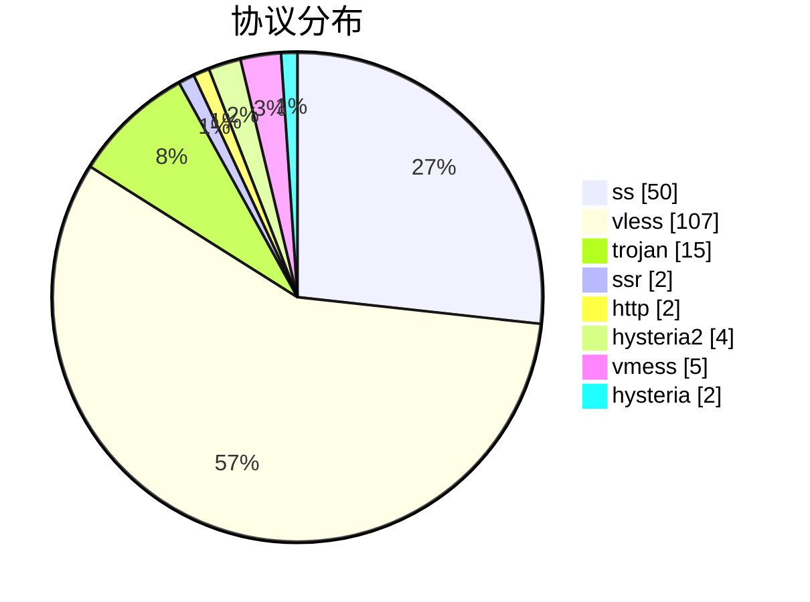

```mermaid
pie showData
title 延迟分布
"123-233ms" : 6
"233-343ms" : 26
"343-453ms" : 21
"453-563ms" : 32
"563-673ms" : 51
"673-783ms" : 46
"783-893ms" : 5
```

```mermaid
pie showData
title 地域分布
"未知" : 44
"中国" : 1
"新加坡" : 5
"波兰" : 27
"荷兰" : 3
"韩国" : 9
"台湾" : 25
"日本" : 2
"德国" : 12
"香港" : 5
"Cloudflare" : 2
"意大利" : 2
"美国" : 18
"法国" : 5
"俄罗斯" : 1
"瑞典" : 4
"芬兰" : 1
"瑞士" : 1
"丹麦" : 1
"捷克" : 1
"西班牙" : 1
"塞尔维亚" : 1
"罗马尼亚" : 1
"英国" : 1
"孟加拉国" : 6
"爱尔兰" : 1
"哈萨克斯坦" : 1
"立陶宛" : 2
"拉脱维亚" : 1
"哥伦比亚" : 1
"印度" : 1
"冰岛" : 1
```

```mermaid
pie showData
title 协议分布
"ss" : 50
"vless" : 107
"trojan" : 15
"ssr" : 2
"http" : 2
"hysteria2" : 4
"vmess" : 5
"hysteria" : 2
```