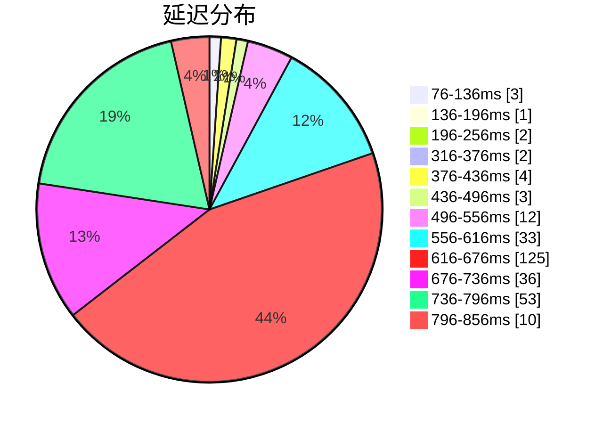
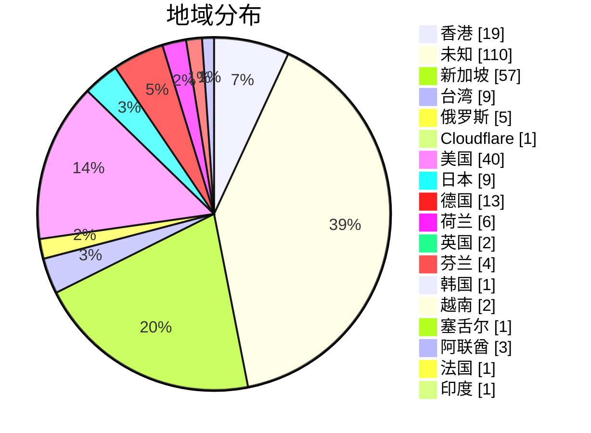
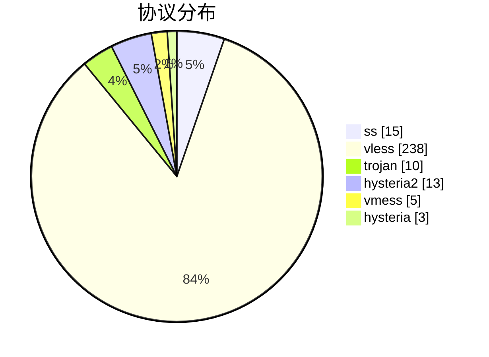

```mermaid
pie showData
title 延迟分布
"76-136ms" : 3
"136-196ms" : 1
"196-256ms" : 2
"316-376ms" : 2
"376-436ms" : 4
"436-496ms" : 3
"496-556ms" : 12
"556-616ms" : 33
"616-676ms" : 125
"676-736ms" : 36
"736-796ms" : 53
"796-856ms" : 10
```

```mermaid
pie showData
title 地域分布
"香港" : 19
"未知" : 110
"新加坡" : 57
"台湾" : 9
"俄罗斯" : 5
"Cloudflare" : 1
"美国" : 40
"日本" : 9
"德国" : 13
"荷兰" : 6
"英国" : 2
"芬兰" : 4
"韩国" : 1
"越南" : 2
"塞舌尔" : 1
"阿联酋" : 3
"法国" : 1
"印度" : 1
```

```mermaid
pie showData
title 协议分布
"ss" : 15
"vless" : 238
"trojan" : 10
"hysteria2" : 13
"vmess" : 5
"hysteria" : 3
```