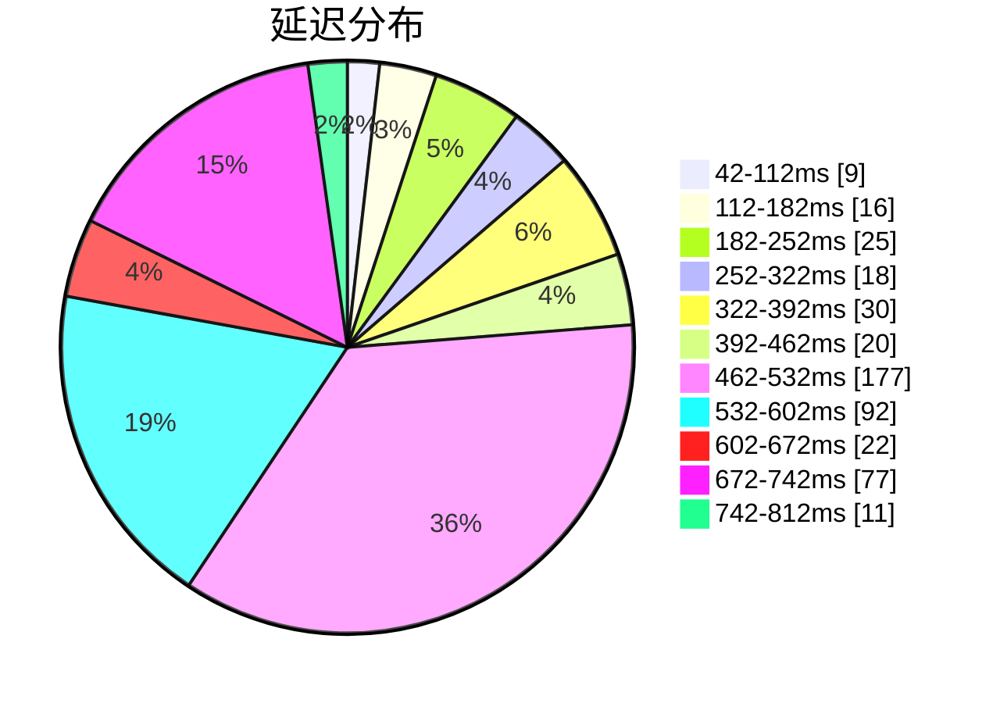
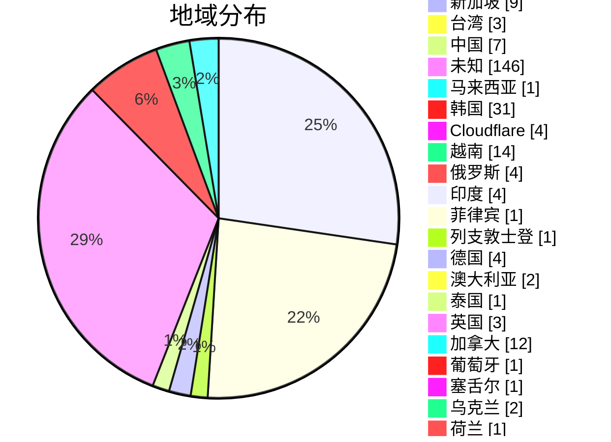
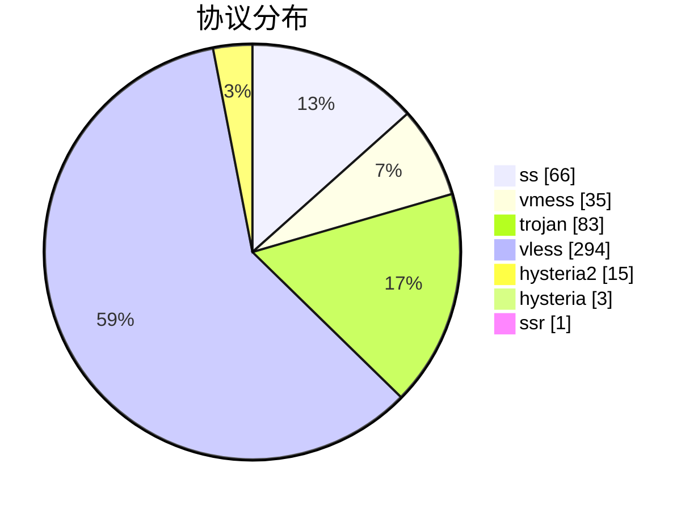

```mermaid
pie showData
title 延迟分布
"42-112ms" : 9
"112-182ms" : 16
"182-252ms" : 25
"252-322ms" : 18
"322-392ms" : 30
"392-462ms" : 20
"462-532ms" : 177
"532-602ms" : 92
"602-672ms" : 22
"672-742ms" : 77
"742-812ms" : 11
```

```mermaid
pie showData
title 地域分布
"香港" : 126
"美国" : 109
"日本" : 7
"新加坡" : 9
"台湾" : 3
"中国" : 7
"未知" : 146
"马来西亚" : 1
"韩国" : 31
"Cloudflare" : 4
"越南" : 14
"俄罗斯" : 4
"印度" : 4
"菲律宾" : 1
"列支敦士登" : 1
"德国" : 4
"澳大利亚" : 2
"泰国" : 1
"英国" : 3
"加拿大" : 12
"葡萄牙" : 1
"塞舌尔" : 1
"乌克兰" : 2
"荷兰" : 1
"西班牙" : 1
"土耳其" : 1
"巴西" : 1
```

```mermaid
pie showData
title 协议分布
"ss" : 66
"vmess" : 35
"trojan" : 83
"vless" : 294
"hysteria2" : 15
"hysteria" : 3
"ssr" : 1
```