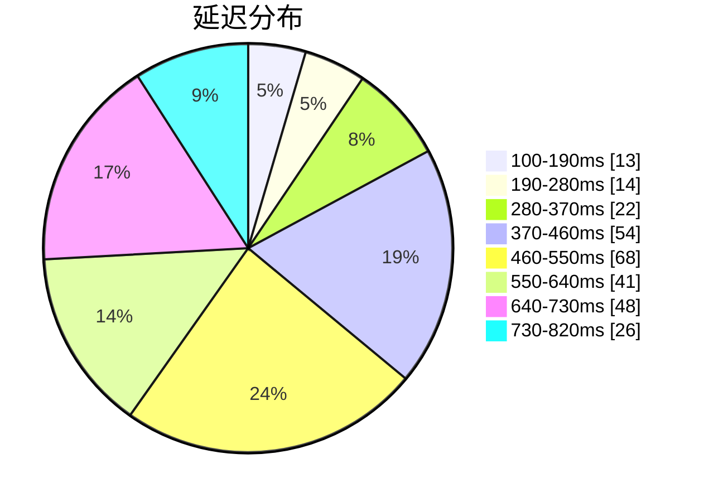
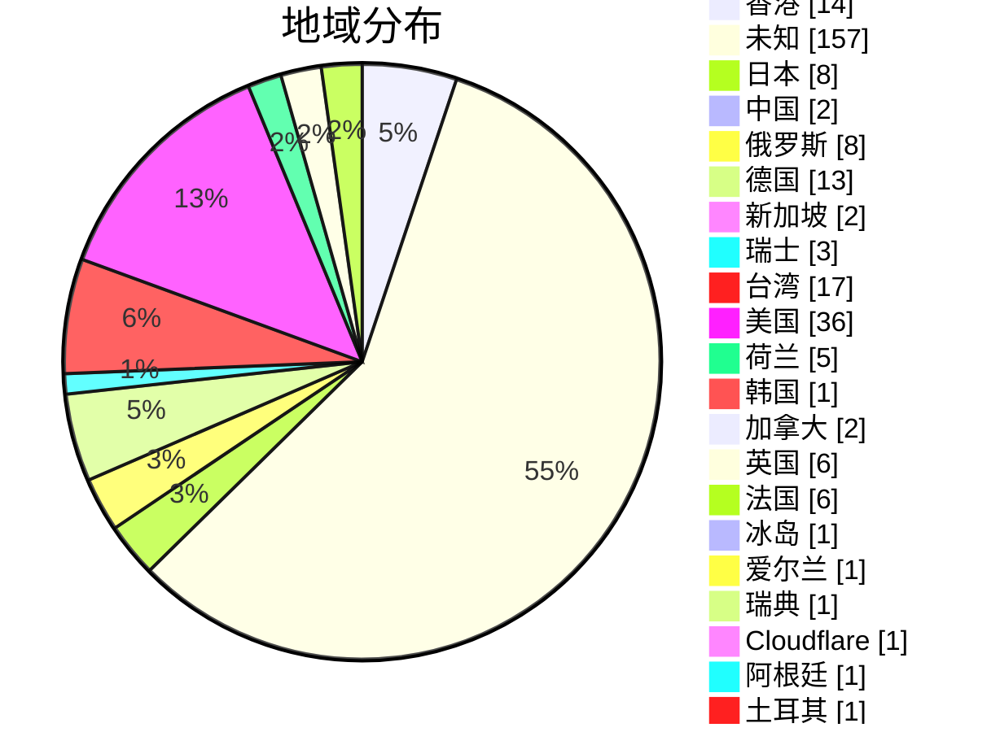
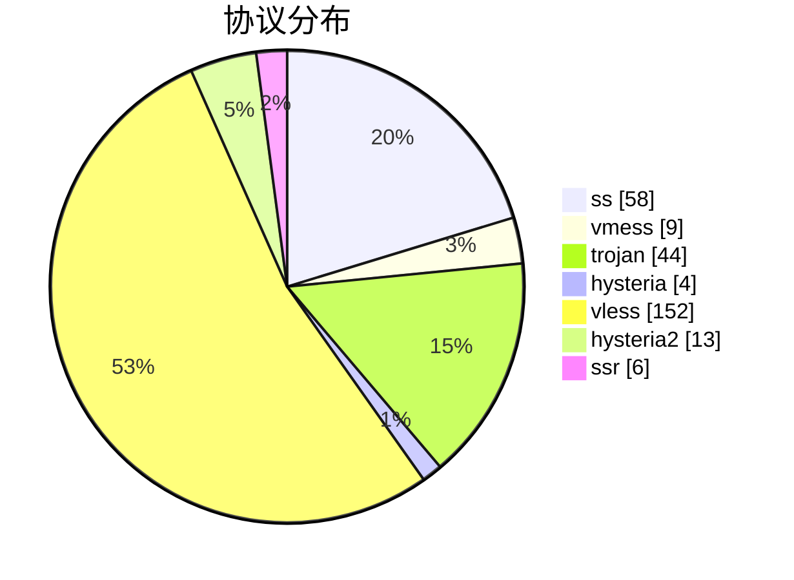

```mermaid
pie showData
title 延迟分布
"100-190ms" : 13
"190-280ms" : 14
"280-370ms" : 22
"370-460ms" : 54
"460-550ms" : 68
"550-640ms" : 41
"640-730ms" : 48
"730-820ms" : 26
```

```mermaid
pie showData
title 地域分布
"香港" : 14
"未知" : 157
"日本" : 8
"中国" : 2
"俄罗斯" : 8
"德国" : 13
"新加坡" : 2
"瑞士" : 3
"台湾" : 17
"美国" : 36
"荷兰" : 5
"韩国" : 1
"加拿大" : 2
"英国" : 6
"法国" : 6
"冰岛" : 1
"爱尔兰" : 1
"瑞典" : 1
"Cloudflare" : 1
"阿根廷" : 1
"土耳其" : 1
```

```mermaid
pie showData
title 协议分布
"ss" : 58
"vmess" : 9
"trojan" : 44
"hysteria" : 4
"vless" : 152
"hysteria2" : 13
"ssr" : 6
```