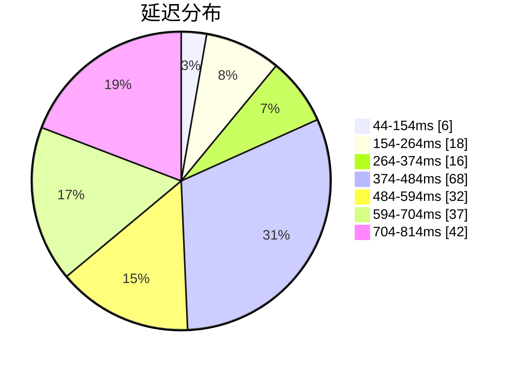
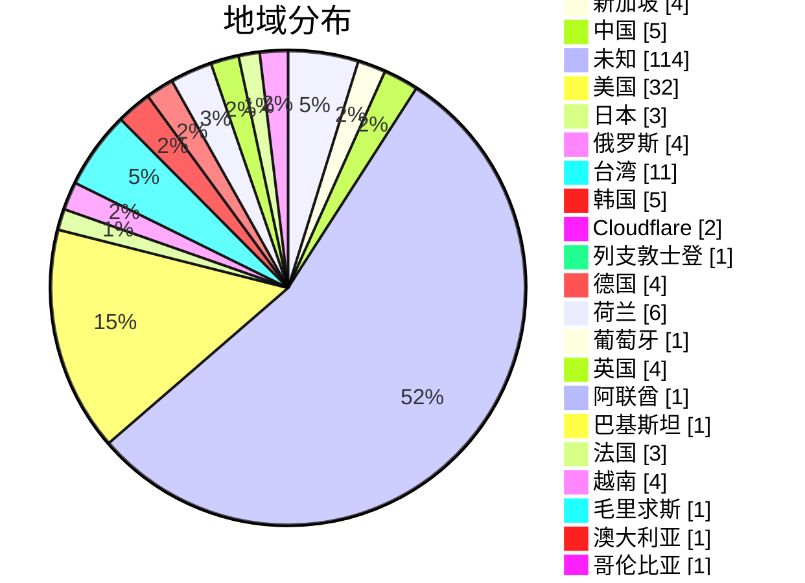
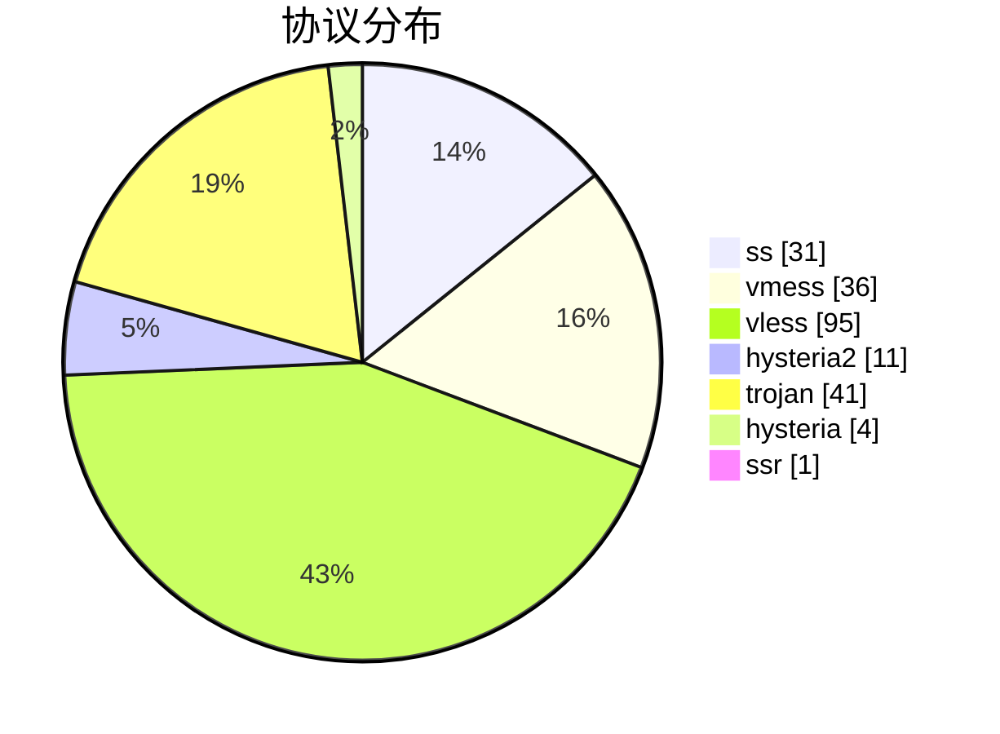

```mermaid
pie showData
title 延迟分布
"44-154ms" : 6
"154-264ms" : 18
"264-374ms" : 16
"374-484ms" : 68
"484-594ms" : 32
"594-704ms" : 37
"704-814ms" : 42
```

```mermaid
pie showData
title 地域分布
"香港" : 10
"新加坡" : 4
"中国" : 5
"未知" : 114
"美国" : 32
"日本" : 3
"俄罗斯" : 4
"台湾" : 11
"韩国" : 5
"Cloudflare" : 2
"列支敦士登" : 1
"德国" : 4
"荷兰" : 6
"葡萄牙" : 1
"英国" : 4
"阿联酋" : 1
"巴基斯坦" : 1
"法国" : 3
"越南" : 4
"毛里求斯" : 1
"澳大利亚" : 1
"哥伦比亚" : 1
"印度尼西亚" : 1
```

```mermaid
pie showData
title 协议分布
"ss" : 31
"vmess" : 36
"vless" : 95
"hysteria2" : 11
"trojan" : 41
"hysteria" : 4
"ssr" : 1
```