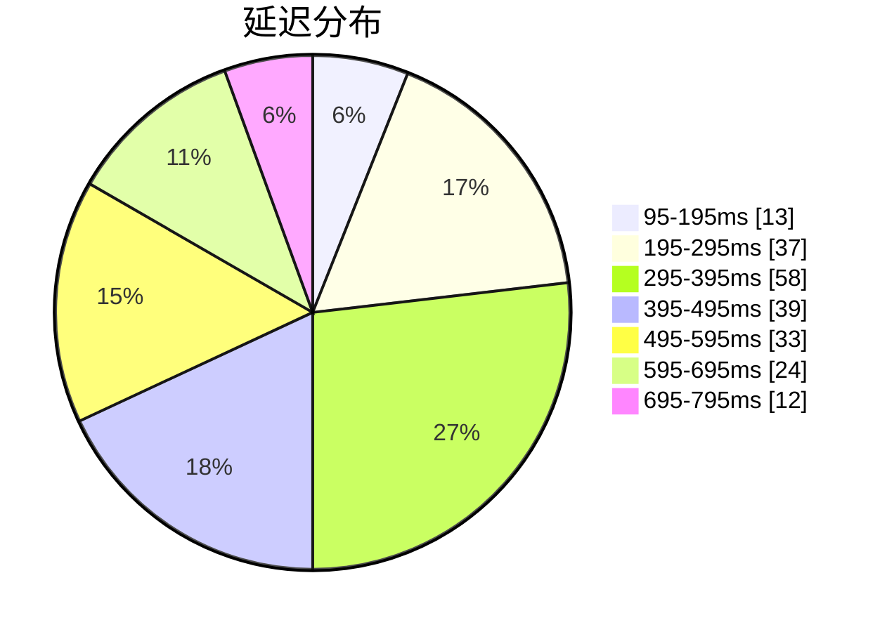
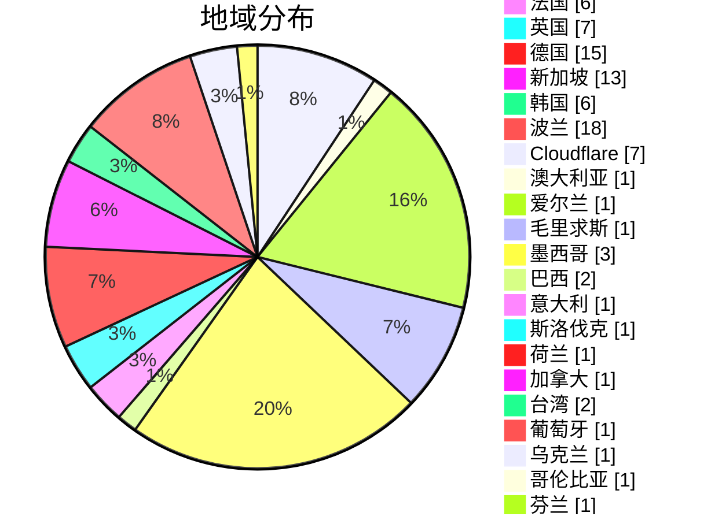
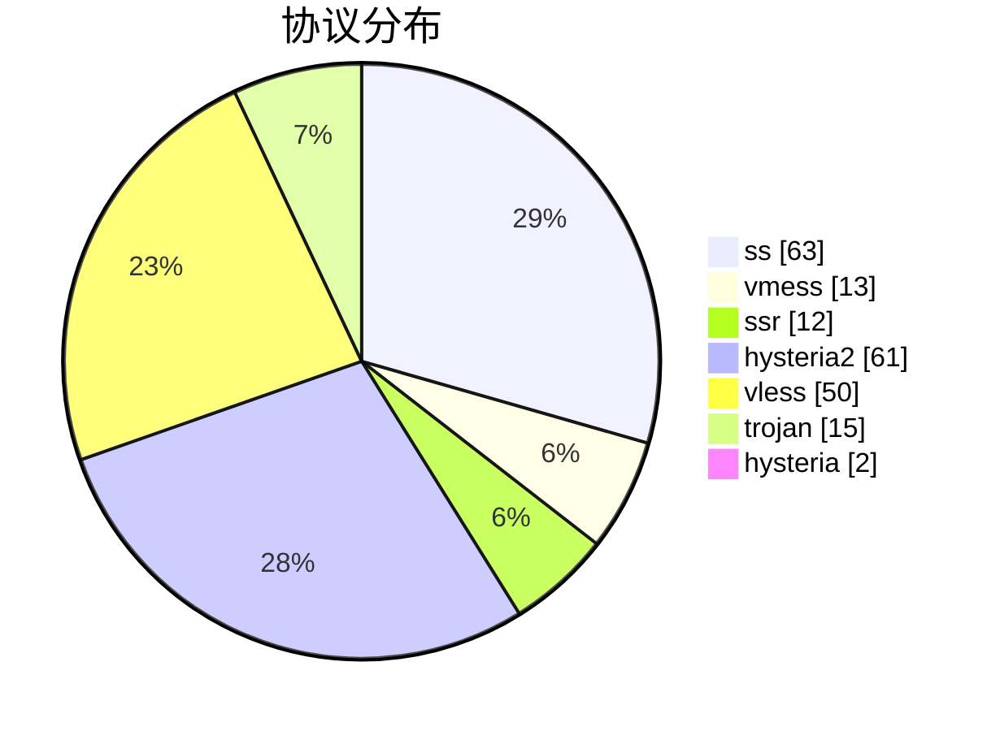

```mermaid
pie showData
title 延迟分布
"95-195ms" : 13
"195-295ms" : 37
"295-395ms" : 58
"395-495ms" : 39
"495-595ms" : 33
"595-695ms" : 24
"695-795ms" : 12
```

```mermaid
pie showData
title 地域分布
"香港" : 18
"中国" : 3
"未知" : 35
"日本" : 16
"美国" : 44
"俄罗斯" : 3
"法国" : 6
"英国" : 7
"德国" : 15
"新加坡" : 13
"韩国" : 6
"波兰" : 18
"Cloudflare" : 7
"澳大利亚" : 1
"爱尔兰" : 1
"毛里求斯" : 1
"墨西哥" : 3
"巴西" : 2
"意大利" : 1
"斯洛伐克" : 1
"荷兰" : 1
"加拿大" : 1
"台湾" : 2
"葡萄牙" : 1
"乌克兰" : 1
"哥伦比亚" : 1
"芬兰" : 1
"爱沙尼亚" : 2
"冰岛" : 1
"土耳其" : 1
"孟加拉国" : 1
"瑞典" : 1
"新西兰" : 1
```

```mermaid
pie showData
title 协议分布
"ss" : 63
"vmess" : 13
"ssr" : 12
"hysteria2" : 61
"vless" : 50
"trojan" : 15
"hysteria" : 2
```