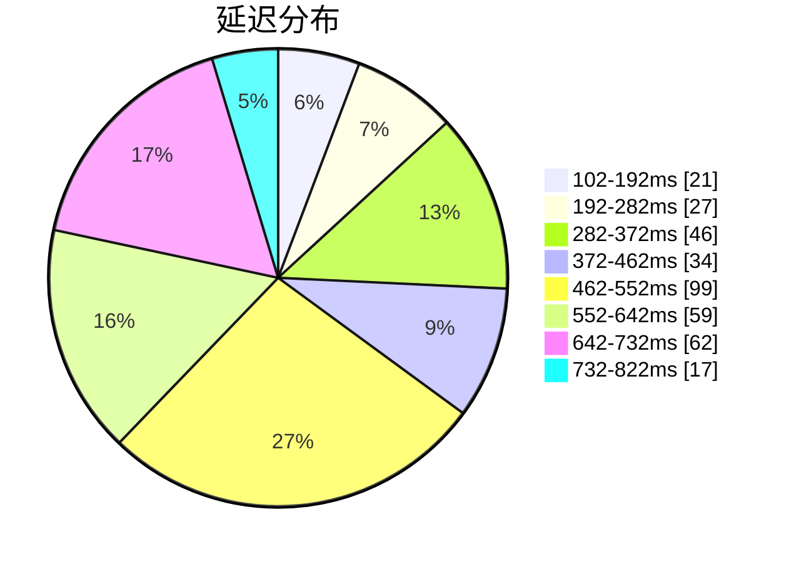
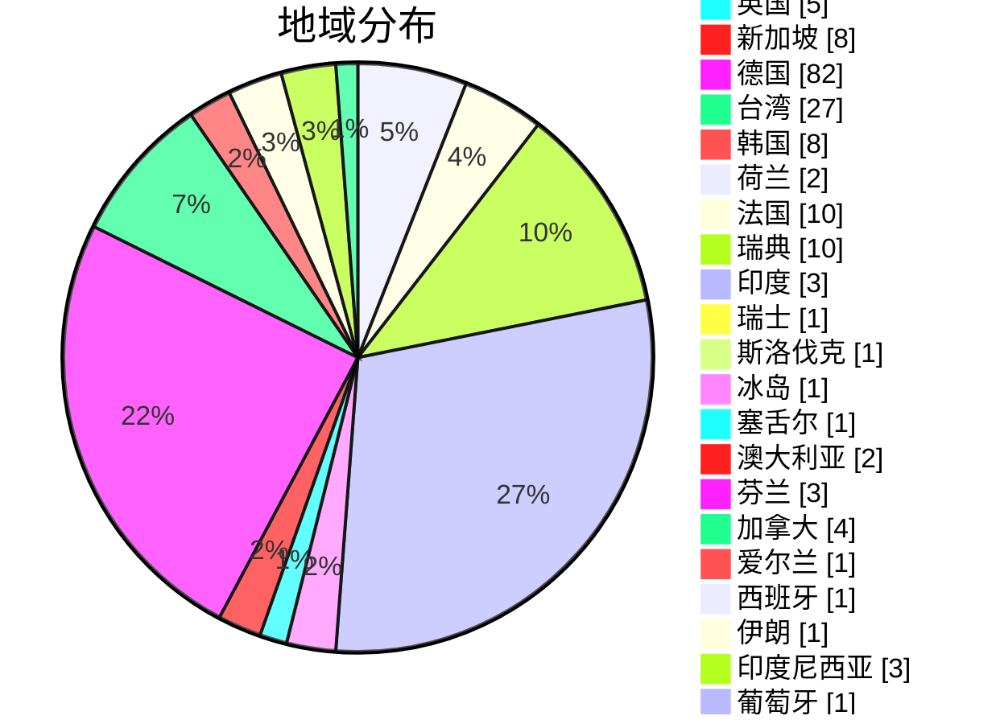
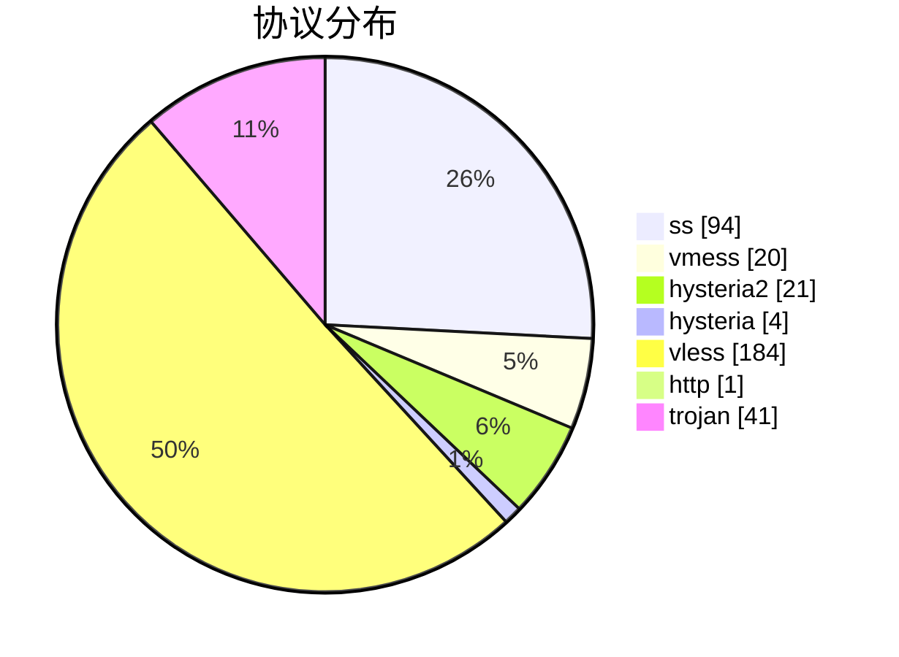

```mermaid
pie showData
title 延迟分布
"102-192ms" : 21
"192-282ms" : 27
"282-372ms" : 46
"372-462ms" : 34
"462-552ms" : 99
"552-642ms" : 59
"642-732ms" : 62
"732-822ms" : 17
```

```mermaid
pie showData
title 地域分布
"香港" : 20
"日本" : 15
"美国" : 38
"未知" : 98
"孟加拉国" : 1
"中国" : 2
"俄罗斯" : 9
"英国" : 5
"新加坡" : 8
"德国" : 82
"台湾" : 27
"韩国" : 8
"荷兰" : 2
"法国" : 10
"瑞典" : 10
"印度" : 3
"瑞士" : 1
"斯洛伐克" : 1
"冰岛" : 1
"塞舌尔" : 1
"澳大利亚" : 2
"芬兰" : 3
"加拿大" : 4
"爱尔兰" : 1
"西班牙" : 1
"伊朗" : 1
"印度尼西亚" : 3
"葡萄牙" : 1
"比利时" : 1
"Cloudflare" : 1
"科威特" : 1
"斯洛文尼亚" : 1
"乌克兰" : 1
"以色列" : 1
"阿联酋" : 1
```

```mermaid
pie showData
title 协议分布
"ss" : 94
"vmess" : 20
"hysteria2" : 21
"hysteria" : 4
"vless" : 184
"http" : 1
"trojan" : 41
```