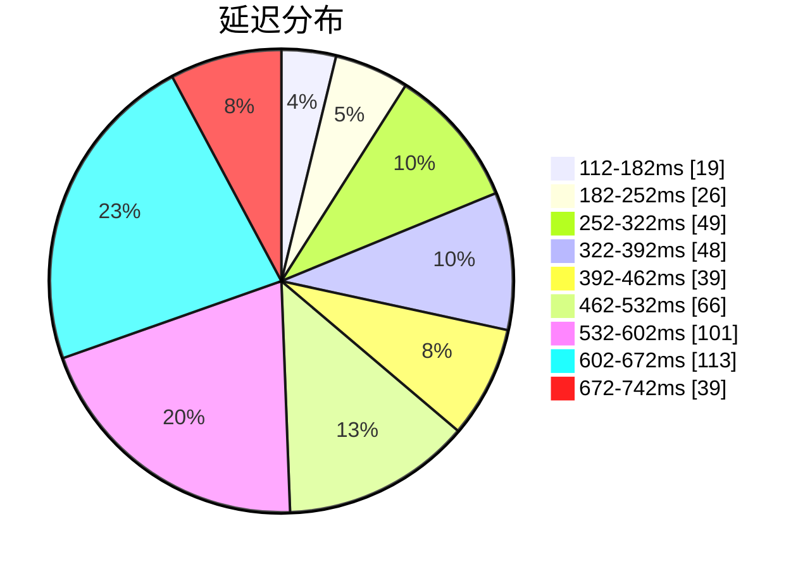
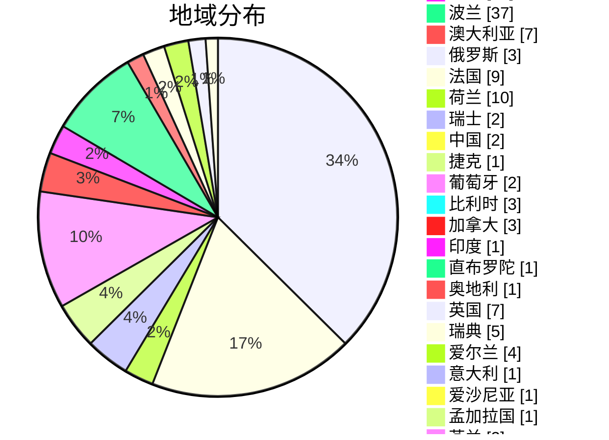
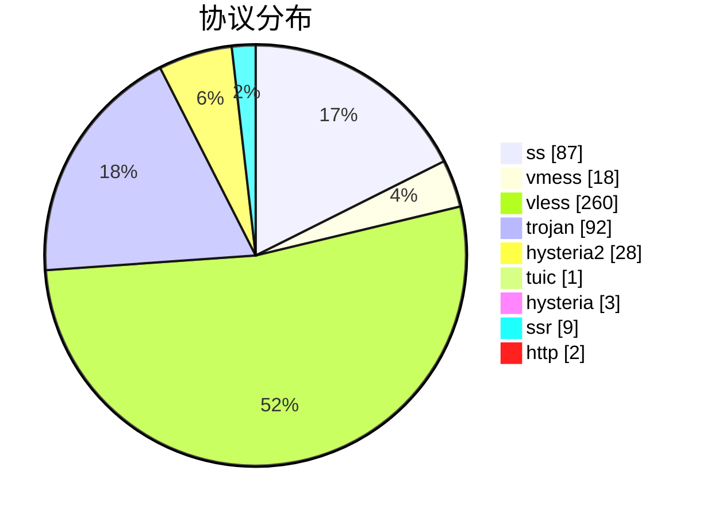

```mermaid
pie showData
title 延迟分布
"112-182ms" : 19
"182-252ms" : 26
"252-322ms" : 49
"322-392ms" : 48
"392-462ms" : 39
"462-532ms" : 66
"532-602ms" : 101
"602-672ms" : 113
"672-742ms" : 39
```

```mermaid
pie showData
title 地域分布
"未知" : 170
"美国" : 84
"香港" : 12
"日本" : 18
"印度尼西亚" : 2
"新加坡" : 19
"台湾" : 48
"Cloudflare" : 3
"韩国" : 16
"德国" : 12
"波兰" : 37
"澳大利亚" : 7
"俄罗斯" : 3
"法国" : 9
"荷兰" : 10
"瑞士" : 2
"中国" : 2
"捷克" : 1
"葡萄牙" : 2
"比利时" : 3
"加拿大" : 3
"印度" : 1
"直布罗陀" : 1
"奥地利" : 1
"英国" : 7
"瑞典" : 5
"爱尔兰" : 4
"意大利" : 1
"爱沙尼亚" : 1
"孟加拉国" : 1
"芬兰" : 2
"罗马尼亚" : 2
"西班牙" : 3
"希腊" : 2
"匈牙利" : 1
"丹麦" : 1
"挪威" : 1
"斯洛伐克" : 1
"乌克兰" : 1
"墨西哥" : 1
```

```mermaid
pie showData
title 协议分布
"ss" : 87
"vmess" : 18
"vless" : 260
"trojan" : 92
"hysteria2" : 28
"tuic" : 1
"hysteria" : 3
"ssr" : 9
"http" : 2
```