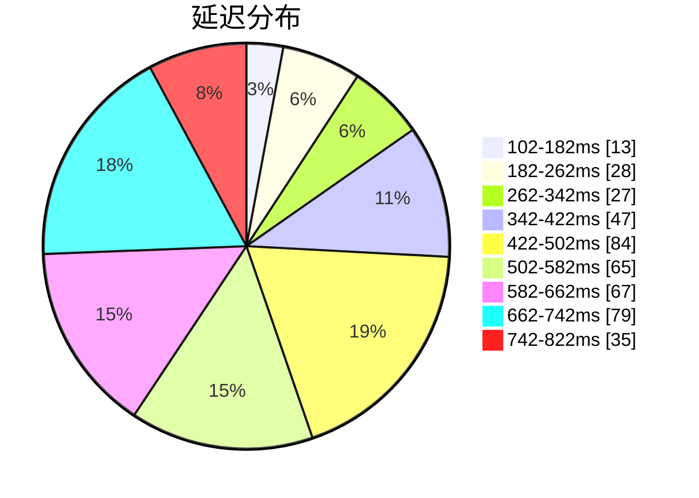
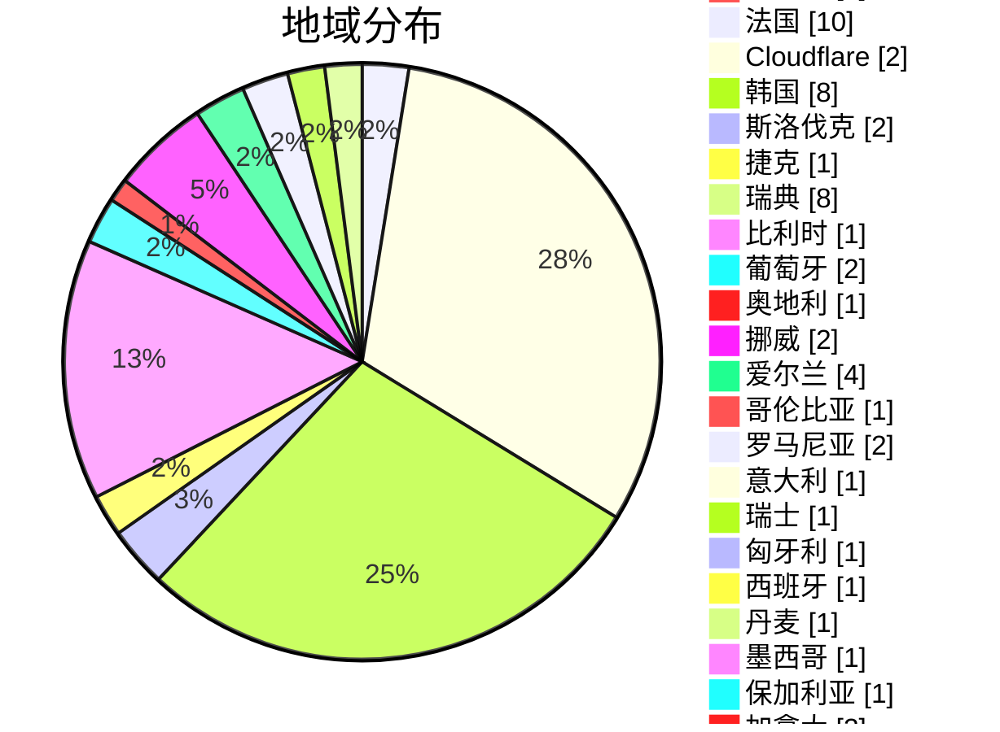
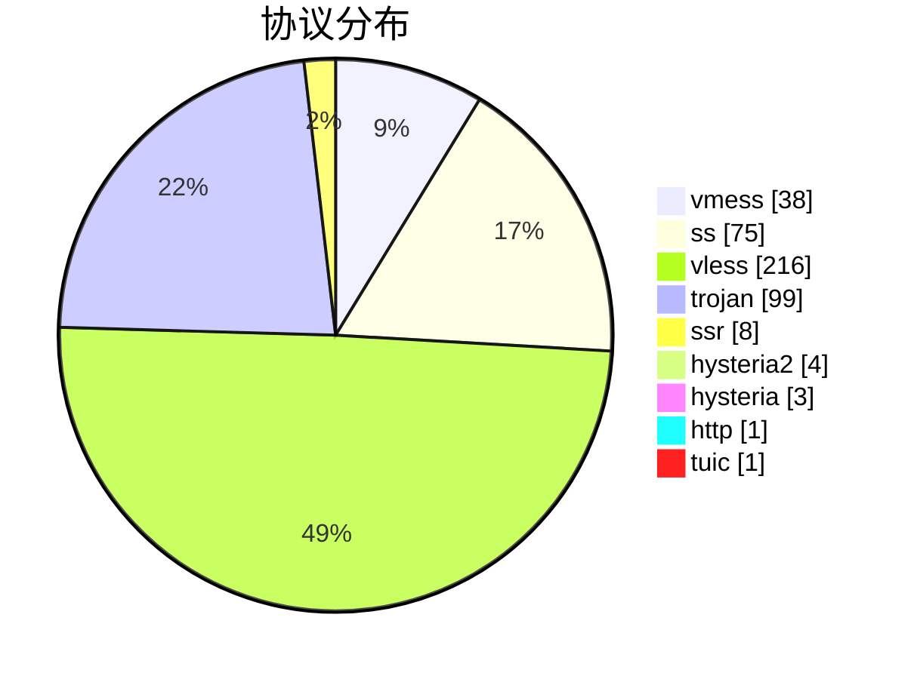

```mermaid
pie showData
title 延迟分布
"102-182ms" : 13
"182-262ms" : 28
"262-342ms" : 27
"342-422ms" : 47
"422-502ms" : 84
"502-582ms" : 65
"582-662ms" : 67
"662-742ms" : 79
"742-822ms" : 35
```

```mermaid
pie showData
title 地域分布
"香港" : 10
"未知" : 124
"美国" : 112
"日本" : 13
"新加坡" : 9
"中国" : 1
"台湾" : 56
"英国" : 10
"荷兰" : 5
"波兰" : 21
"德国" : 11
"俄罗斯" : 4
"法国" : 10
"Cloudflare" : 2
"韩国" : 8
"斯洛伐克" : 2
"捷克" : 1
"瑞典" : 8
"比利时" : 1
"葡萄牙" : 2
"奥地利" : 1
"挪威" : 2
"爱尔兰" : 4
"哥伦比亚" : 1
"罗马尼亚" : 2
"意大利" : 1
"瑞士" : 1
"匈牙利" : 1
"西班牙" : 1
"丹麦" : 1
"墨西哥" : 1
"保加利亚" : 1
"加拿大" : 3
"越南" : 1
"芬兰" : 1
"土耳其" : 1
"冰岛" : 1
"摩尔多瓦" : 1
"乌克兰" : 1
"爱沙尼亚" : 1
"拉脱维亚" : 1
"立陶宛" : 1
"印度" : 4
"孟加拉国" : 2
```

```mermaid
pie showData
title 协议分布
"vmess" : 38
"ss" : 75
"vless" : 216
"trojan" : 99
"ssr" : 8
"hysteria2" : 4
"hysteria" : 3
"http" : 1
"tuic" : 1
```