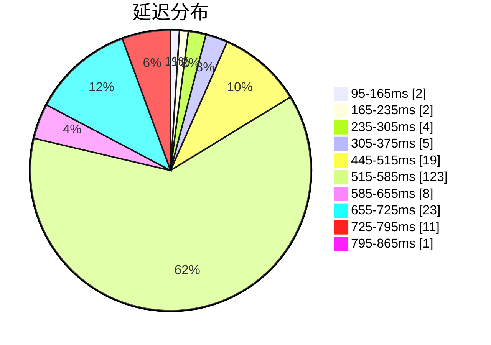
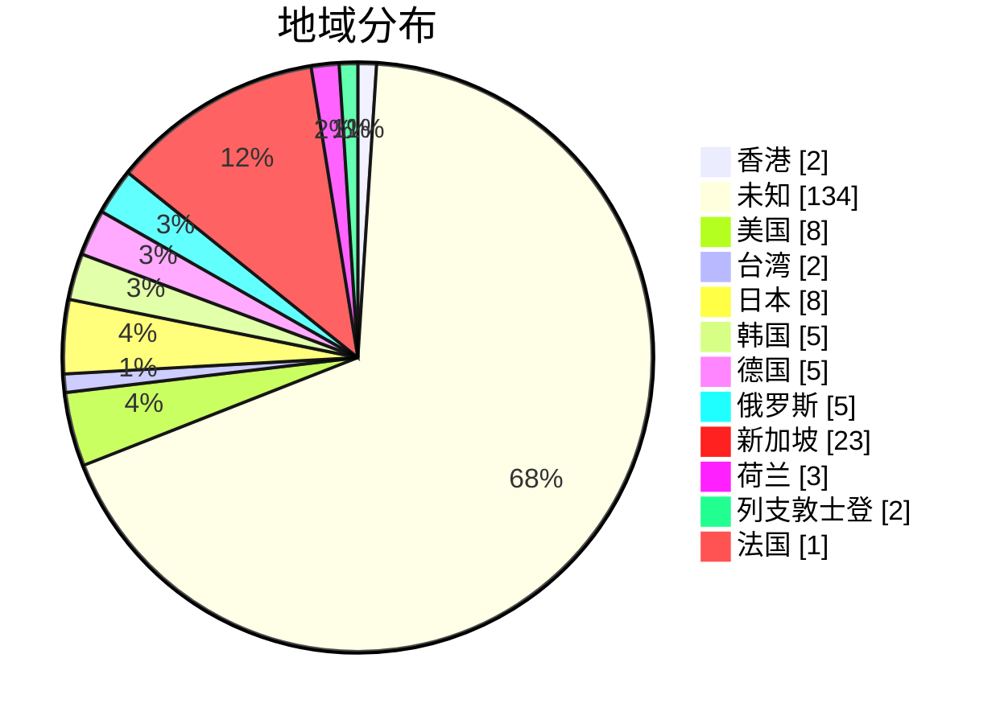
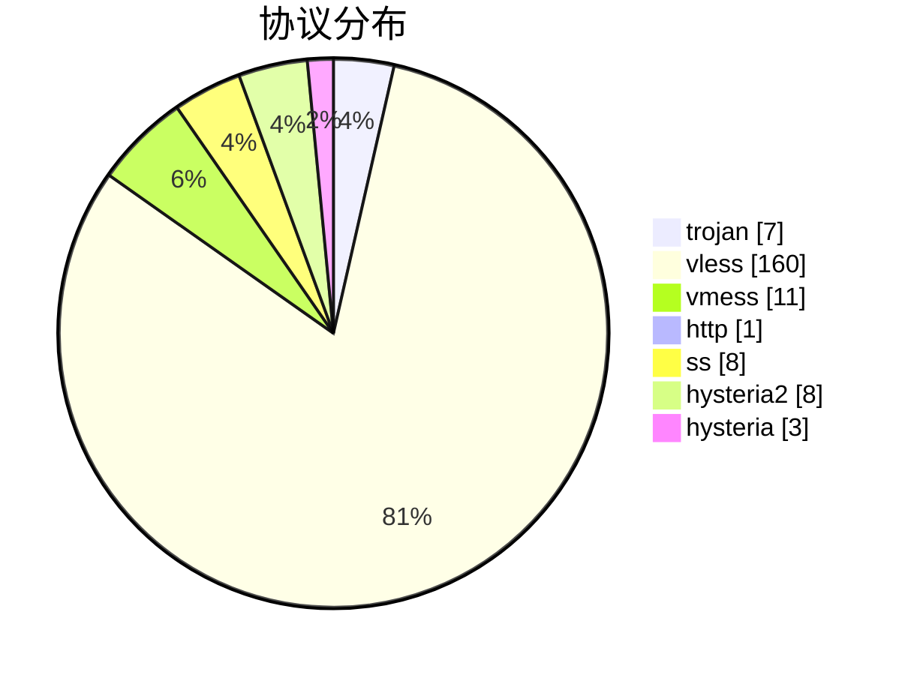

```mermaid
pie showData
title 延迟分布
"95-165ms" : 2
"165-235ms" : 2
"235-305ms" : 4
"305-375ms" : 5
"445-515ms" : 19
"515-585ms" : 123
"585-655ms" : 8
"655-725ms" : 23
"725-795ms" : 11
"795-865ms" : 1
```

```mermaid
pie showData
title 地域分布
"香港" : 2
"未知" : 134
"美国" : 8
"台湾" : 2
"日本" : 8
"韩国" : 5
"德国" : 5
"俄罗斯" : 5
"新加坡" : 23
"荷兰" : 3
"列支敦士登" : 2
"法国" : 1
```

```mermaid
pie showData
title 协议分布
"trojan" : 7
"vless" : 160
"vmess" : 11
"http" : 1
"ss" : 8
"hysteria2" : 8
"hysteria" : 3
```