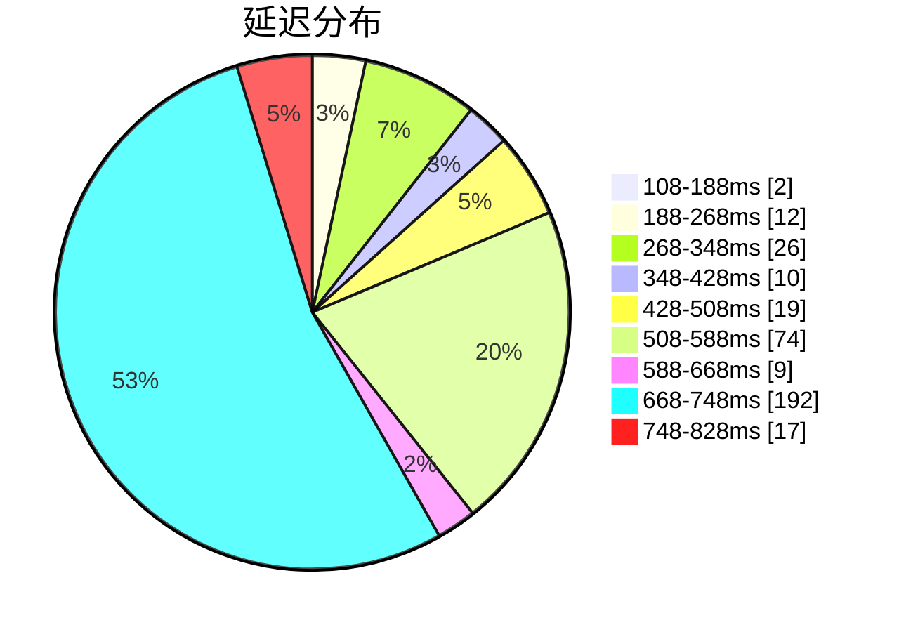
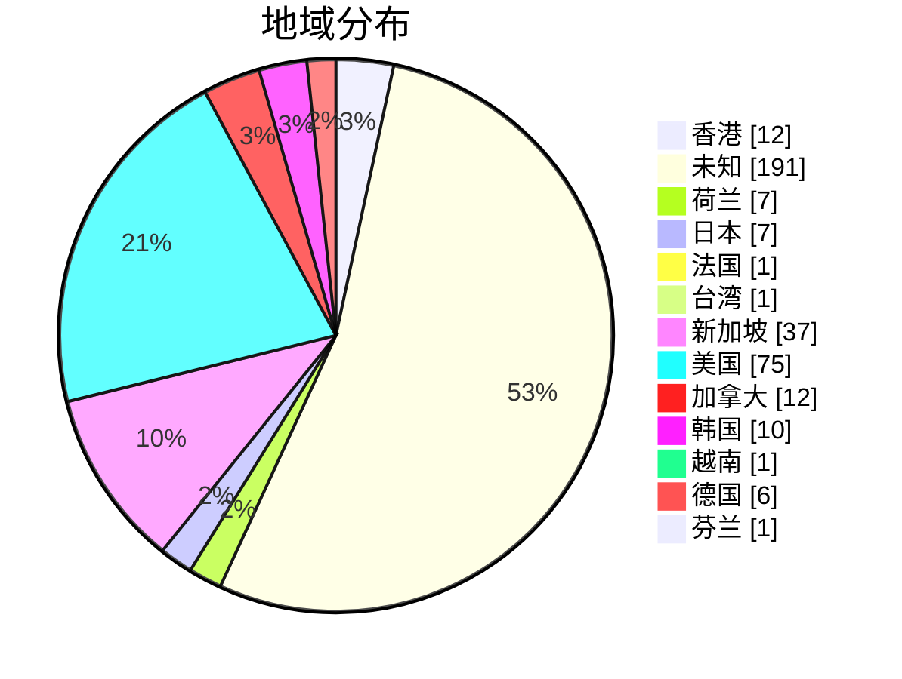
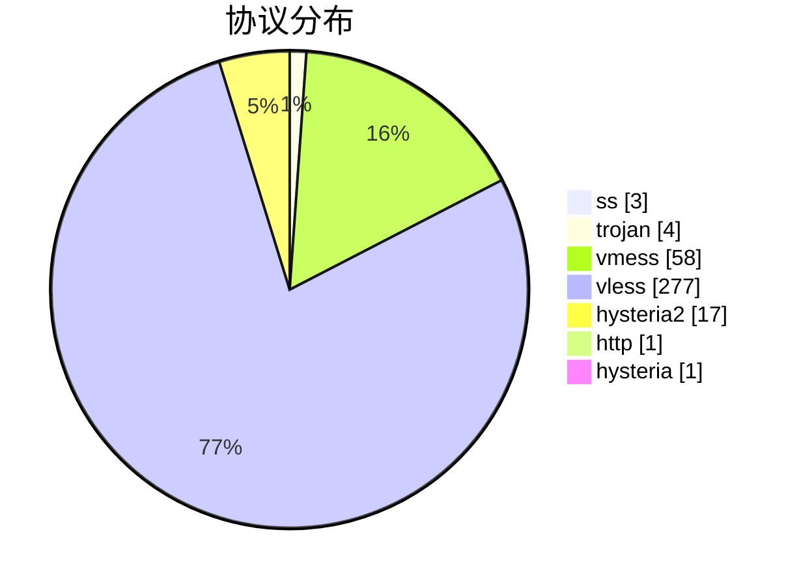

```mermaid
pie showData
title 延迟分布
"108-188ms" : 2
"188-268ms" : 12
"268-348ms" : 26
"348-428ms" : 10
"428-508ms" : 19
"508-588ms" : 74
"588-668ms" : 9
"668-748ms" : 192
"748-828ms" : 17
```

```mermaid
pie showData
title 地域分布
"香港" : 12
"未知" : 191
"荷兰" : 7
"日本" : 7
"法国" : 1
"台湾" : 1
"新加坡" : 37
"美国" : 75
"加拿大" : 12
"韩国" : 10
"越南" : 1
"德国" : 6
"芬兰" : 1
```

```mermaid
pie showData
title 协议分布
"ss" : 3
"trojan" : 4
"vmess" : 58
"vless" : 277
"hysteria2" : 17
"http" : 1
"hysteria" : 1
```