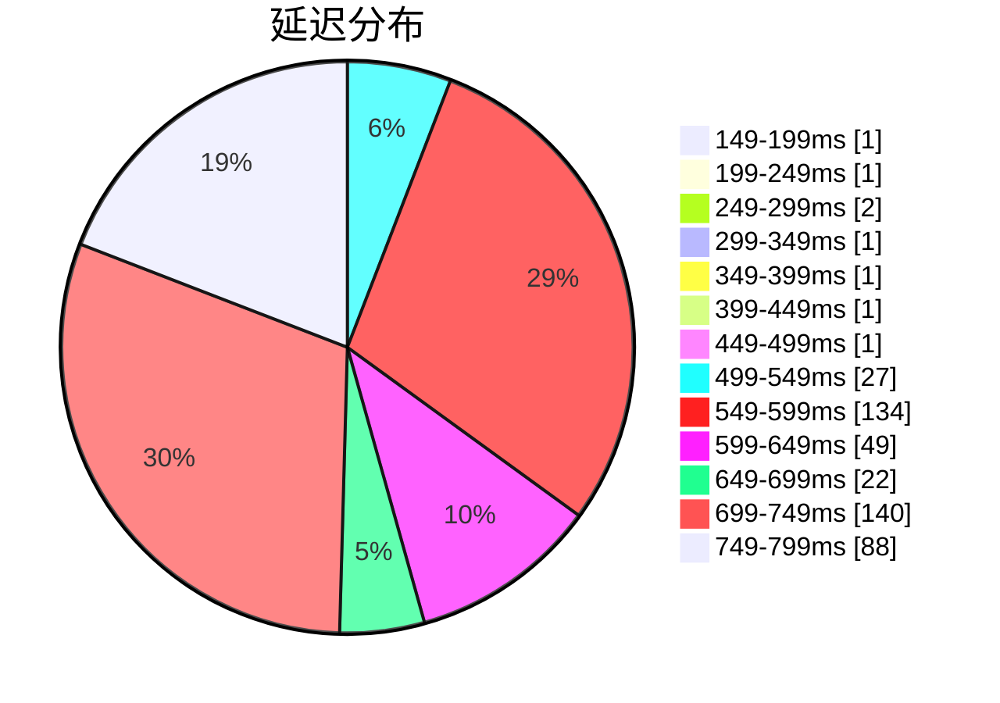
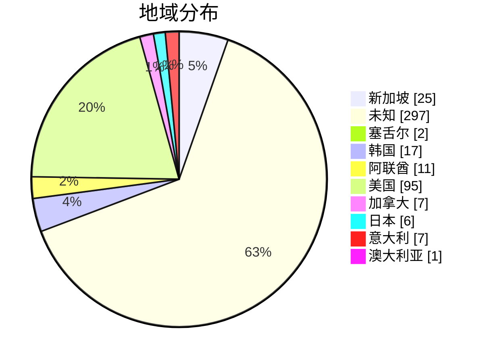
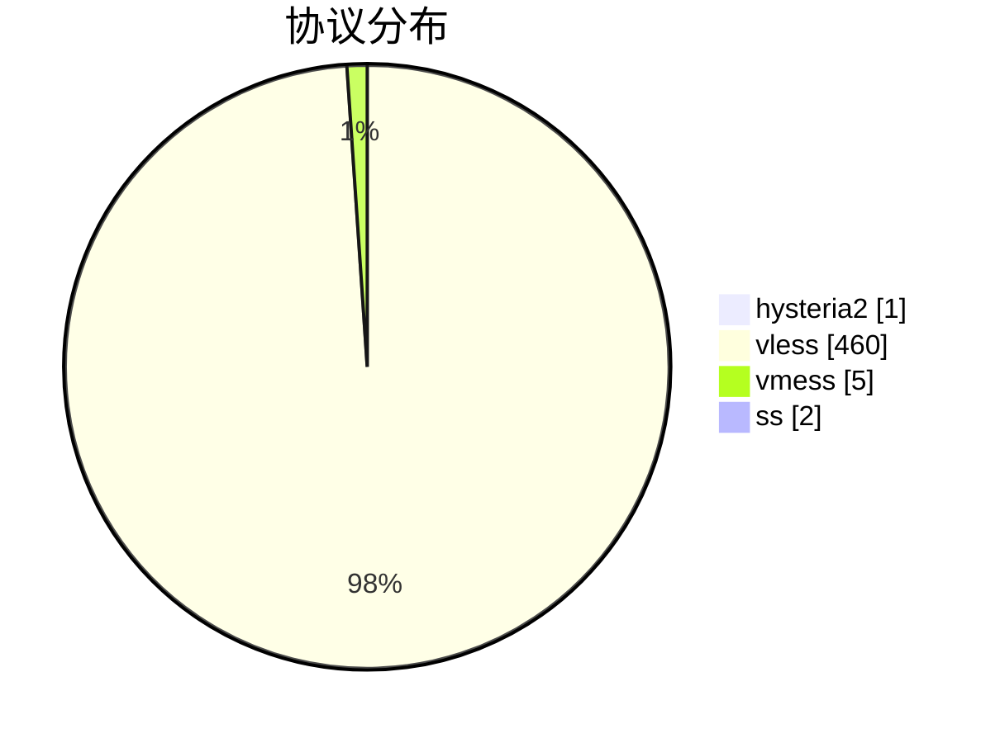

```mermaid
pie showData
title 延迟分布
"149-199ms" : 1
"199-249ms" : 1
"249-299ms" : 2
"299-349ms" : 1
"349-399ms" : 1
"399-449ms" : 1
"449-499ms" : 1
"499-549ms" : 27
"549-599ms" : 134
"599-649ms" : 49
"649-699ms" : 22
"699-749ms" : 140
"749-799ms" : 88
```

```mermaid
pie showData
title 地域分布
"新加坡" : 25
"未知" : 297
"塞舌尔" : 2
"韩国" : 17
"阿联酋" : 11
"美国" : 95
"加拿大" : 7
"日本" : 6
"意大利" : 7
"澳大利亚" : 1
```

```mermaid
pie showData
title 协议分布
"hysteria2" : 1
"vless" : 460
"vmess" : 5
"ss" : 2
```