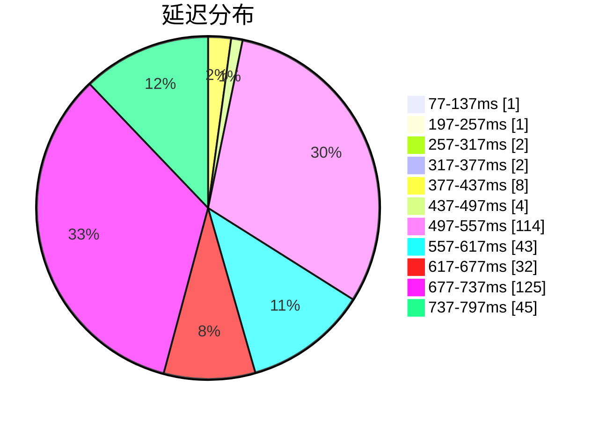
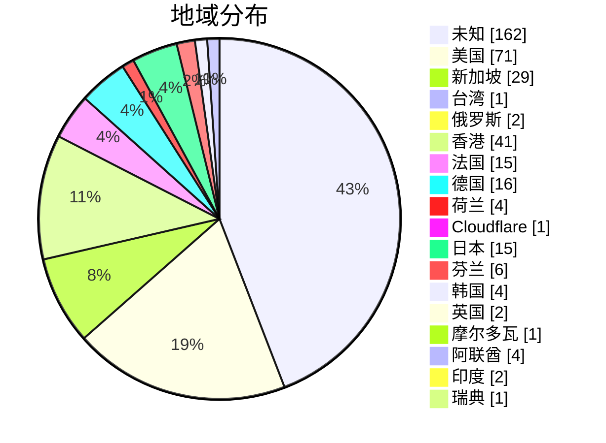
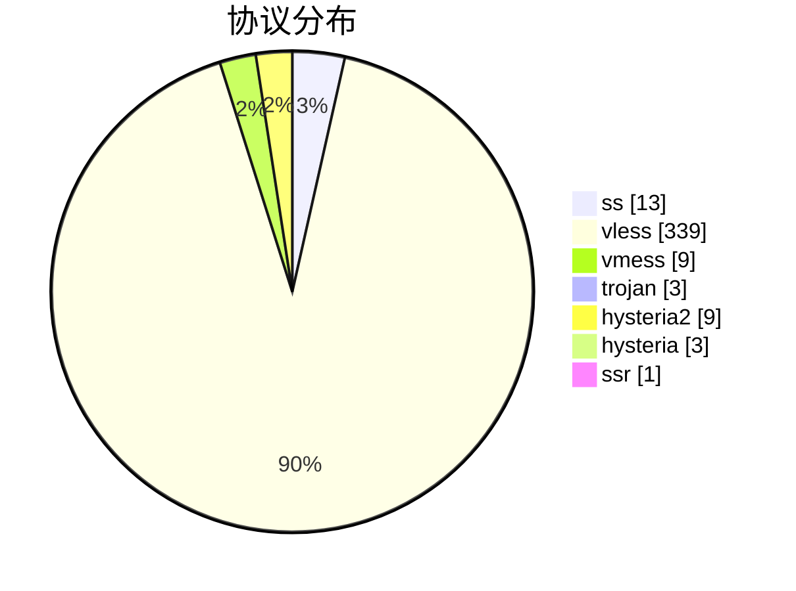

```mermaid
pie showData
title 延迟分布
"77-137ms" : 1
"197-257ms" : 1
"257-317ms" : 2
"317-377ms" : 2
"377-437ms" : 8
"437-497ms" : 4
"497-557ms" : 114
"557-617ms" : 43
"617-677ms" : 32
"677-737ms" : 125
"737-797ms" : 45
```

```mermaid
pie showData
title 地域分布
"未知" : 162
"美国" : 71
"新加坡" : 29
"台湾" : 1
"俄罗斯" : 2
"香港" : 41
"法国" : 15
"德国" : 16
"荷兰" : 4
"Cloudflare" : 1
"日本" : 15
"芬兰" : 6
"韩国" : 4
"英国" : 2
"摩尔多瓦" : 1
"阿联酋" : 4
"印度" : 2
"瑞典" : 1
```

```mermaid
pie showData
title 协议分布
"ss" : 13
"vless" : 339
"vmess" : 9
"trojan" : 3
"hysteria2" : 9
"hysteria" : 3
"ssr" : 1
```