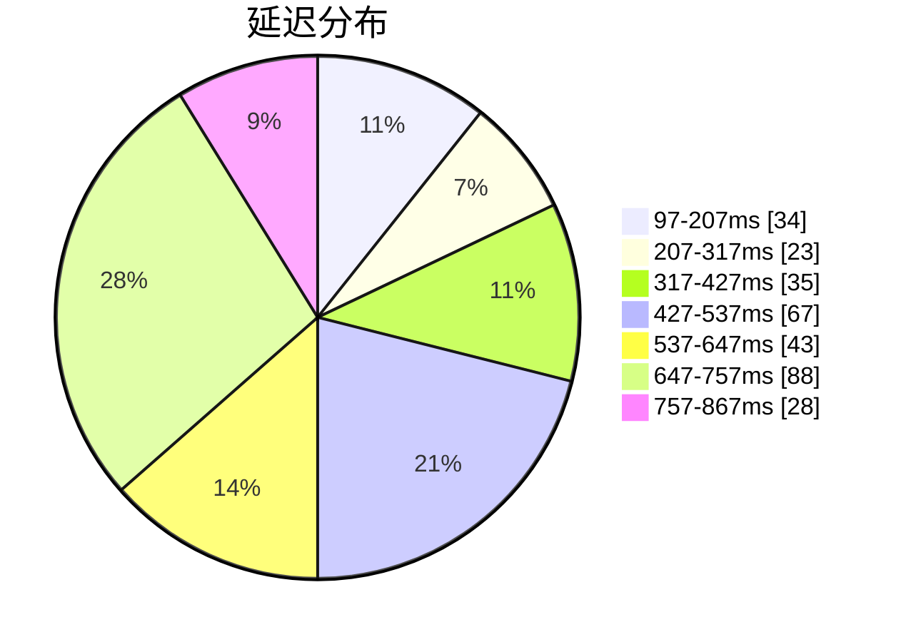
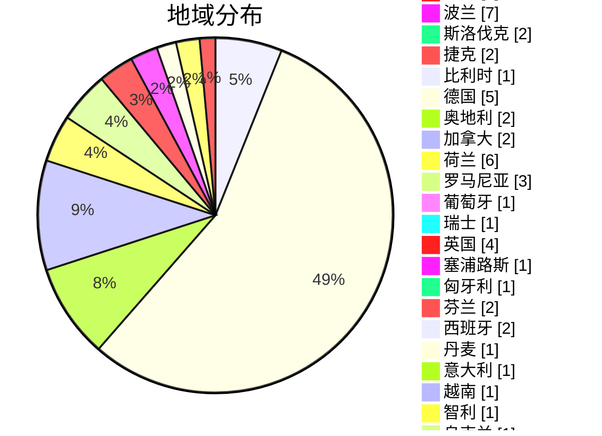
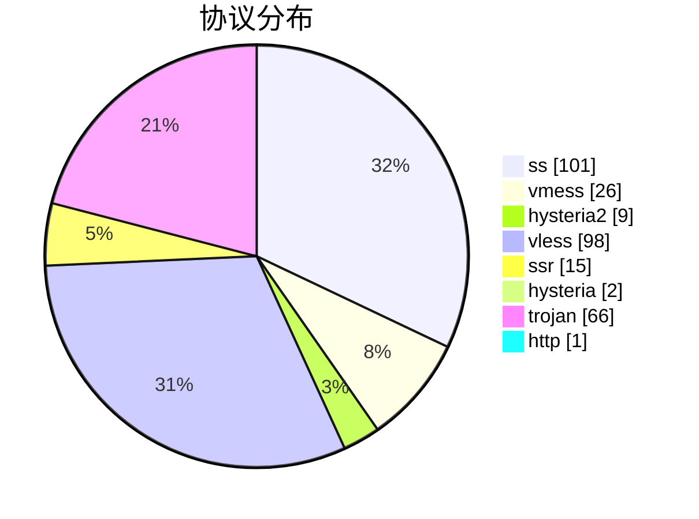

```mermaid
pie showData
title 延迟分布
"97-207ms" : 34
"207-317ms" : 23
"317-427ms" : 35
"427-537ms" : 67
"537-647ms" : 43
"647-757ms" : 88
"757-867ms" : 28
```

```mermaid
pie showData
title 地域分布
"香港" : 17
"未知" : 155
"美国" : 24
"台湾" : 28
"新加坡" : 12
"日本" : 13
"泰国" : 1
"俄罗斯" : 3
"韩国" : 9
"波兰" : 7
"斯洛伐克" : 2
"捷克" : 2
"比利时" : 1
"德国" : 5
"奥地利" : 2
"加拿大" : 2
"荷兰" : 6
"罗马尼亚" : 3
"葡萄牙" : 1
"瑞士" : 1
"英国" : 4
"塞浦路斯" : 1
"匈牙利" : 1
"芬兰" : 2
"西班牙" : 2
"丹麦" : 1
"意大利" : 1
"越南" : 1
"智利" : 1
"乌克兰" : 1
"希腊" : 1
"爱尔兰" : 1
"摩尔多瓦" : 1
"哈萨克斯坦" : 1
"立陶宛" : 1
"爱沙尼亚" : 1
"拉脱维亚" : 2
"挪威" : 1
```

```mermaid
pie showData
title 协议分布
"ss" : 101
"vmess" : 26
"hysteria2" : 9
"vless" : 98
"ssr" : 15
"hysteria" : 2
"trojan" : 66
"http" : 1
```