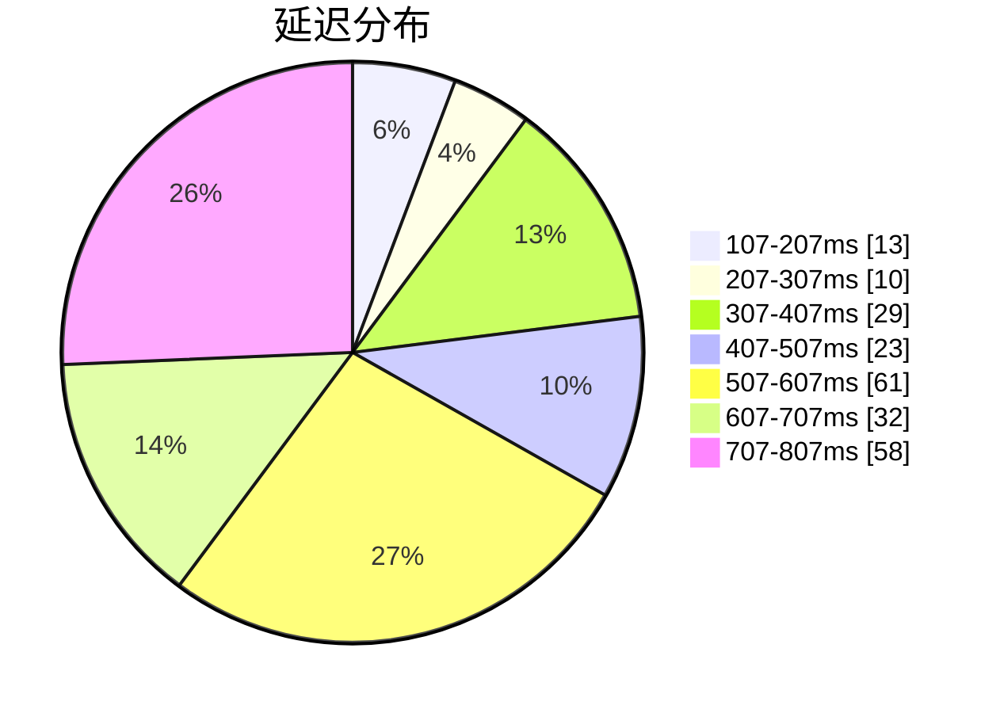
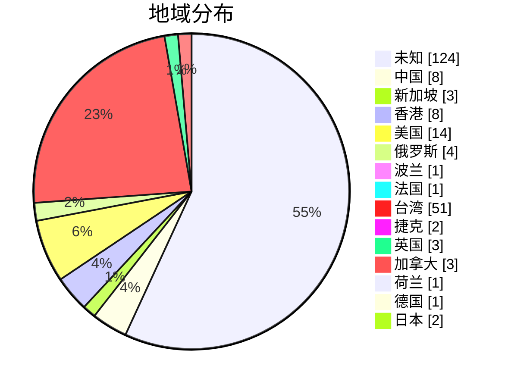
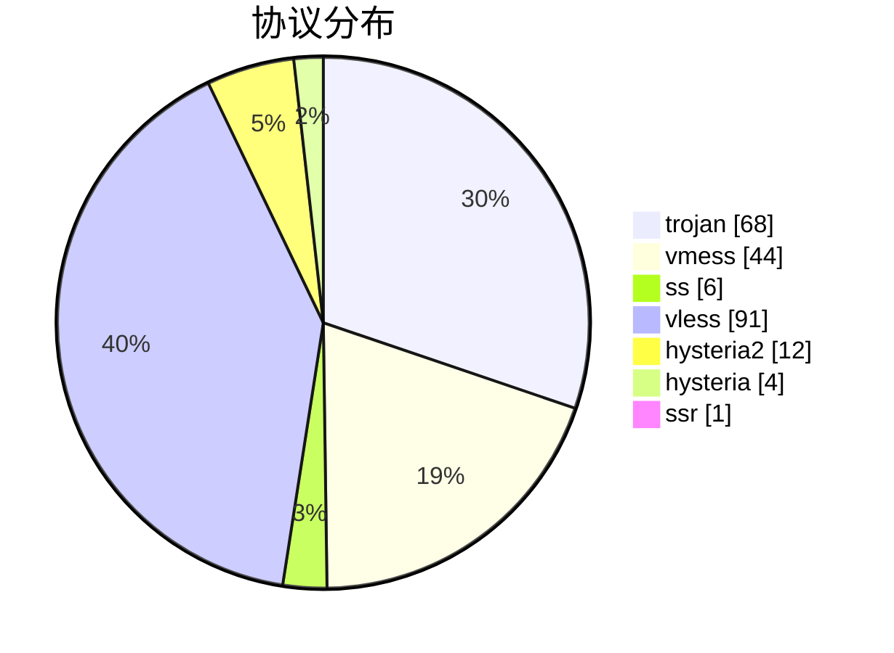

```mermaid
pie showData
title 延迟分布
"107-207ms" : 13
"207-307ms" : 10
"307-407ms" : 29
"407-507ms" : 23
"507-607ms" : 61
"607-707ms" : 32
"707-807ms" : 58
```

```mermaid
pie showData
title 地域分布
"未知" : 124
"中国" : 8
"新加坡" : 3
"香港" : 8
"美国" : 14
"俄罗斯" : 4
"波兰" : 1
"法国" : 1
"台湾" : 51
"捷克" : 2
"英国" : 3
"加拿大" : 3
"荷兰" : 1
"德国" : 1
"日本" : 2
```

```mermaid
pie showData
title 协议分布
"trojan" : 68
"vmess" : 44
"ss" : 6
"vless" : 91
"hysteria2" : 12
"hysteria" : 4
"ssr" : 1
```