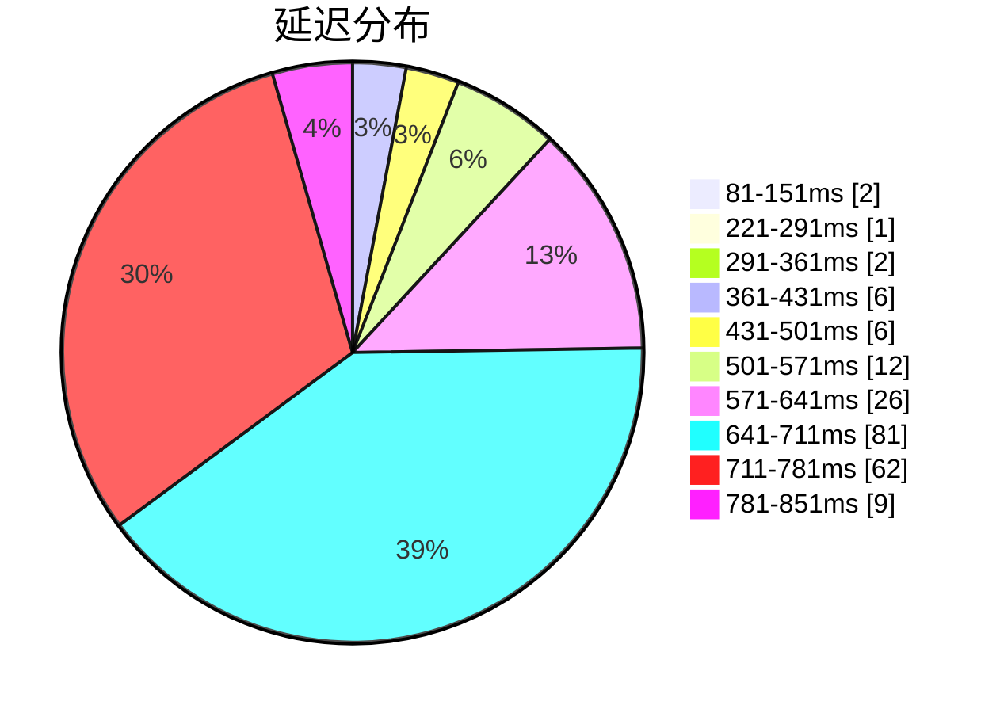
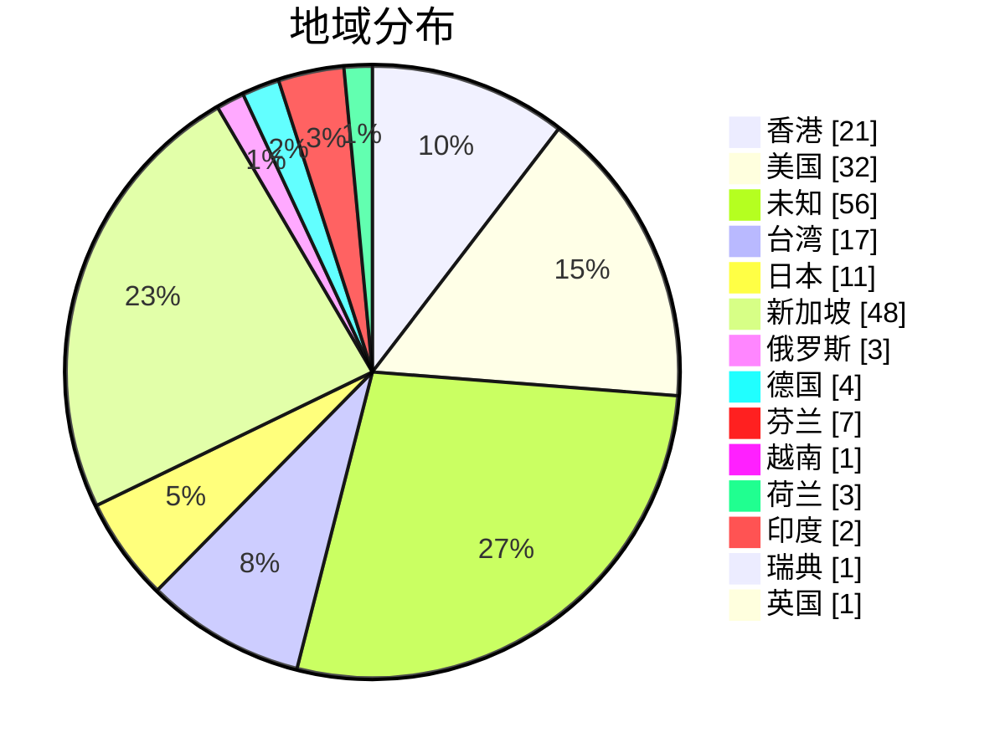
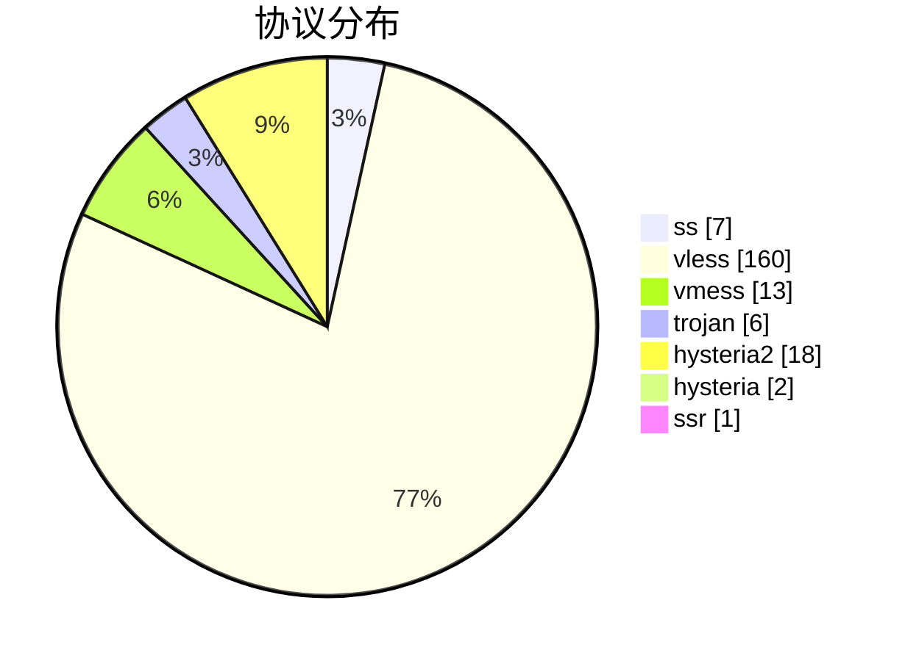

```mermaid
pie showData
title 延迟分布
"81-151ms" : 2
"221-291ms" : 1
"291-361ms" : 2
"361-431ms" : 6
"431-501ms" : 6
"501-571ms" : 12
"571-641ms" : 26
"641-711ms" : 81
"711-781ms" : 62
"781-851ms" : 9
```

```mermaid
pie showData
title 地域分布
"香港" : 21
"美国" : 32
"未知" : 56
"台湾" : 17
"日本" : 11
"新加坡" : 48
"俄罗斯" : 3
"德国" : 4
"芬兰" : 7
"越南" : 1
"荷兰" : 3
"印度" : 2
"瑞典" : 1
"英国" : 1
```

```mermaid
pie showData
title 协议分布
"ss" : 7
"vless" : 160
"vmess" : 13
"trojan" : 6
"hysteria2" : 18
"hysteria" : 2
"ssr" : 1
```