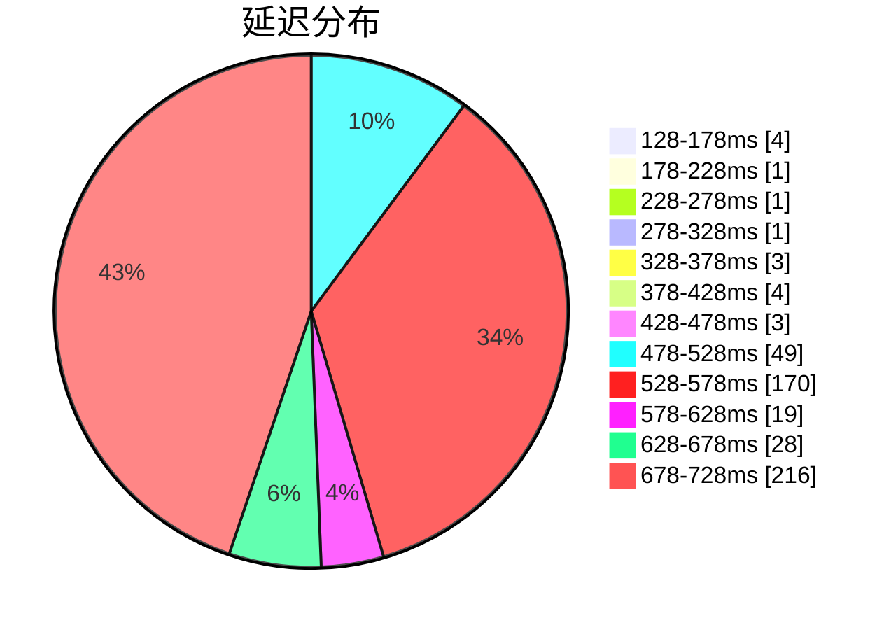
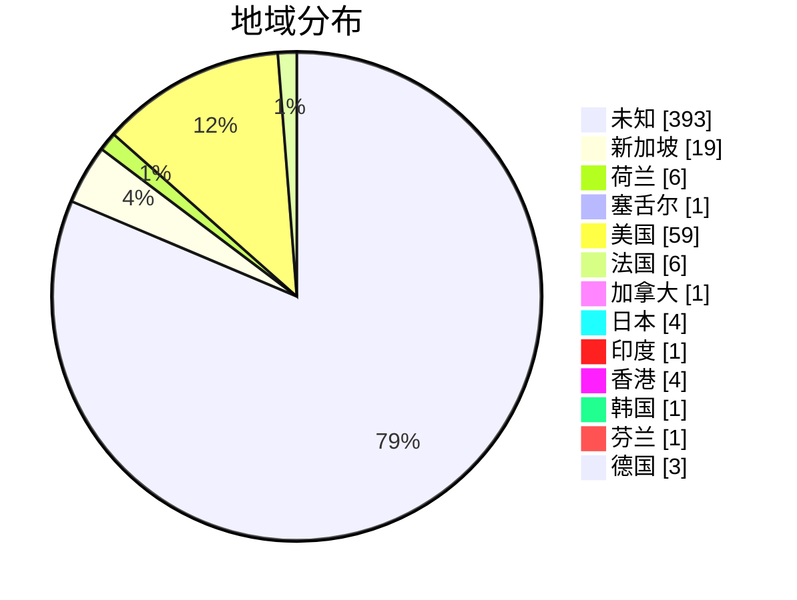
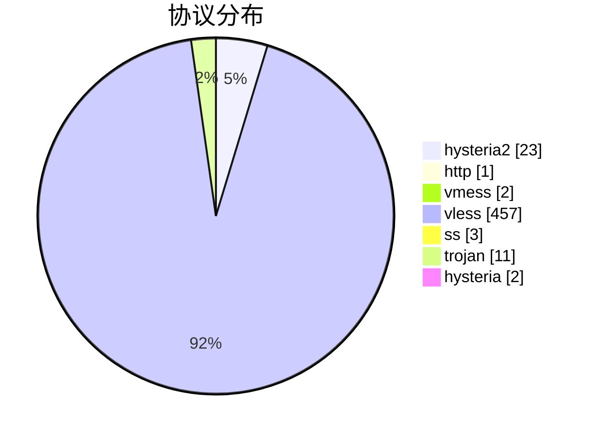

```mermaid
pie showData
title 延迟分布
"128-178ms" : 4
"178-228ms" : 1
"228-278ms" : 1
"278-328ms" : 1
"328-378ms" : 3
"378-428ms" : 4
"428-478ms" : 3
"478-528ms" : 49
"528-578ms" : 170
"578-628ms" : 19
"628-678ms" : 28
"678-728ms" : 216
```

```mermaid
pie showData
title 地域分布
"未知" : 393
"新加坡" : 19
"荷兰" : 6
"塞舌尔" : 1
"美国" : 59
"法国" : 6
"加拿大" : 1
"日本" : 4
"印度" : 1
"香港" : 4
"韩国" : 1
"芬兰" : 1
"德国" : 3
```

```mermaid
pie showData
title 协议分布
"hysteria2" : 23
"http" : 1
"vmess" : 2
"vless" : 457
"ss" : 3
"trojan" : 11
"hysteria" : 2
```