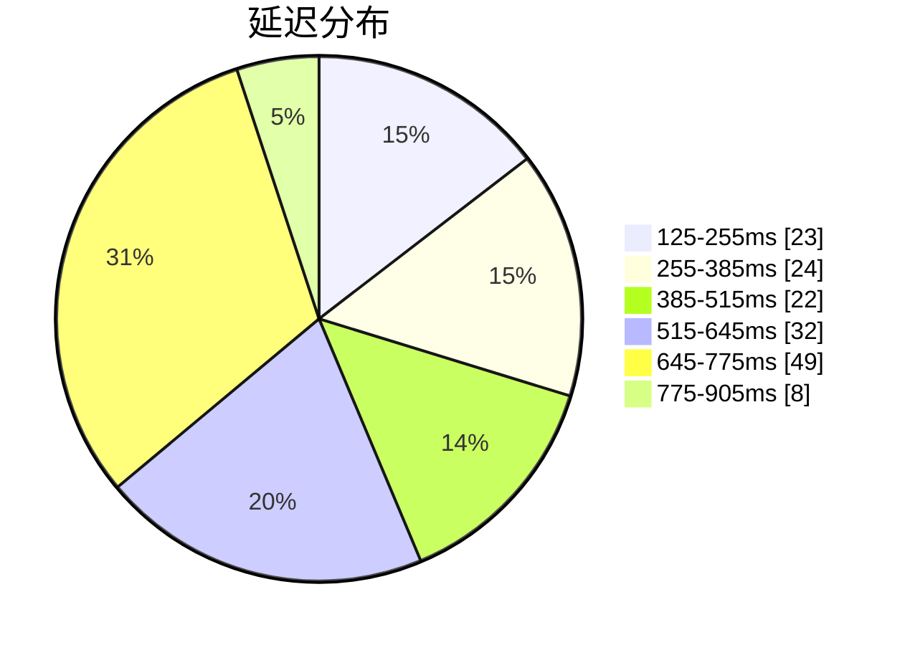
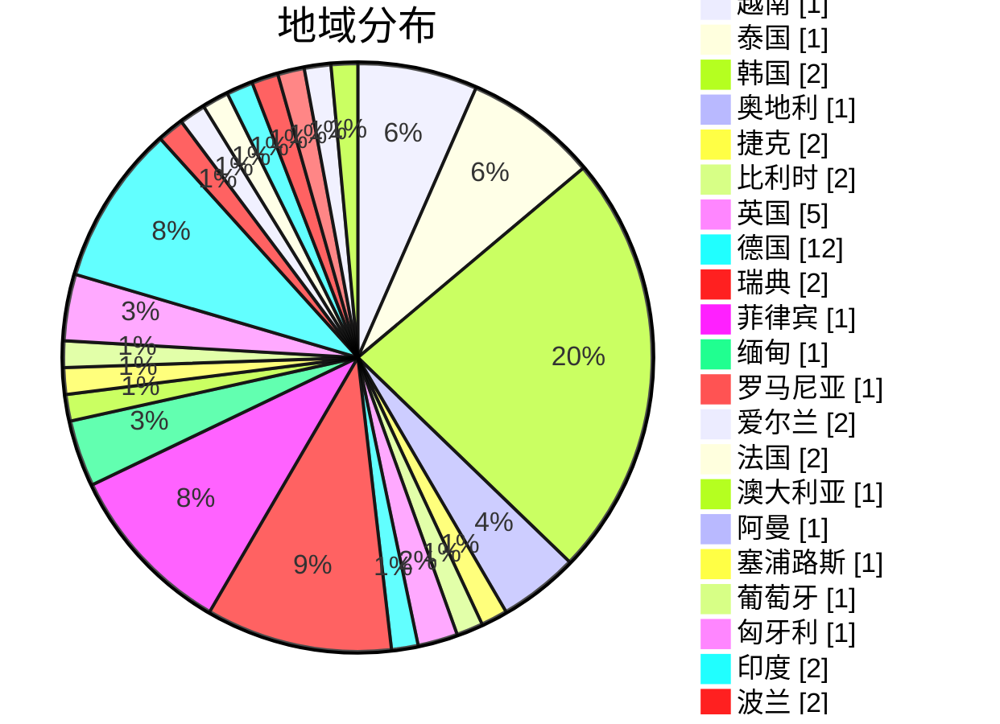
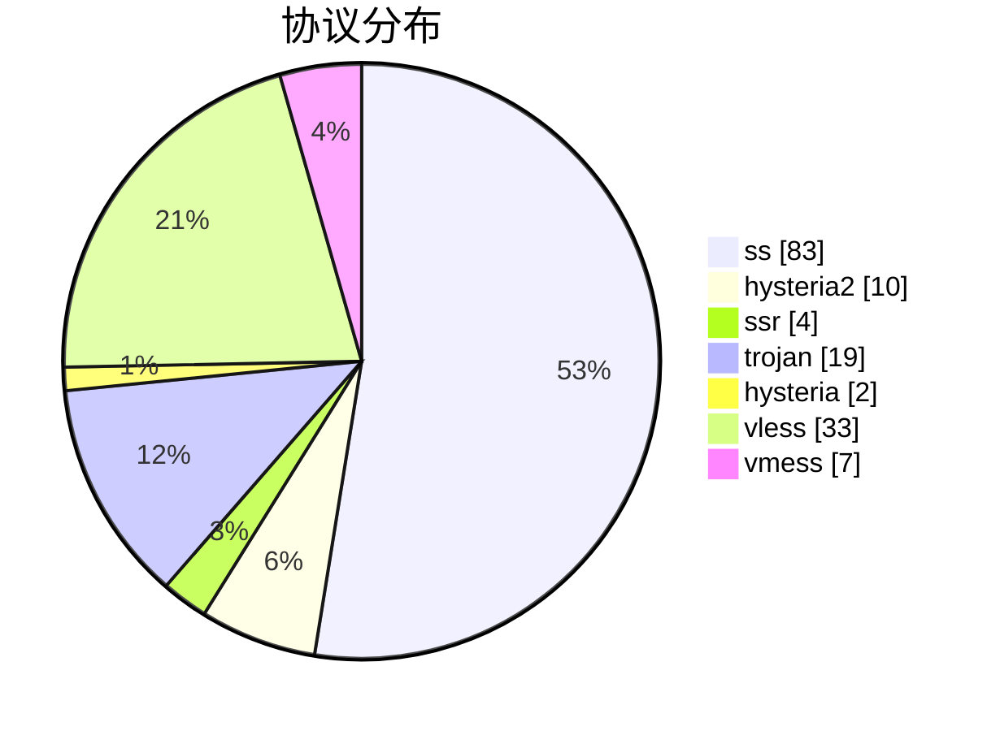

```mermaid
pie showData
title 延迟分布
"125-255ms" : 23
"255-385ms" : 24
"385-515ms" : 22
"515-645ms" : 32
"645-775ms" : 49
"775-905ms" : 8
```

```mermaid
pie showData
title 地域分布
"香港" : 9
"日本" : 10
"未知" : 32
"新加坡" : 6
"台湾" : 2
"俄罗斯" : 2
"荷兰" : 3
"意大利" : 2
"美国" : 14
"加拿大" : 13
"孟加拉国" : 5
"印度尼西亚" : 1
"越南" : 1
"泰国" : 1
"韩国" : 2
"奥地利" : 1
"捷克" : 2
"比利时" : 2
"英国" : 5
"德国" : 12
"瑞典" : 2
"菲律宾" : 1
"缅甸" : 1
"罗马尼亚" : 1
"爱尔兰" : 2
"法国" : 2
"澳大利亚" : 1
"阿曼" : 1
"塞浦路斯" : 1
"葡萄牙" : 1
"匈牙利" : 1
"印度" : 2
"波兰" : 2
"瑞士" : 1
"阿联酋" : 1
"芬兰" : 2
"斯洛伐克" : 2
"西班牙" : 1
"土耳其" : 2
"冰岛" : 1
"立陶宛" : 1
"丹麦" : 1
"波黑" : 1
"爱沙尼亚" : 1
"亚美尼亚" : 1
```

```mermaid
pie showData
title 协议分布
"ss" : 83
"hysteria2" : 10
"ssr" : 4
"trojan" : 19
"hysteria" : 2
"vless" : 33
"vmess" : 7
```