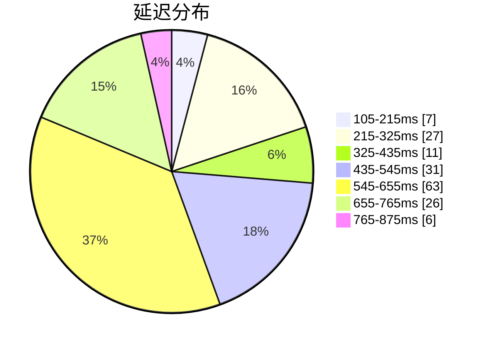
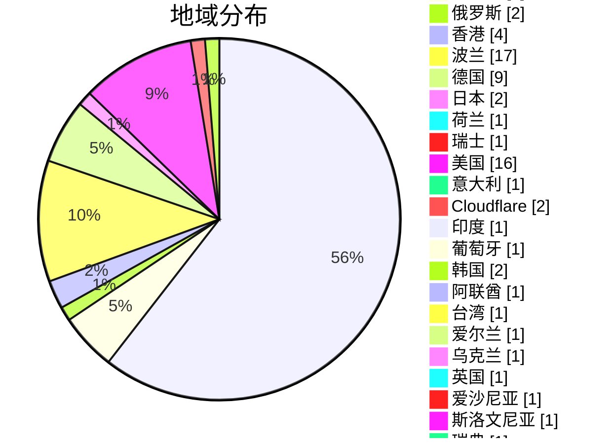
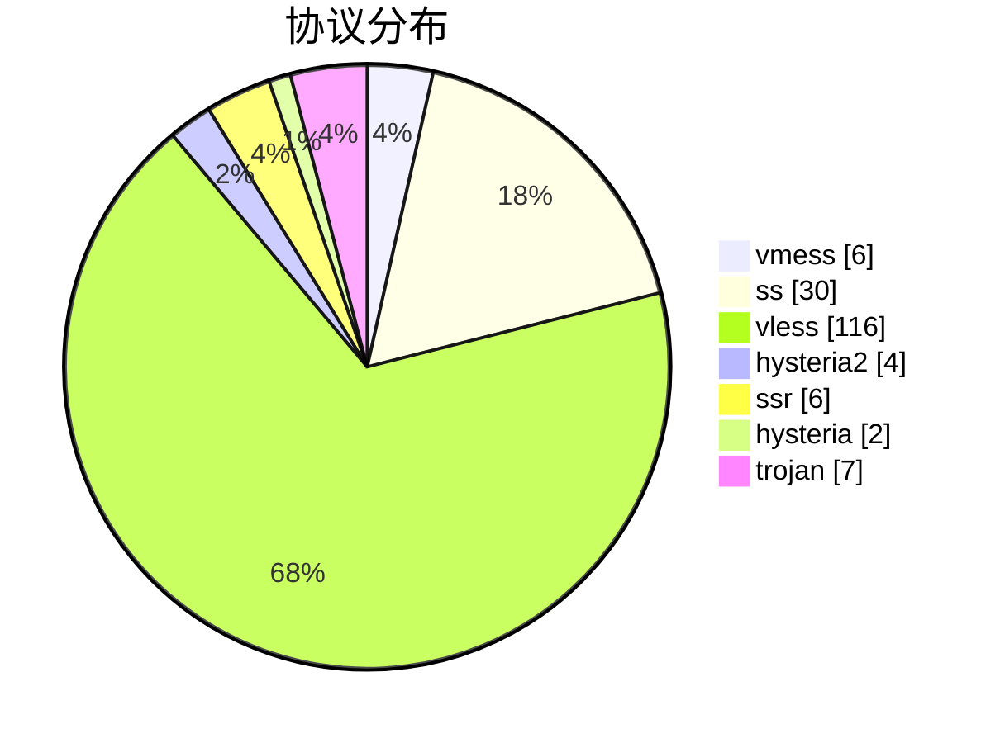

```mermaid
pie showData
title 延迟分布
"105-215ms" : 7
"215-325ms" : 27
"325-435ms" : 11
"435-545ms" : 31
"545-655ms" : 63
"655-765ms" : 26
"765-875ms" : 6
```

```mermaid
pie showData
title 地域分布
"未知" : 95
"新加坡" : 8
"俄罗斯" : 2
"香港" : 4
"波兰" : 17
"德国" : 9
"日本" : 2
"荷兰" : 1
"瑞士" : 1
"美国" : 16
"意大利" : 1
"Cloudflare" : 2
"印度" : 1
"葡萄牙" : 1
"韩国" : 2
"阿联酋" : 1
"台湾" : 1
"爱尔兰" : 1
"乌克兰" : 1
"英国" : 1
"爱沙尼亚" : 1
"斯洛文尼亚" : 1
"瑞典" : 1
"芬兰" : 1
```

```mermaid
pie showData
title 协议分布
"vmess" : 6
"ss" : 30
"vless" : 116
"hysteria2" : 4
"ssr" : 6
"hysteria" : 2
"trojan" : 7
```