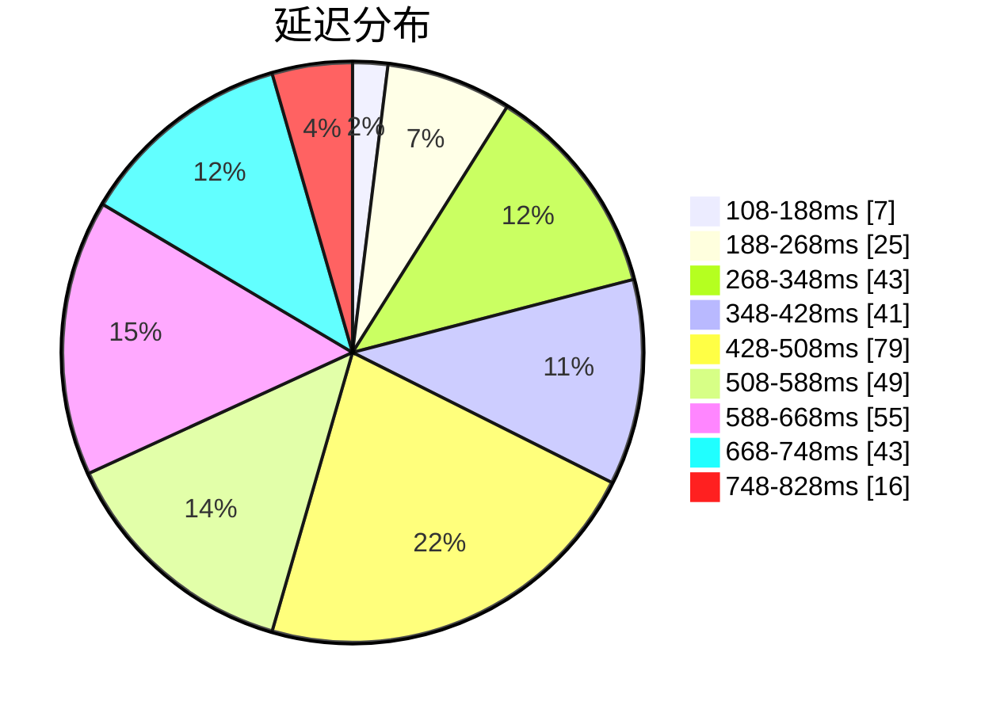
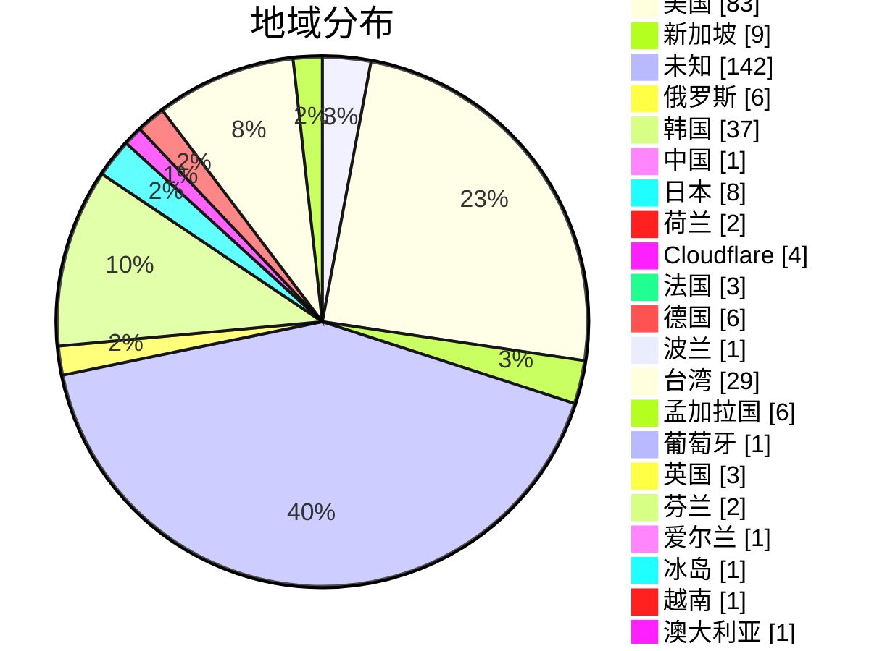
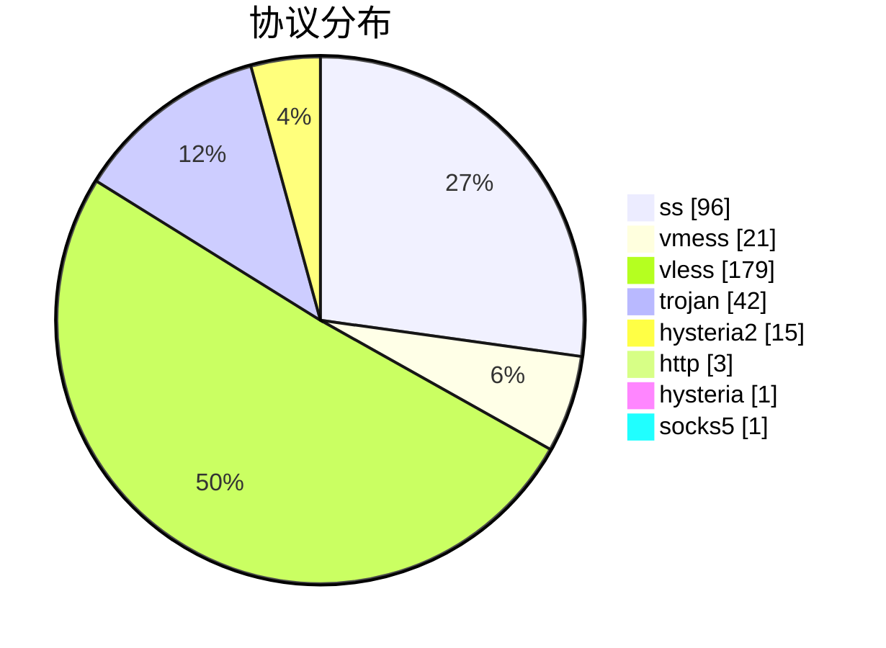

```mermaid
pie showData
title 延迟分布
"108-188ms" : 7
"188-268ms" : 25
"268-348ms" : 43
"348-428ms" : 41
"428-508ms" : 79
"508-588ms" : 49
"588-668ms" : 55
"668-748ms" : 43
"748-828ms" : 16
```

```mermaid
pie showData
title 地域分布
"香港" : 10
"美国" : 83
"新加坡" : 9
"未知" : 142
"俄罗斯" : 6
"韩国" : 37
"中国" : 1
"日本" : 8
"荷兰" : 2
"Cloudflare" : 4
"法国" : 3
"德国" : 6
"波兰" : 1
"台湾" : 29
"孟加拉国" : 6
"葡萄牙" : 1
"英国" : 3
"芬兰" : 2
"爱尔兰" : 1
"冰岛" : 1
"越南" : 1
"澳大利亚" : 1
"哥伦比亚" : 1
```

```mermaid
pie showData
title 协议分布
"ss" : 96
"vmess" : 21
"vless" : 179
"trojan" : 42
"hysteria2" : 15
"http" : 3
"hysteria" : 1
"socks5" : 1
```