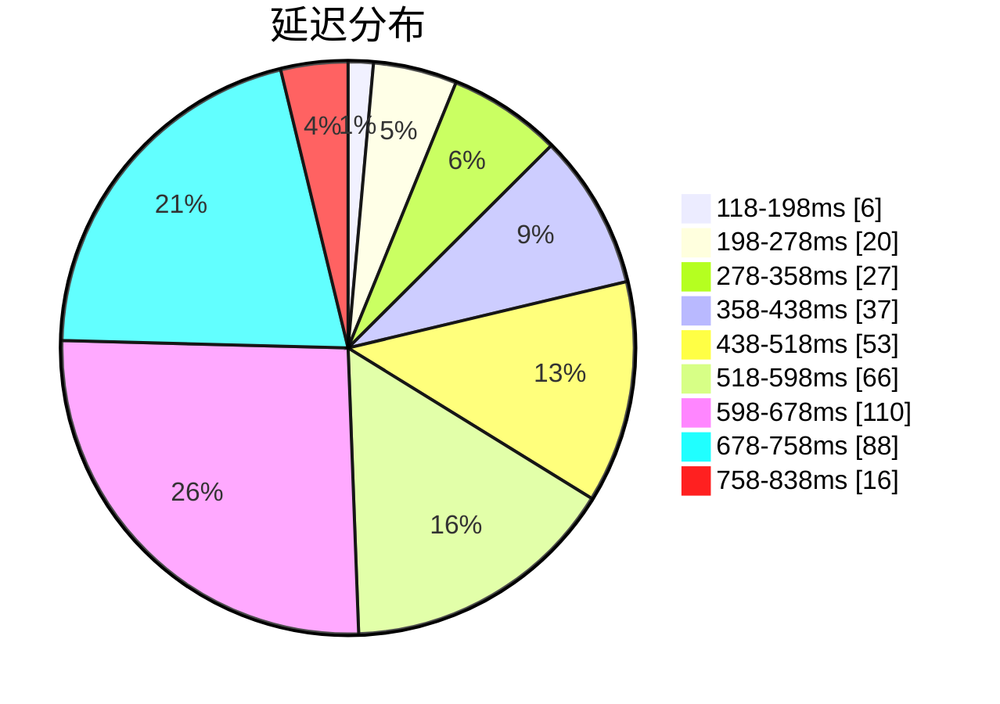
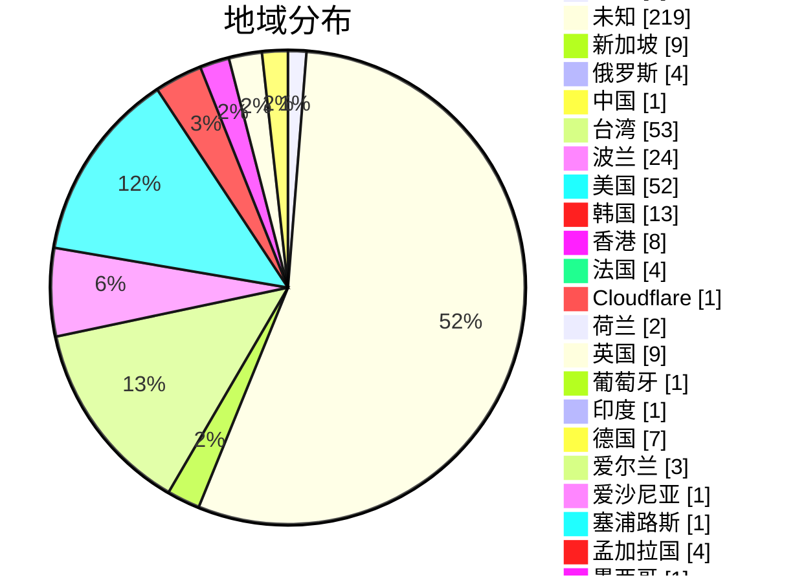
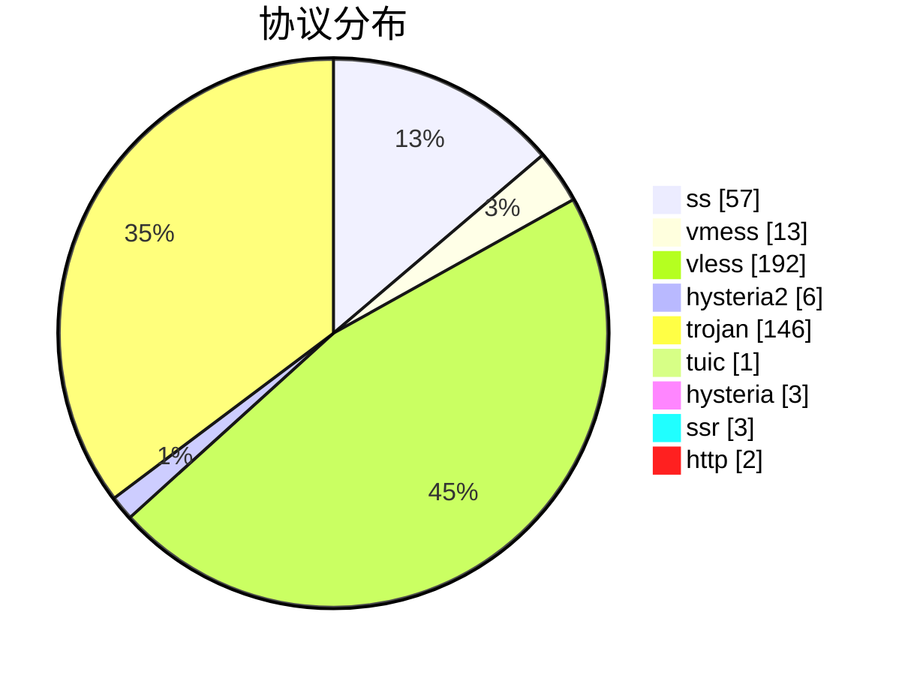

```mermaid
pie showData
title 延迟分布
"118-198ms" : 6
"198-278ms" : 20
"278-358ms" : 27
"358-438ms" : 37
"438-518ms" : 53
"518-598ms" : 66
"598-678ms" : 110
"678-758ms" : 88
"758-838ms" : 16
```

```mermaid
pie showData
title 地域分布
"日本" : 5
"未知" : 219
"新加坡" : 9
"俄罗斯" : 4
"中国" : 1
"台湾" : 53
"波兰" : 24
"美国" : 52
"韩国" : 13
"香港" : 8
"法国" : 4
"Cloudflare" : 1
"荷兰" : 2
"英国" : 9
"葡萄牙" : 1
"印度" : 1
"德国" : 7
"爱尔兰" : 3
"爱沙尼亚" : 1
"塞浦路斯" : 1
"孟加拉国" : 4
"墨西哥" : 1
```

```mermaid
pie showData
title 协议分布
"ss" : 57
"vmess" : 13
"vless" : 192
"hysteria2" : 6
"trojan" : 146
"tuic" : 1
"hysteria" : 3
"ssr" : 3
"http" : 2
```