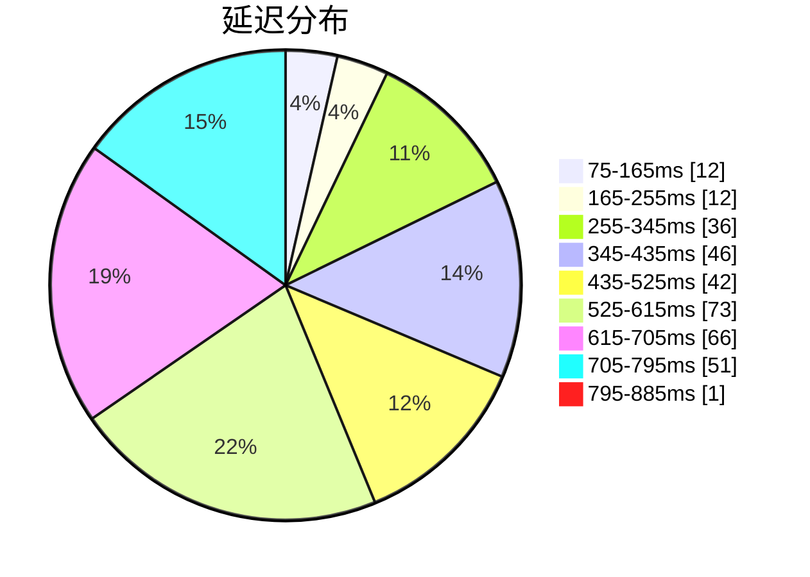
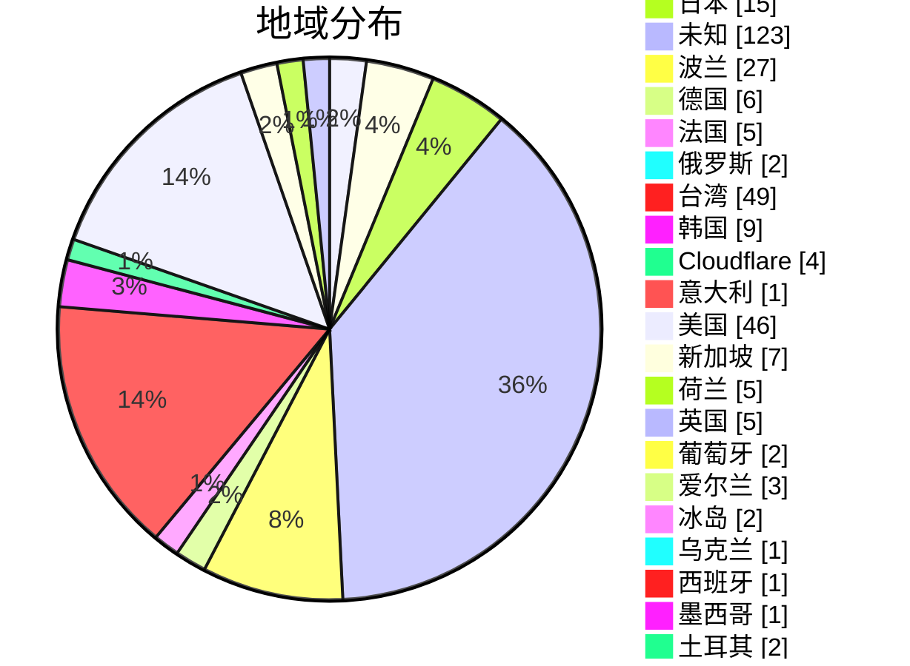
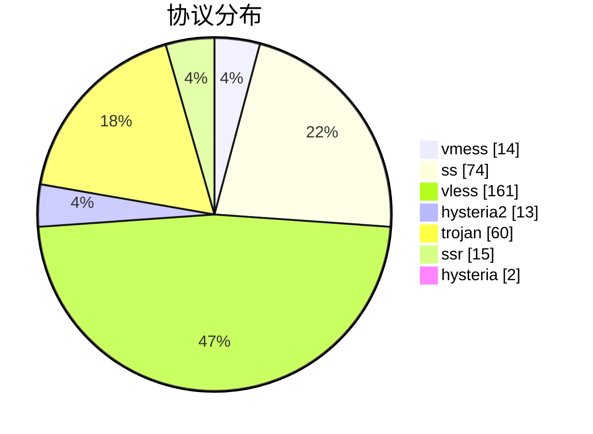

```mermaid
pie showData
title 延迟分布
"75-165ms" : 12
"165-255ms" : 12
"255-345ms" : 36
"345-435ms" : 46
"435-525ms" : 42
"525-615ms" : 73
"615-705ms" : 66
"705-795ms" : 51
"795-885ms" : 1
```

```mermaid
pie showData
title 地域分布
"中国" : 7
"香港" : 13
"日本" : 15
"未知" : 123
"波兰" : 27
"德国" : 6
"法国" : 5
"俄罗斯" : 2
"台湾" : 49
"韩国" : 9
"Cloudflare" : 4
"意大利" : 1
"美国" : 46
"新加坡" : 7
"荷兰" : 5
"英国" : 5
"葡萄牙" : 2
"爱尔兰" : 3
"冰岛" : 2
"乌克兰" : 1
"西班牙" : 1
"墨西哥" : 1
"土耳其" : 2
"爱沙尼亚" : 2
"澳大利亚" : 1
```

```mermaid
pie showData
title 协议分布
"vmess" : 14
"ss" : 74
"vless" : 161
"hysteria2" : 13
"trojan" : 60
"ssr" : 15
"hysteria" : 2
```