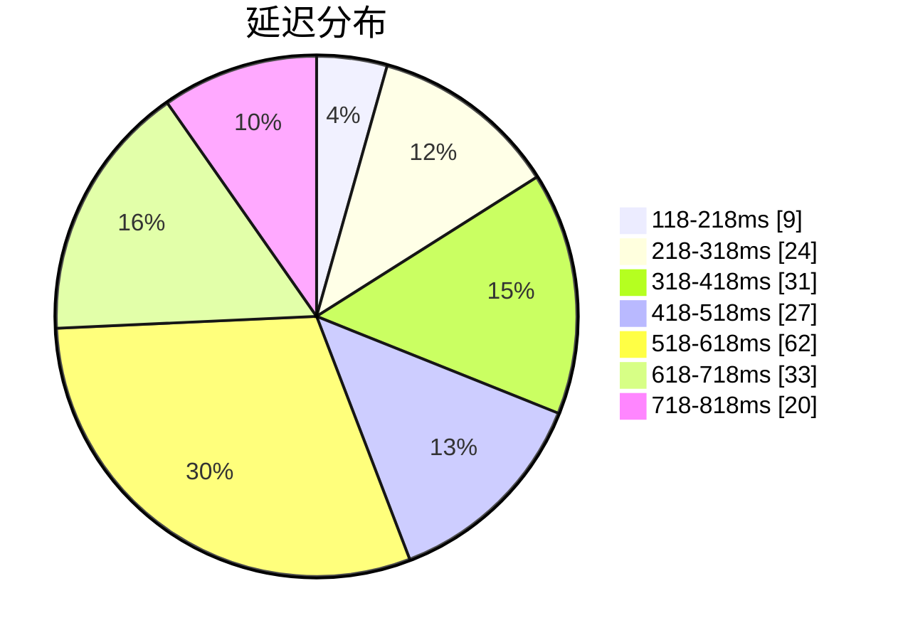
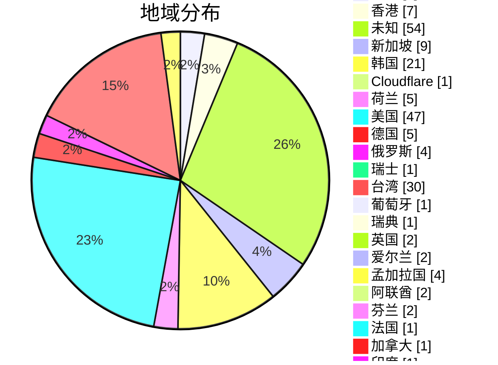
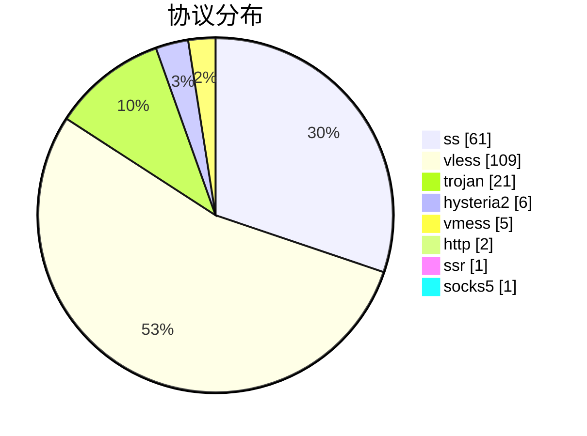

```mermaid
pie showData
title 延迟分布
"118-218ms" : 9
"218-318ms" : 24
"318-418ms" : 31
"418-518ms" : 27
"518-618ms" : 62
"618-718ms" : 33
"718-818ms" : 20
```

```mermaid
pie showData
title 地域分布
"日本" : 5
"香港" : 7
"未知" : 54
"新加坡" : 9
"韩国" : 21
"Cloudflare" : 1
"荷兰" : 5
"美国" : 47
"德国" : 5
"俄罗斯" : 4
"瑞士" : 1
"台湾" : 30
"葡萄牙" : 1
"瑞典" : 1
"英国" : 2
"爱尔兰" : 2
"孟加拉国" : 4
"阿联酋" : 2
"芬兰" : 2
"法国" : 1
"加拿大" : 1
"印度" : 1
```

```mermaid
pie showData
title 协议分布
"ss" : 61
"vless" : 109
"trojan" : 21
"hysteria2" : 6
"vmess" : 5
"http" : 2
"ssr" : 1
"socks5" : 1
```