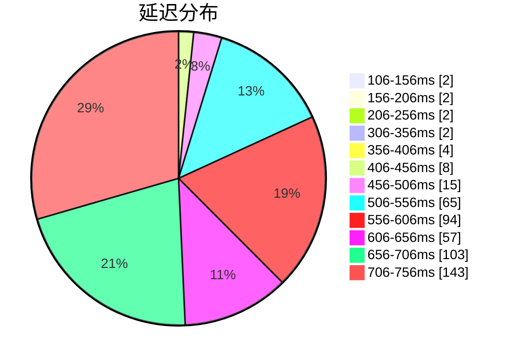
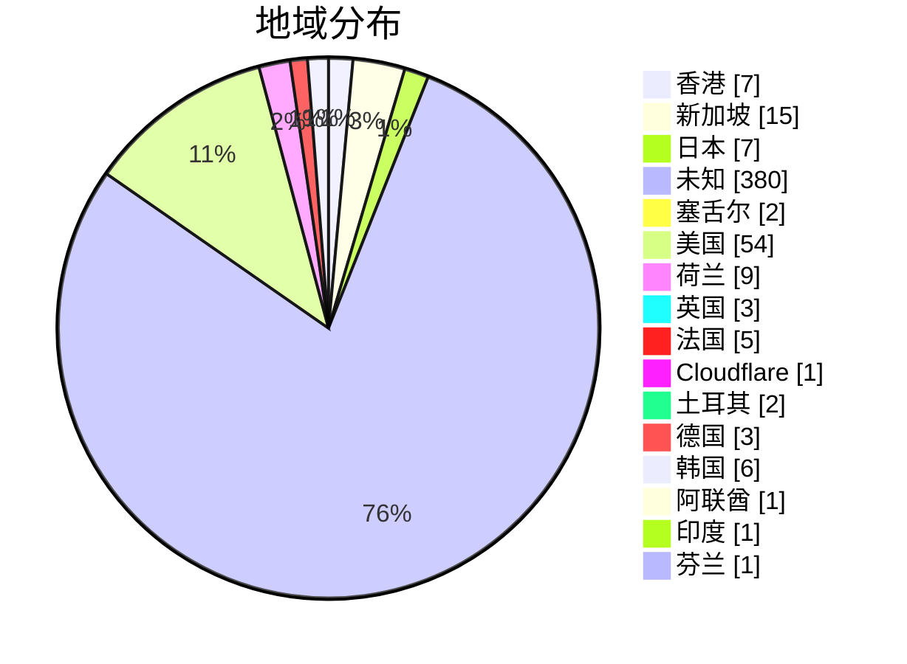
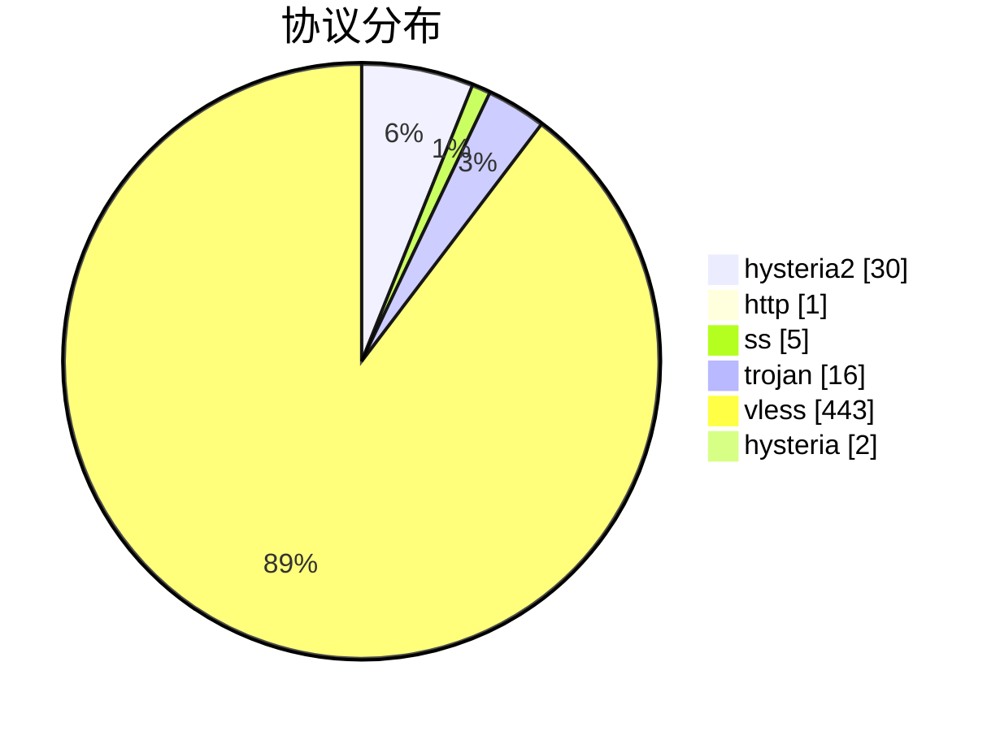

```mermaid
pie showData
title 延迟分布
"106-156ms" : 2
"156-206ms" : 2
"206-256ms" : 2
"306-356ms" : 2
"356-406ms" : 4
"406-456ms" : 8
"456-506ms" : 15
"506-556ms" : 65
"556-606ms" : 94
"606-656ms" : 57
"656-706ms" : 103
"706-756ms" : 143
```

```mermaid
pie showData
title 地域分布
"香港" : 7
"新加坡" : 15
"日本" : 7
"未知" : 380
"塞舌尔" : 2
"美国" : 54
"荷兰" : 9
"英国" : 3
"法国" : 5
"Cloudflare" : 1
"土耳其" : 2
"德国" : 3
"韩国" : 6
"阿联酋" : 1
"印度" : 1
"芬兰" : 1
```

```mermaid
pie showData
title 协议分布
"hysteria2" : 30
"http" : 1
"ss" : 5
"trojan" : 16
"vless" : 443
"hysteria" : 2
```