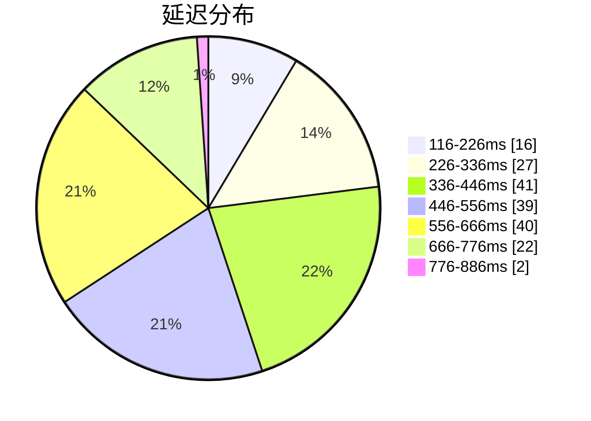
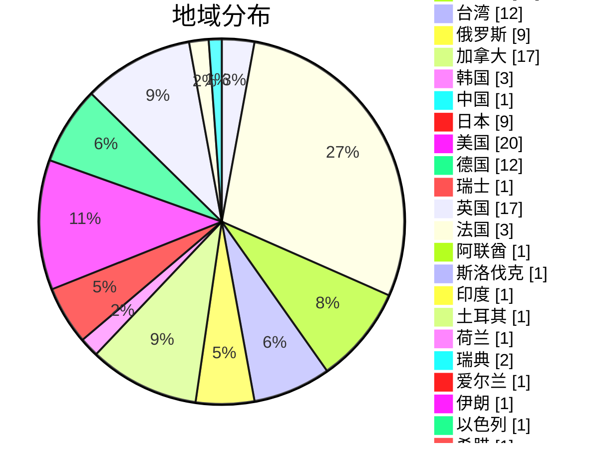
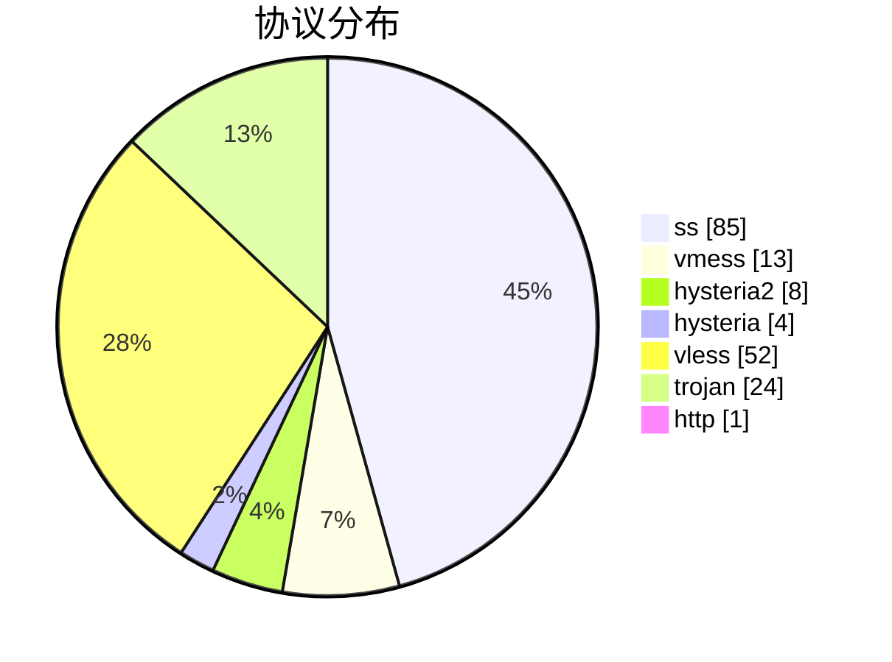

```mermaid
pie showData
title 延迟分布
"116-226ms" : 16
"226-336ms" : 27
"336-446ms" : 41
"446-556ms" : 39
"556-666ms" : 40
"666-776ms" : 22
"776-886ms" : 2
```

```mermaid
pie showData
title 地域分布
"香港" : 5
"未知" : 50
"新加坡" : 15
"台湾" : 12
"俄罗斯" : 9
"加拿大" : 17
"韩国" : 3
"中国" : 1
"日本" : 9
"美国" : 20
"德国" : 12
"瑞士" : 1
"英国" : 17
"法国" : 3
"阿联酋" : 1
"斯洛伐克" : 1
"印度" : 1
"土耳其" : 1
"荷兰" : 1
"瑞典" : 2
"爱尔兰" : 1
"伊朗" : 1
"以色列" : 1
"希腊" : 1
"秘鲁" : 1
"塞浦路斯" : 1
```

```mermaid
pie showData
title 协议分布
"ss" : 85
"vmess" : 13
"hysteria2" : 8
"hysteria" : 4
"vless" : 52
"trojan" : 24
"http" : 1
```