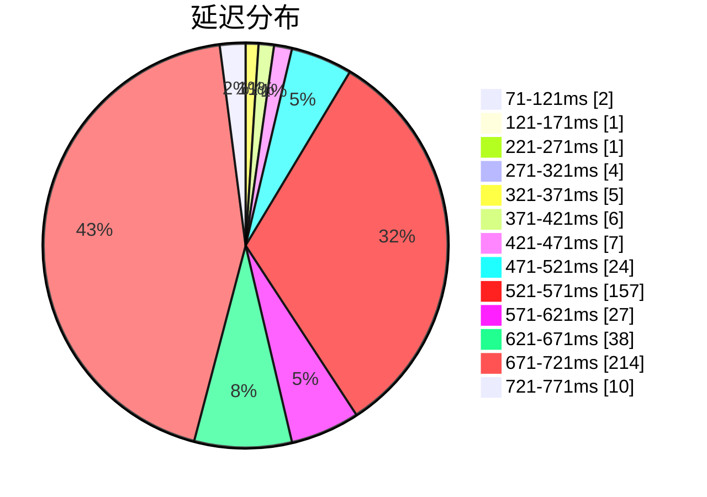
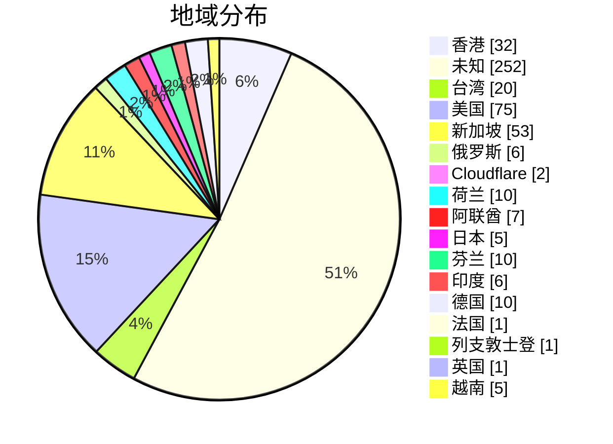
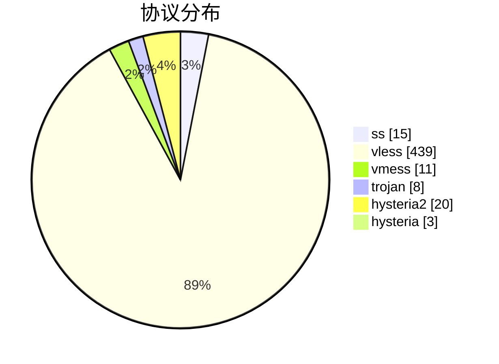

```mermaid
pie showData
title 延迟分布
"71-121ms" : 2
"121-171ms" : 1
"221-271ms" : 1
"271-321ms" : 4
"321-371ms" : 5
"371-421ms" : 6
"421-471ms" : 7
"471-521ms" : 24
"521-571ms" : 157
"571-621ms" : 27
"621-671ms" : 38
"671-721ms" : 214
"721-771ms" : 10
```

```mermaid
pie showData
title 地域分布
"香港" : 32
"未知" : 252
"台湾" : 20
"美国" : 75
"新加坡" : 53
"俄罗斯" : 6
"Cloudflare" : 2
"荷兰" : 10
"阿联酋" : 7
"日本" : 5
"芬兰" : 10
"印度" : 6
"德国" : 10
"法国" : 1
"列支敦士登" : 1
"英国" : 1
"越南" : 5
```

```mermaid
pie showData
title 协议分布
"ss" : 15
"vless" : 439
"vmess" : 11
"trojan" : 8
"hysteria2" : 20
"hysteria" : 3
```