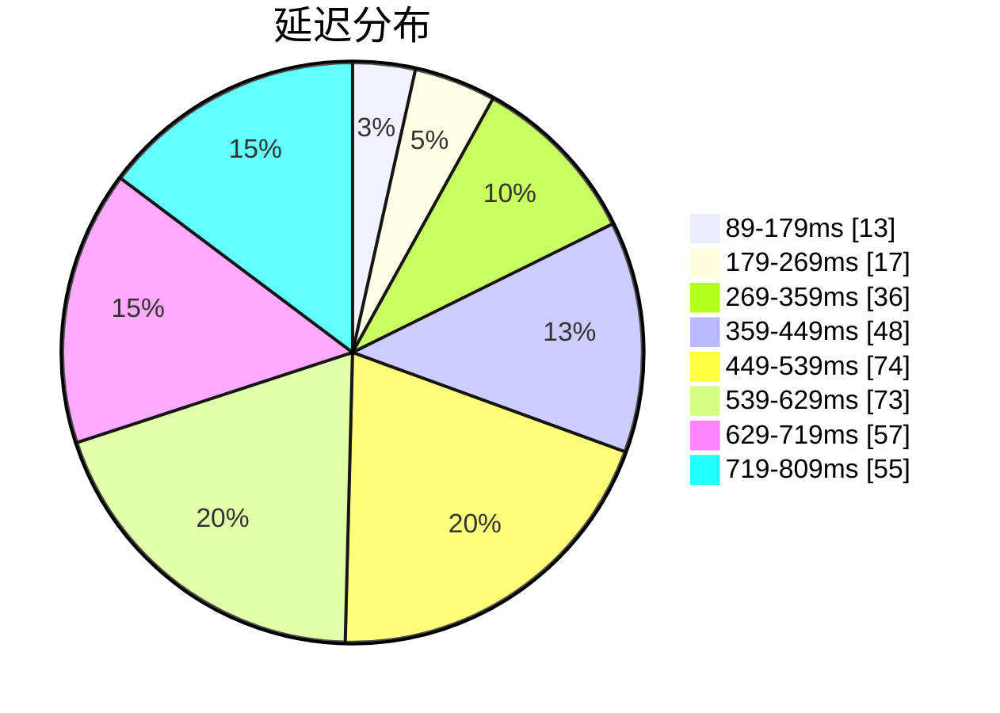
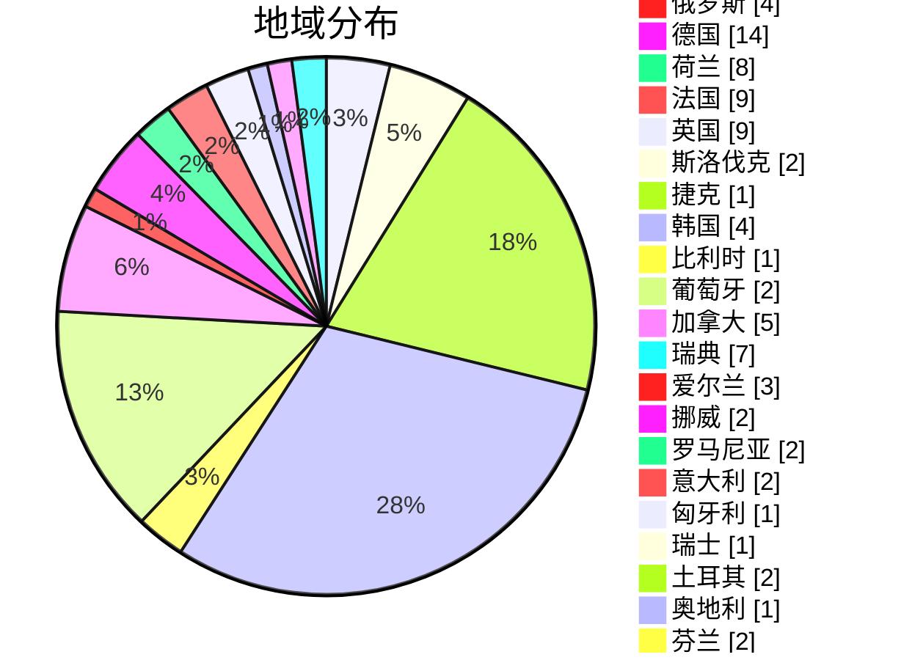
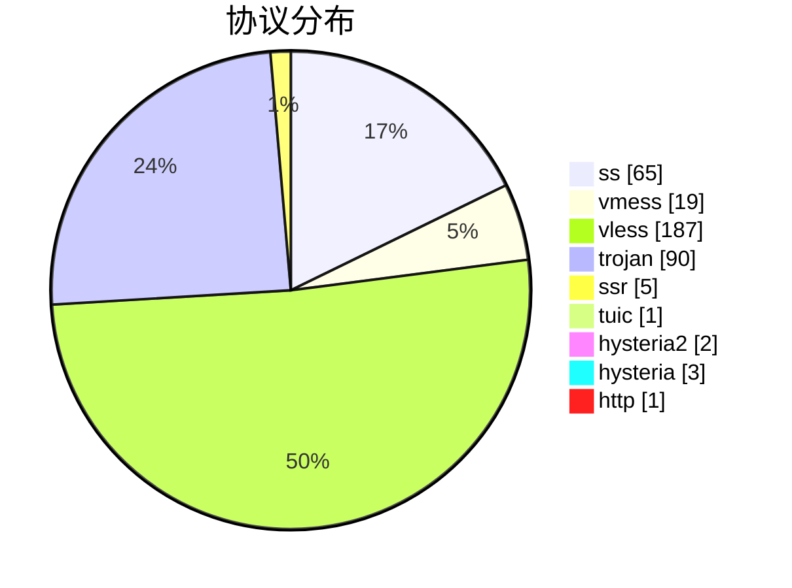

```mermaid
pie showData
title 延迟分布
"89-179ms" : 13
"179-269ms" : 17
"269-359ms" : 36
"359-449ms" : 48
"449-539ms" : 74
"539-629ms" : 73
"629-719ms" : 57
"719-809ms" : 55
```

```mermaid
pie showData
title 地域分布
"香港" : 13
"日本" : 17
"未知" : 68
"美国" : 103
"新加坡" : 10
"台湾" : 47
"波兰" : 22
"Cloudflare" : 1
"俄罗斯" : 4
"德国" : 14
"荷兰" : 8
"法国" : 9
"英国" : 9
"斯洛伐克" : 2
"捷克" : 1
"韩国" : 4
"比利时" : 1
"葡萄牙" : 2
"加拿大" : 5
"瑞典" : 7
"爱尔兰" : 3
"挪威" : 2
"罗马尼亚" : 2
"意大利" : 2
"匈牙利" : 1
"瑞士" : 1
"土耳其" : 2
"奥地利" : 1
"芬兰" : 2
"西班牙" : 1
"哥伦比亚" : 1
"乌克兰" : 1
"拉脱维亚" : 1
"立陶宛" : 1
"爱沙尼亚" : 1
"孟加拉国" : 3
"印度" : 1
```

```mermaid
pie showData
title 协议分布
"ss" : 65
"vmess" : 19
"vless" : 187
"trojan" : 90
"ssr" : 5
"tuic" : 1
"hysteria2" : 2
"hysteria" : 3
"http" : 1
```