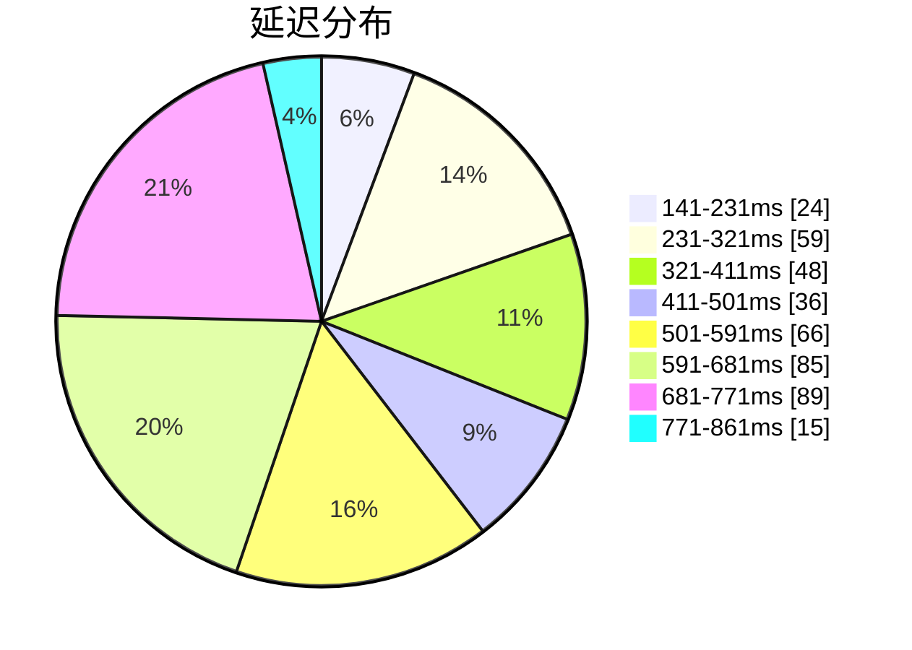
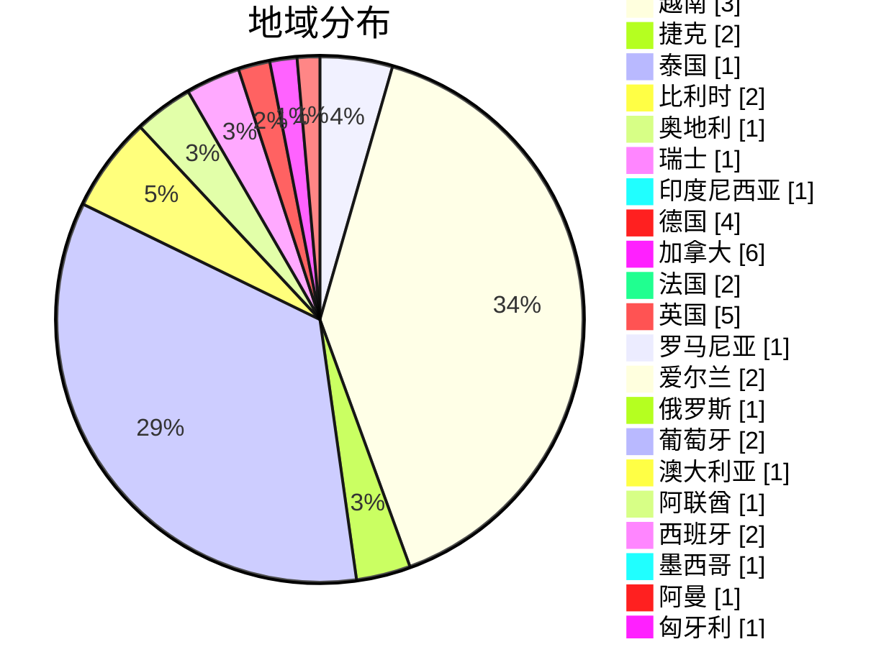
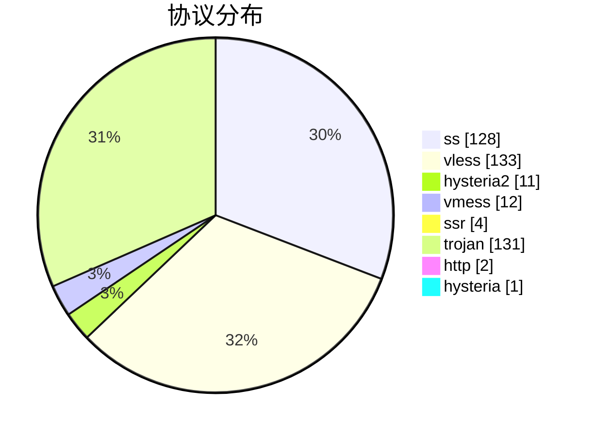

```mermaid
pie showData
title 延迟分布
"141-231ms" : 24
"231-321ms" : 59
"321-411ms" : 48
"411-501ms" : 36
"501-591ms" : 66
"591-681ms" : 85
"681-771ms" : 89
"771-861ms" : 15
```

```mermaid
pie showData
title 地域分布
"香港" : 16
"未知" : 144
"日本" : 12
"台湾" : 124
"波兰" : 21
"美国" : 13
"新加坡" : 12
"印度" : 3
"韩国" : 7
"瑞典" : 2
"荷兰" : 2
"Cloudflare" : 4
"菲律宾" : 2
"越南" : 3
"捷克" : 2
"泰国" : 1
"比利时" : 2
"奥地利" : 1
"瑞士" : 1
"印度尼西亚" : 1
"德国" : 4
"加拿大" : 6
"法国" : 2
"英国" : 5
"罗马尼亚" : 1
"爱尔兰" : 2
"俄罗斯" : 1
"葡萄牙" : 2
"澳大利亚" : 1
"阿联酋" : 1
"西班牙" : 2
"墨西哥" : 1
"阿曼" : 1
"匈牙利" : 1
"丹麦" : 1
"斯洛伐克" : 2
"芬兰" : 2
"卡塔尔" : 1
"土耳其" : 3
"意大利" : 1
"乌克兰" : 2
"爱沙尼亚" : 1
"冰岛" : 1
"孟加拉国" : 2
"挪威" : 1
"拉脱维亚" : 1
"立陶宛" : 1
```

```mermaid
pie showData
title 协议分布
"ss" : 128
"vless" : 133
"hysteria2" : 11
"vmess" : 12
"ssr" : 4
"trojan" : 131
"http" : 2
"hysteria" : 1
```