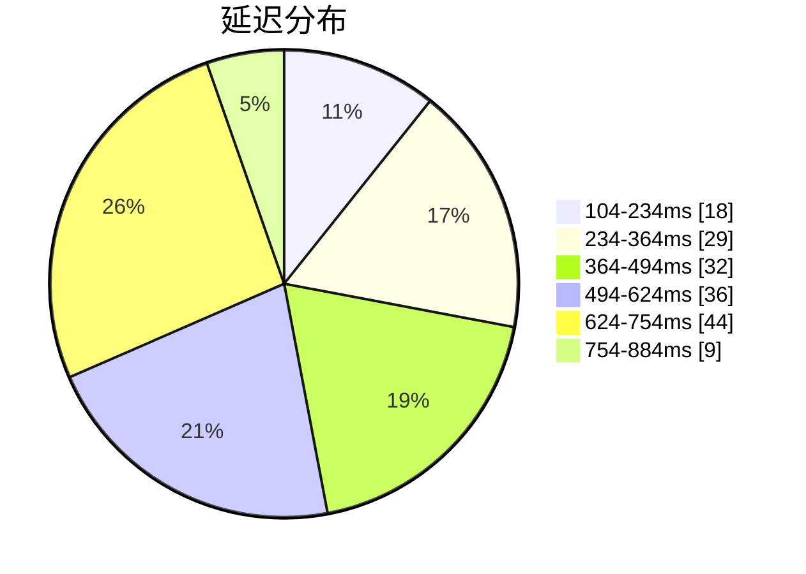
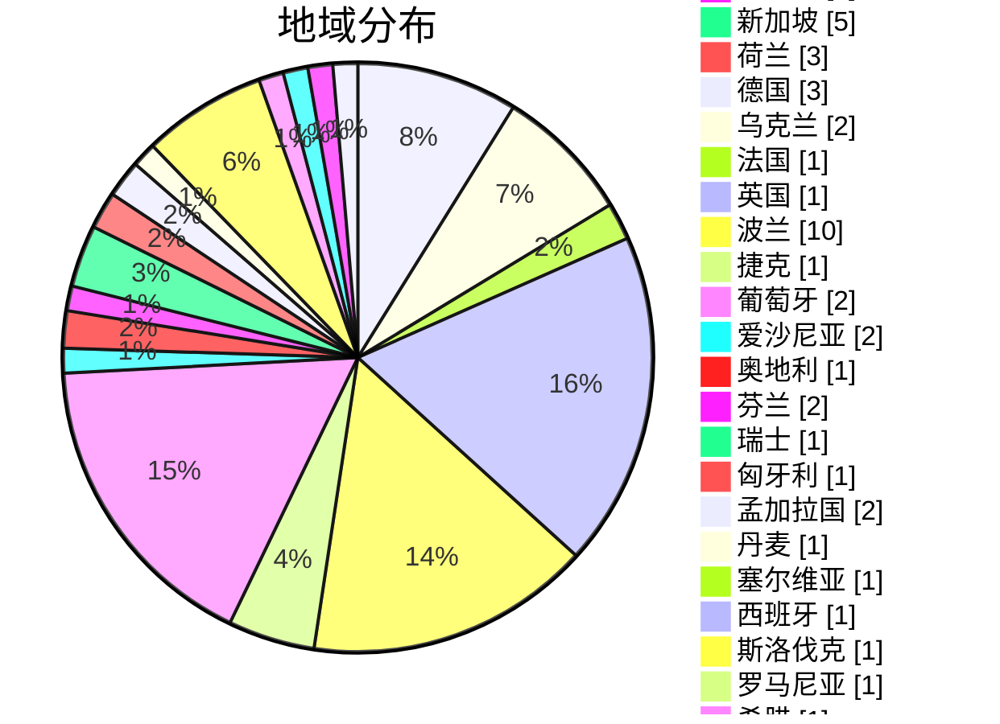
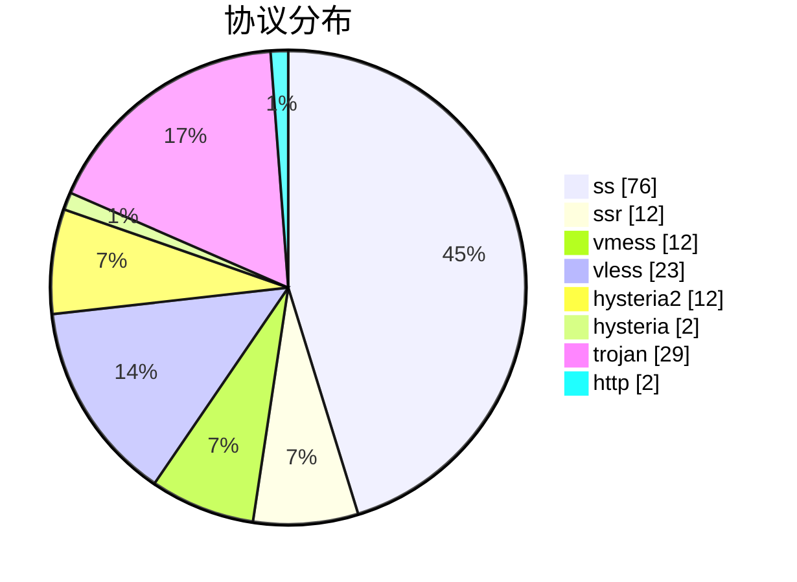

```mermaid
pie showData
title 延迟分布
"104-234ms" : 18
"234-364ms" : 29
"364-494ms" : 32
"494-624ms" : 36
"624-754ms" : 44
"754-884ms" : 9
```

```mermaid
pie showData
title 地域分布
"香港" : 13
"日本" : 11
"中国" : 3
"未知" : 27
"美国" : 23
"韩国" : 7
"台湾" : 25
"印度" : 2
"Cloudflare" : 3
"俄罗斯" : 2
"新加坡" : 5
"荷兰" : 3
"德国" : 3
"乌克兰" : 2
"法国" : 1
"英国" : 1
"波兰" : 10
"捷克" : 1
"葡萄牙" : 2
"爱沙尼亚" : 2
"奥地利" : 1
"芬兰" : 2
"瑞士" : 1
"匈牙利" : 1
"孟加拉国" : 2
"丹麦" : 1
"塞尔维亚" : 1
"西班牙" : 1
"斯洛伐克" : 1
"罗马尼亚" : 1
"希腊" : 1
"爱尔兰" : 1
"冰岛" : 1
"保加利亚" : 1
"哈萨克斯坦" : 1
"塞浦路斯" : 1
"挪威" : 1
"拉脱维亚" : 1
"摩尔多瓦" : 1
"立陶宛" : 1
```

```mermaid
pie showData
title 协议分布
"ss" : 76
"ssr" : 12
"vmess" : 12
"vless" : 23
"hysteria2" : 12
"hysteria" : 2
"trojan" : 29
"http" : 2
```