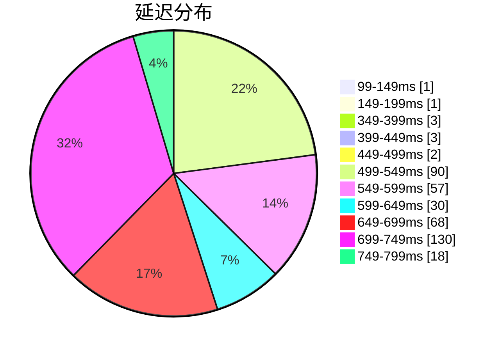
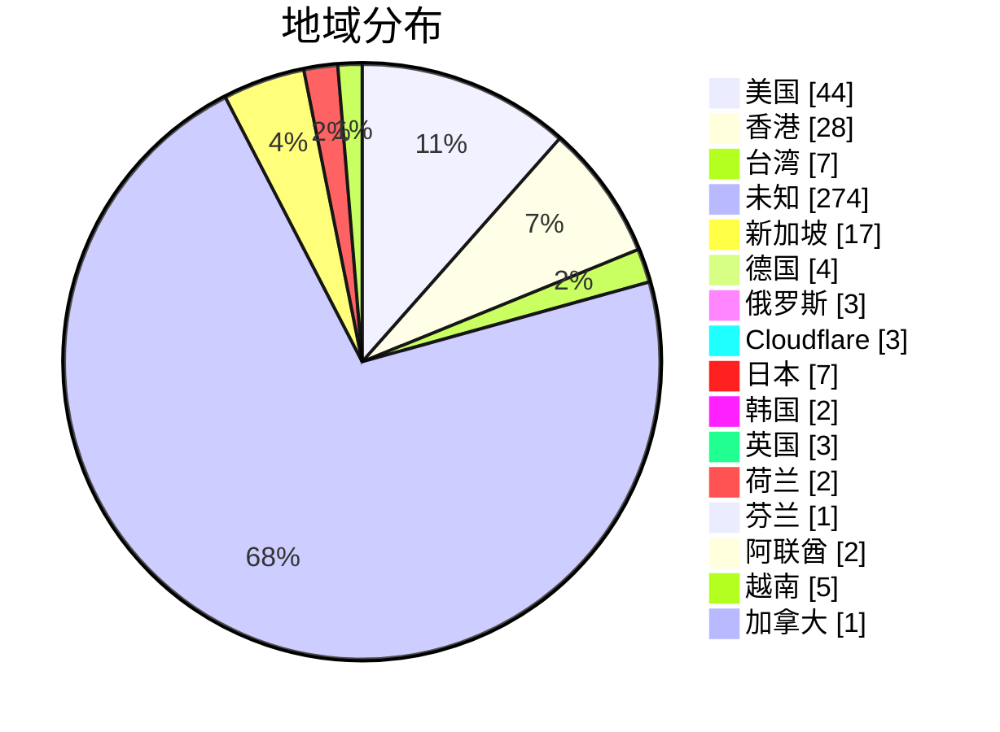
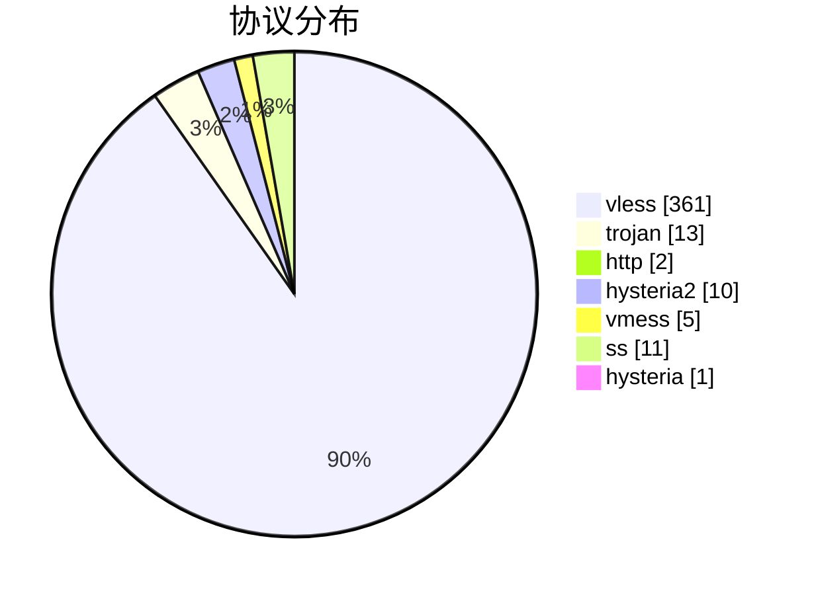

```mermaid
pie showData
title 延迟分布
"99-149ms" : 1
"149-199ms" : 1
"349-399ms" : 3
"399-449ms" : 3
"449-499ms" : 2
"499-549ms" : 90
"549-599ms" : 57
"599-649ms" : 30
"649-699ms" : 68
"699-749ms" : 130
"749-799ms" : 18
```

```mermaid
pie showData
title 地域分布
"美国" : 44
"香港" : 28
"台湾" : 7
"未知" : 274
"新加坡" : 17
"德国" : 4
"俄罗斯" : 3
"Cloudflare" : 3
"日本" : 7
"韩国" : 2
"英国" : 3
"荷兰" : 2
"芬兰" : 1
"阿联酋" : 2
"越南" : 5
"加拿大" : 1
```

```mermaid
pie showData
title 协议分布
"vless" : 361
"trojan" : 13
"http" : 2
"hysteria2" : 10
"vmess" : 5
"ss" : 11
"hysteria" : 1
```