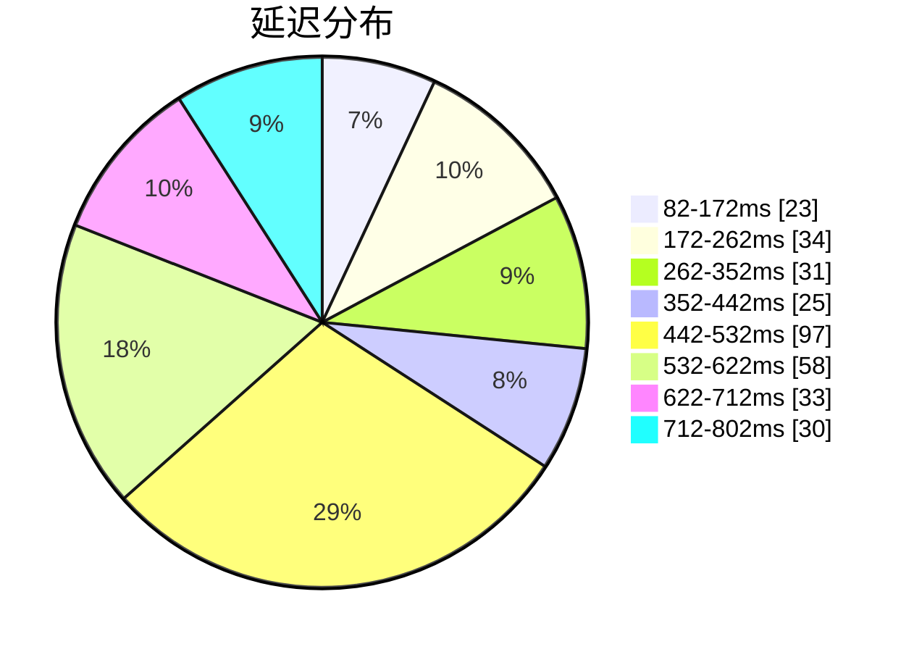
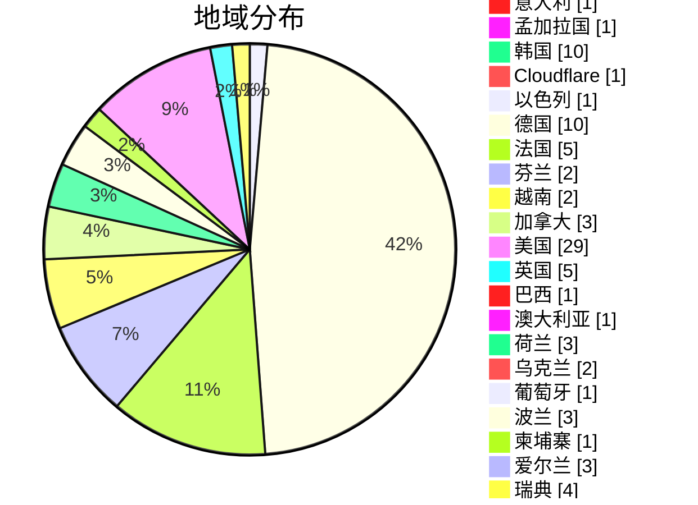
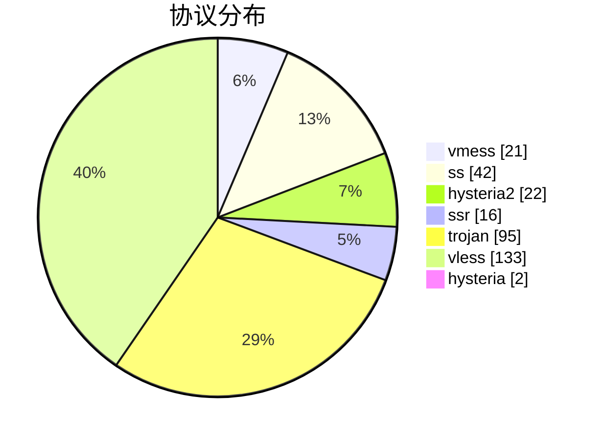

```mermaid
pie showData
title 延迟分布
"82-172ms" : 23
"172-262ms" : 34
"262-352ms" : 31
"352-442ms" : 25
"442-532ms" : 97
"532-622ms" : 58
"622-712ms" : 33
"712-802ms" : 30
```

```mermaid
pie showData
title 地域分布
"中国" : 4
"未知" : 138
"台湾" : 36
"日本" : 22
"香港" : 16
"新加坡" : 12
"俄罗斯" : 2
"泰国" : 2
"意大利" : 1
"孟加拉国" : 1
"韩国" : 10
"Cloudflare" : 1
"以色列" : 1
"德国" : 10
"法国" : 5
"芬兰" : 2
"越南" : 2
"加拿大" : 3
"美国" : 29
"英国" : 5
"巴西" : 1
"澳大利亚" : 1
"荷兰" : 3
"乌克兰" : 2
"葡萄牙" : 1
"波兰" : 3
"柬埔寨" : 1
"爱尔兰" : 3
"瑞典" : 4
"比利时" : 1
"塞浦路斯" : 1
"墨西哥" : 1
"捷克" : 1
"哈萨克斯坦" : 1
"厄瓜多尔" : 1
"斯洛文尼亚" : 1
"印度" : 3
```

```mermaid
pie showData
title 协议分布
"vmess" : 21
"ss" : 42
"hysteria2" : 22
"ssr" : 16
"trojan" : 95
"vless" : 133
"hysteria" : 2
```