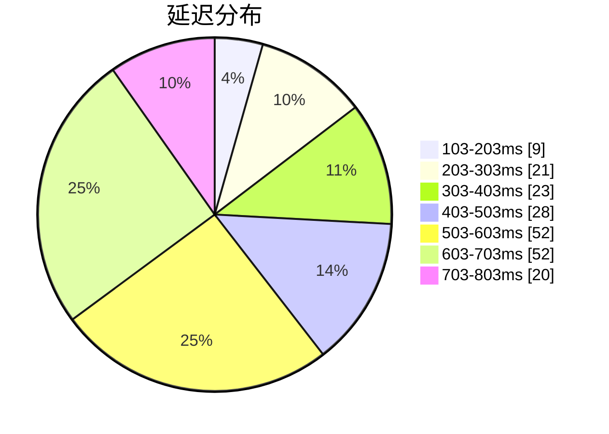
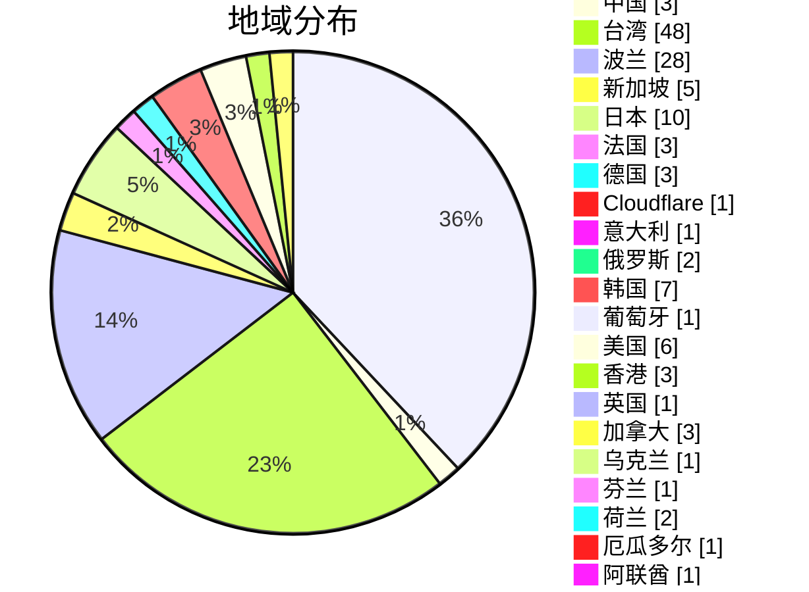
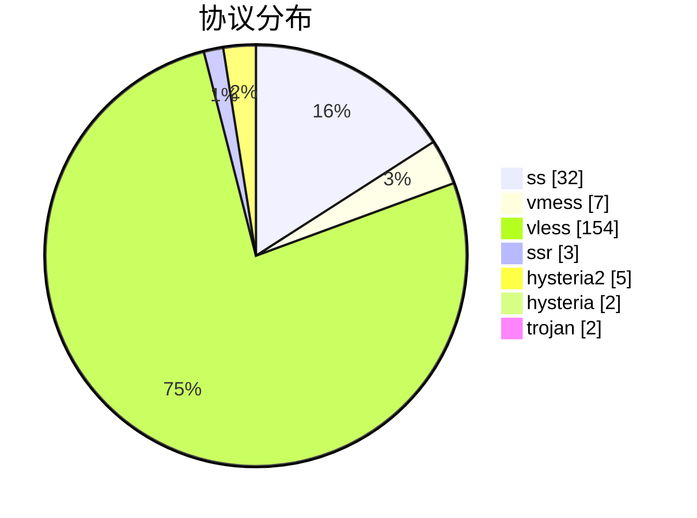

```mermaid
pie showData
title 延迟分布
"103-203ms" : 9
"203-303ms" : 21
"303-403ms" : 23
"403-503ms" : 28
"503-603ms" : 52
"603-703ms" : 52
"703-803ms" : 20
```

```mermaid
pie showData
title 地域分布
"未知" : 73
"中国" : 3
"台湾" : 48
"波兰" : 28
"新加坡" : 5
"日本" : 10
"法国" : 3
"德国" : 3
"Cloudflare" : 1
"意大利" : 1
"俄罗斯" : 2
"韩国" : 7
"葡萄牙" : 1
"美国" : 6
"香港" : 3
"英国" : 1
"加拿大" : 3
"乌克兰" : 1
"芬兰" : 1
"荷兰" : 2
"厄瓜多尔" : 1
"阿联酋" : 1
"爱沙尼亚" : 1
```

```mermaid
pie showData
title 协议分布
"ss" : 32
"vmess" : 7
"vless" : 154
"ssr" : 3
"hysteria2" : 5
"hysteria" : 2
"trojan" : 2
```