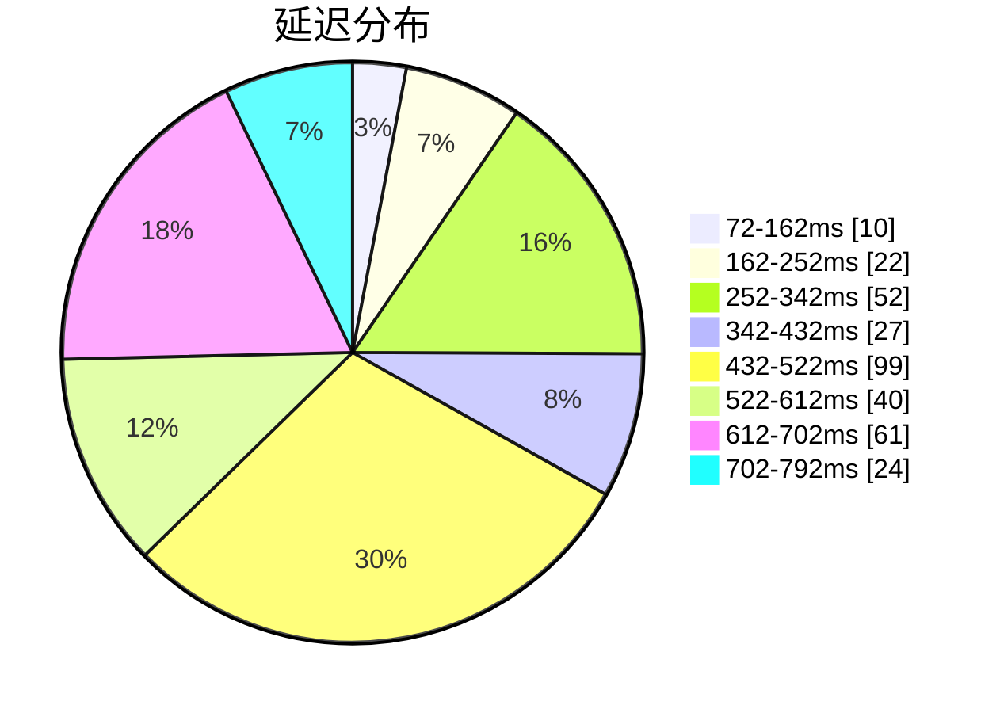
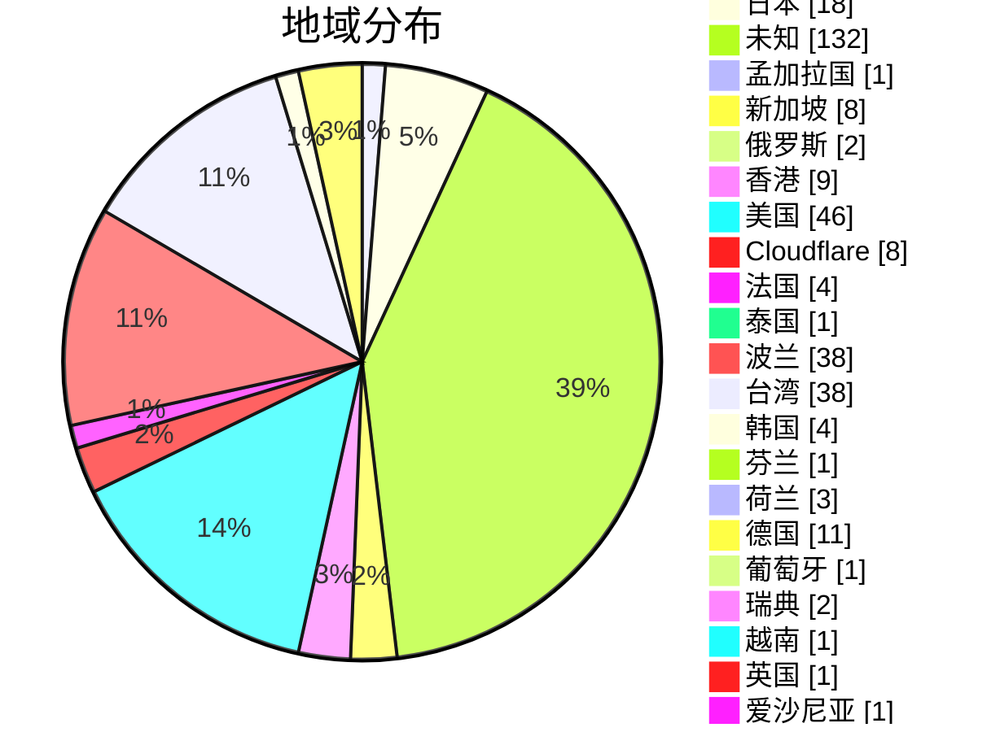
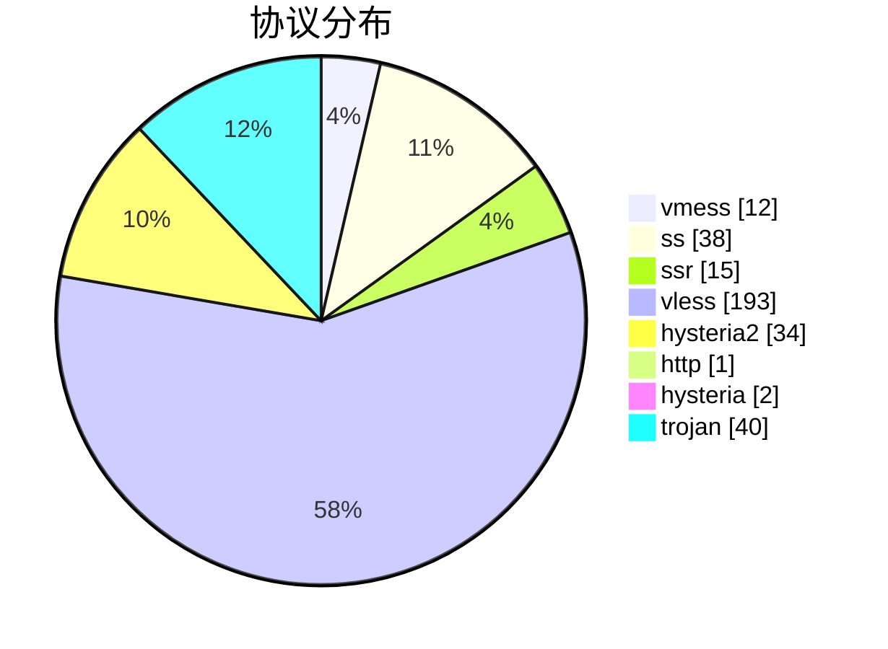

```mermaid
pie showData
title 延迟分布
"72-162ms" : 10
"162-252ms" : 22
"252-342ms" : 52
"342-432ms" : 27
"432-522ms" : 99
"522-612ms" : 40
"612-702ms" : 61
"702-792ms" : 24
```

```mermaid
pie showData
title 地域分布
"中国" : 4
"日本" : 18
"未知" : 132
"孟加拉国" : 1
"新加坡" : 8
"俄罗斯" : 2
"香港" : 9
"美国" : 46
"Cloudflare" : 8
"法国" : 4
"泰国" : 1
"波兰" : 38
"台湾" : 38
"韩国" : 4
"芬兰" : 1
"荷兰" : 3
"德国" : 11
"葡萄牙" : 1
"瑞典" : 2
"越南" : 1
"英国" : 1
"爱沙尼亚" : 1
"拉脱维亚" : 1
```

```mermaid
pie showData
title 协议分布
"vmess" : 12
"ss" : 38
"ssr" : 15
"vless" : 193
"hysteria2" : 34
"http" : 1
"hysteria" : 2
"trojan" : 40
```