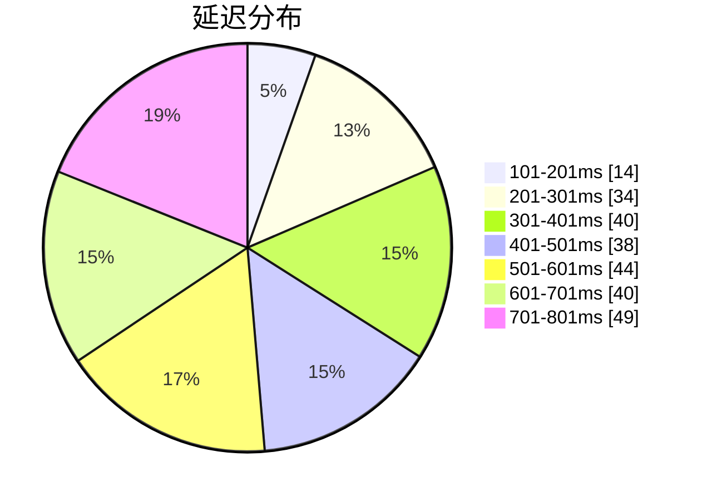
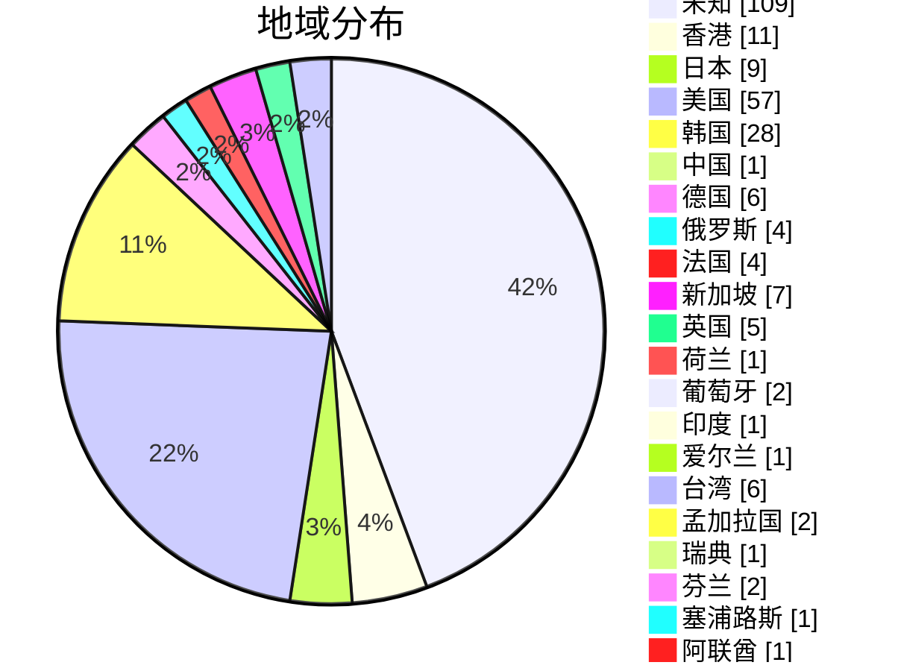
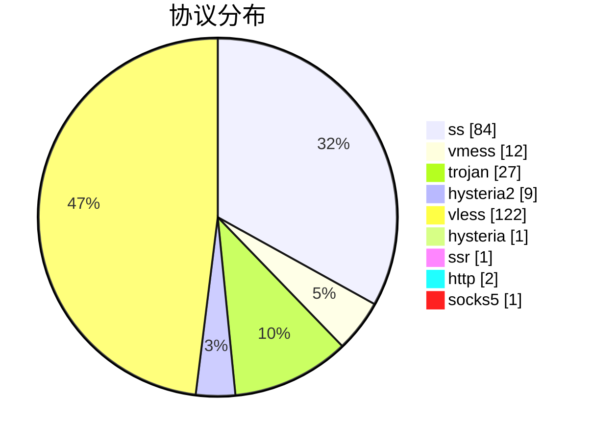

```mermaid
pie showData
title 延迟分布
"101-201ms" : 14
"201-301ms" : 34
"301-401ms" : 40
"401-501ms" : 38
"501-601ms" : 44
"601-701ms" : 40
"701-801ms" : 49
```

```mermaid
pie showData
title 地域分布
"未知" : 109
"香港" : 11
"日本" : 9
"美国" : 57
"韩国" : 28
"中国" : 1
"德国" : 6
"俄罗斯" : 4
"法国" : 4
"新加坡" : 7
"英国" : 5
"荷兰" : 1
"葡萄牙" : 2
"印度" : 1
"爱尔兰" : 1
"台湾" : 6
"孟加拉国" : 2
"瑞典" : 1
"芬兰" : 2
"塞浦路斯" : 1
"阿联酋" : 1
```

```mermaid
pie showData
title 协议分布
"ss" : 84
"vmess" : 12
"trojan" : 27
"hysteria2" : 9
"vless" : 122
"hysteria" : 1
"ssr" : 1
"http" : 2
"socks5" : 1
```