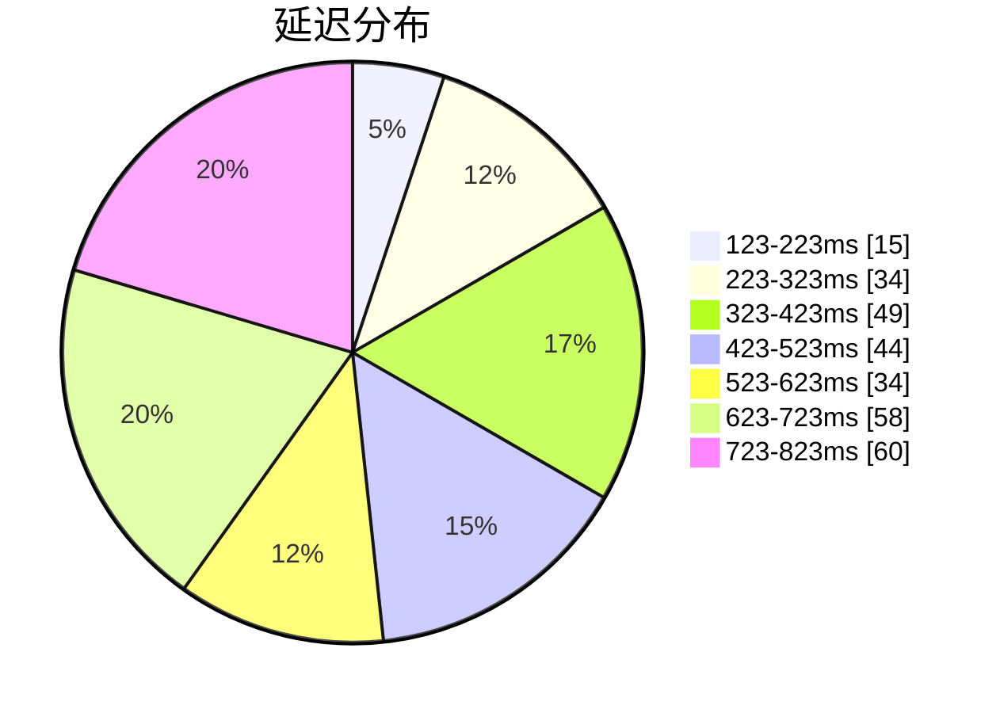
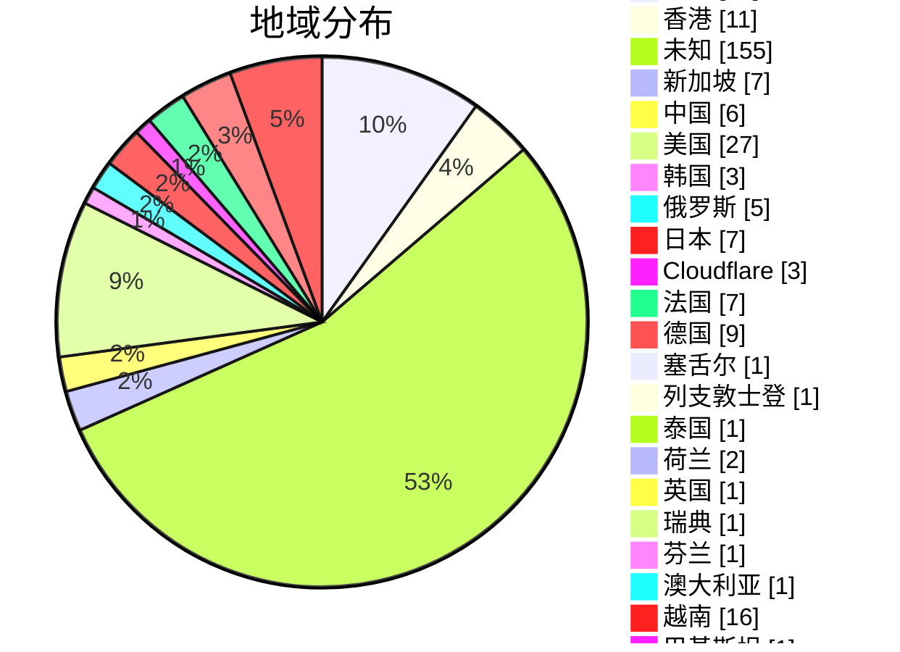
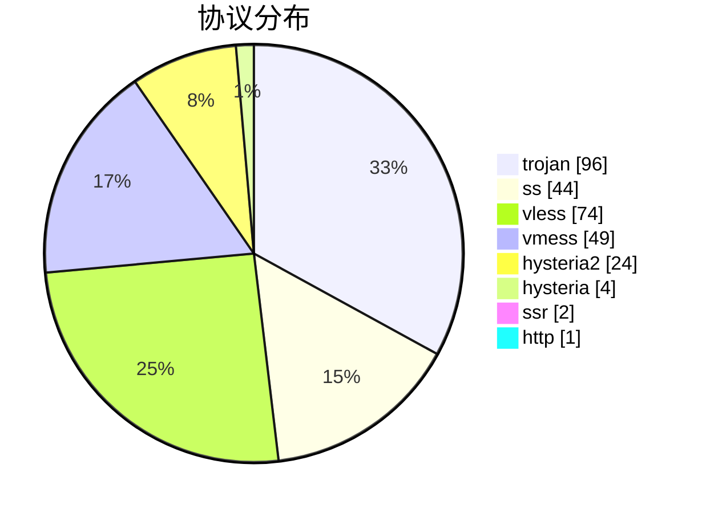

```mermaid
pie showData
title 延迟分布
"123-223ms" : 15
"223-323ms" : 34
"323-423ms" : 49
"423-523ms" : 44
"523-623ms" : 34
"623-723ms" : 58
"723-823ms" : 60
```

```mermaid
pie showData
title 地域分布
"台湾" : 28
"香港" : 11
"未知" : 155
"新加坡" : 7
"中国" : 6
"美国" : 27
"韩国" : 3
"俄罗斯" : 5
"日本" : 7
"Cloudflare" : 3
"法国" : 7
"德国" : 9
"塞舌尔" : 1
"列支敦士登" : 1
"泰国" : 1
"荷兰" : 2
"英国" : 1
"瑞典" : 1
"芬兰" : 1
"澳大利亚" : 1
"越南" : 16
"巴基斯坦" : 1
```

```mermaid
pie showData
title 协议分布
"trojan" : 96
"ss" : 44
"vless" : 74
"vmess" : 49
"hysteria2" : 24
"hysteria" : 4
"ssr" : 2
"http" : 1
```