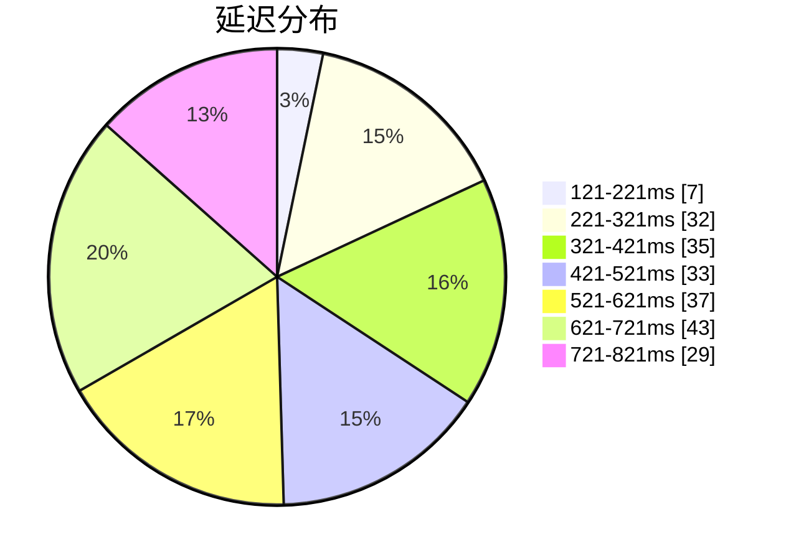
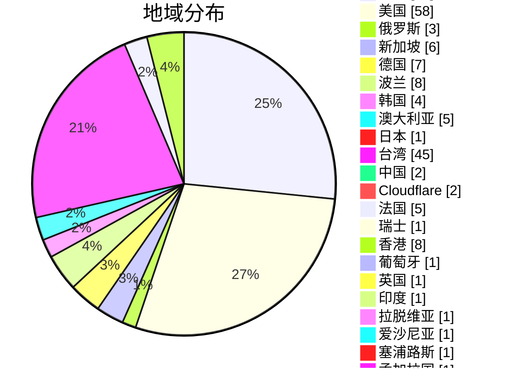
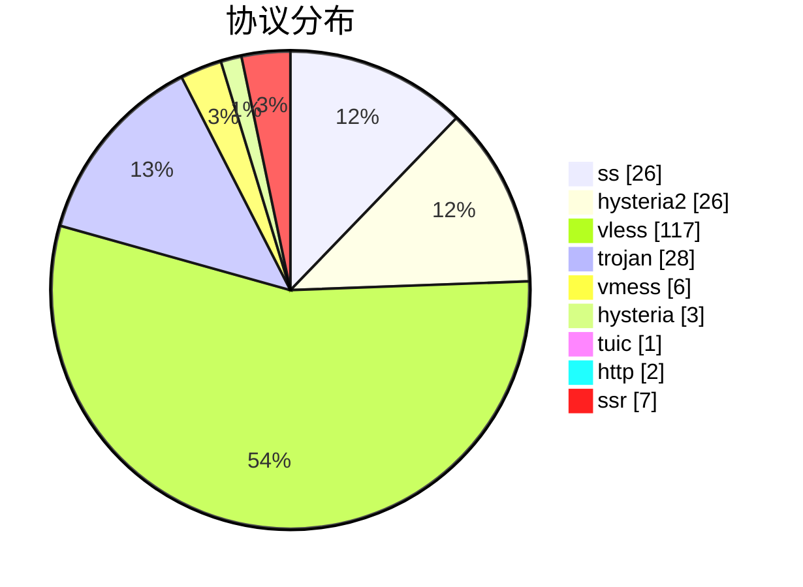

```mermaid
pie showData
title 延迟分布
"121-221ms" : 7
"221-321ms" : 32
"321-421ms" : 35
"421-521ms" : 33
"521-621ms" : 37
"621-721ms" : 43
"721-821ms" : 29
```

```mermaid
pie showData
title 地域分布
"未知" : 54
"美国" : 58
"俄罗斯" : 3
"新加坡" : 6
"德国" : 7
"波兰" : 8
"韩国" : 4
"澳大利亚" : 5
"日本" : 1
"台湾" : 45
"中国" : 2
"Cloudflare" : 2
"法国" : 5
"瑞士" : 1
"香港" : 8
"葡萄牙" : 1
"英国" : 1
"印度" : 1
"拉脱维亚" : 1
"爱沙尼亚" : 1
"塞浦路斯" : 1
"孟加拉国" : 1
```

```mermaid
pie showData
title 协议分布
"ss" : 26
"hysteria2" : 26
"vless" : 117
"trojan" : 28
"vmess" : 6
"hysteria" : 3
"tuic" : 1
"http" : 2
"ssr" : 7
```