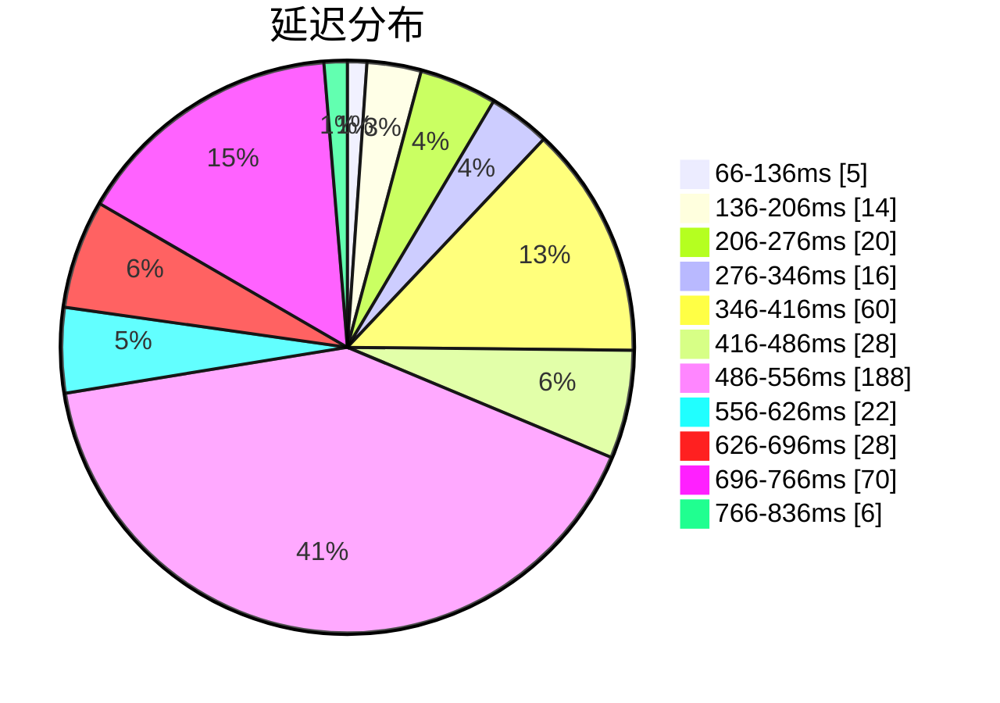
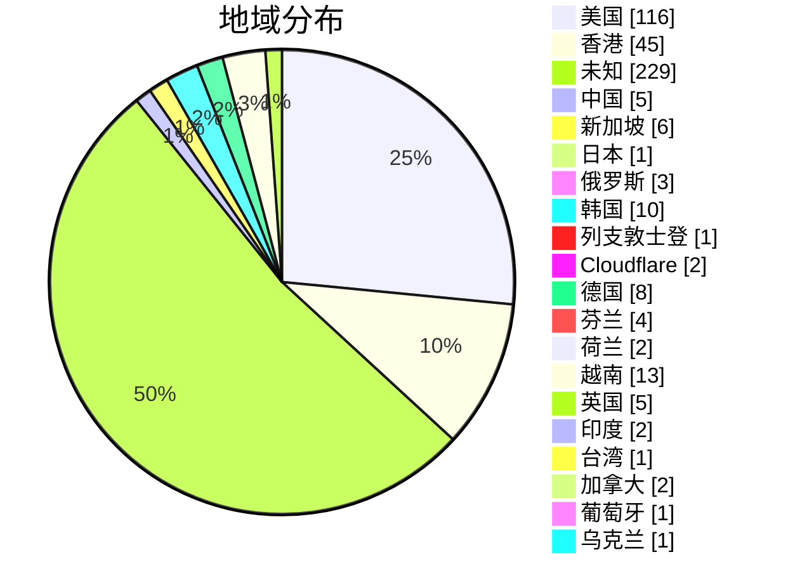
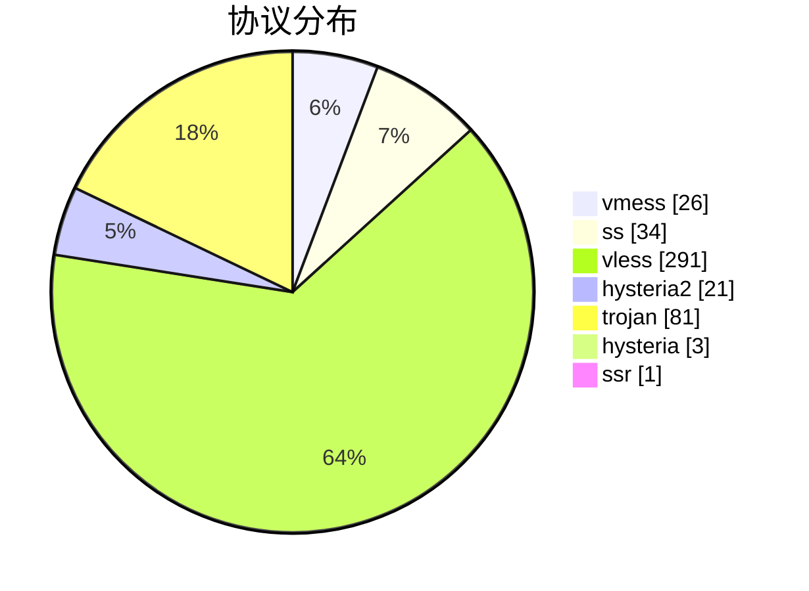

```mermaid
pie showData
title 延迟分布
"66-136ms" : 5
"136-206ms" : 14
"206-276ms" : 20
"276-346ms" : 16
"346-416ms" : 60
"416-486ms" : 28
"486-556ms" : 188
"556-626ms" : 22
"626-696ms" : 28
"696-766ms" : 70
"766-836ms" : 6
```

```mermaid
pie showData
title 地域分布
"美国" : 116
"香港" : 45
"未知" : 229
"中国" : 5
"新加坡" : 6
"日本" : 1
"俄罗斯" : 3
"韩国" : 10
"列支敦士登" : 1
"Cloudflare" : 2
"德国" : 8
"芬兰" : 4
"荷兰" : 2
"越南" : 13
"英国" : 5
"印度" : 2
"台湾" : 1
"加拿大" : 2
"葡萄牙" : 1
"乌克兰" : 1
```

```mermaid
pie showData
title 协议分布
"vmess" : 26
"ss" : 34
"vless" : 291
"hysteria2" : 21
"trojan" : 81
"hysteria" : 3
"ssr" : 1
```