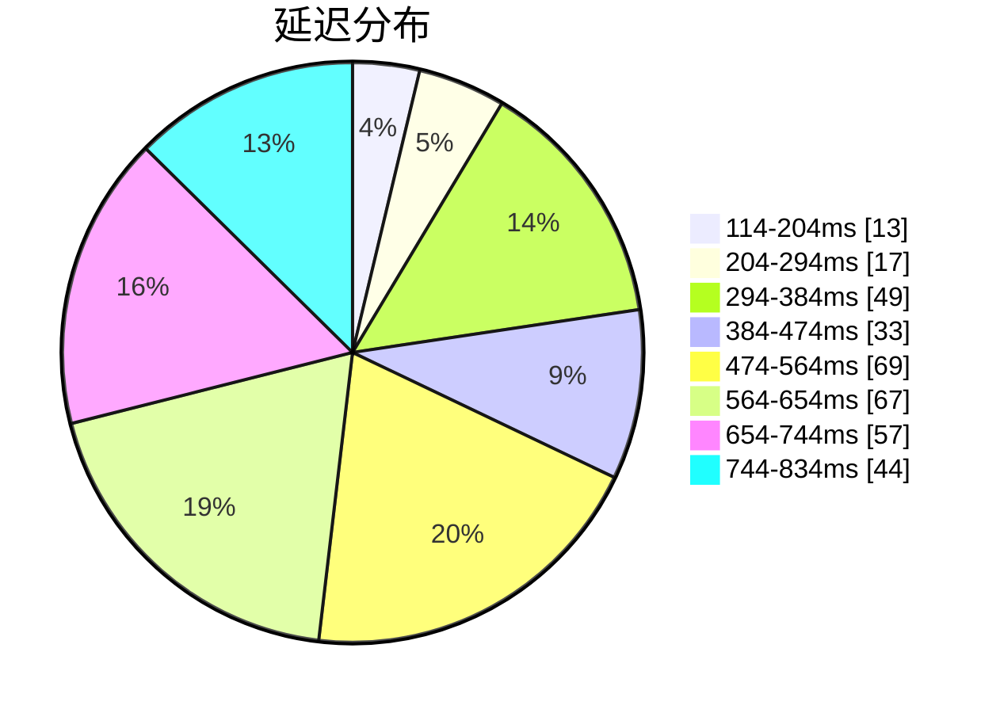
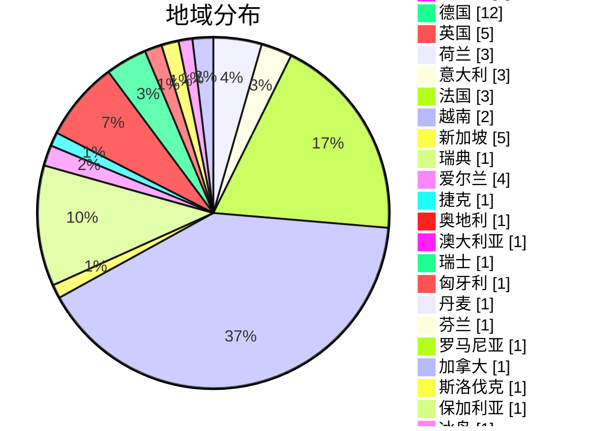
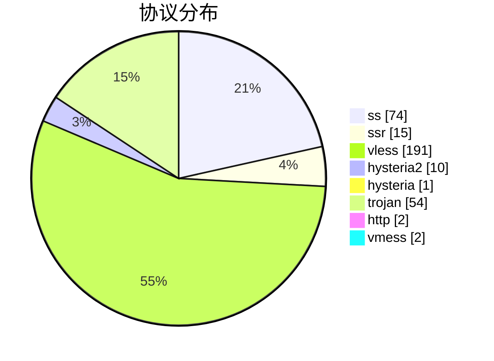

```mermaid
pie showData
title 延迟分布
"114-204ms" : 13
"204-294ms" : 17
"294-384ms" : 49
"384-474ms" : 33
"474-564ms" : 69
"564-654ms" : 67
"654-744ms" : 57
"744-834ms" : 44
```

```mermaid
pie showData
title 地域分布
"日本" : 14
"香港" : 9
"台湾" : 60
"未知" : 128
"印度" : 4
"波兰" : 35
"韩国" : 6
"Cloudflare" : 4
"美国" : 23
"俄罗斯" : 2
"德国" : 12
"英国" : 5
"荷兰" : 3
"意大利" : 3
"法国" : 3
"越南" : 2
"新加坡" : 5
"瑞典" : 1
"爱尔兰" : 4
"捷克" : 1
"奥地利" : 1
"澳大利亚" : 1
"瑞士" : 1
"匈牙利" : 1
"丹麦" : 1
"芬兰" : 1
"罗马尼亚" : 1
"加拿大" : 1
"斯洛伐克" : 1
"保加利亚" : 1
"冰岛" : 1
"乌克兰" : 1
"摩尔多瓦" : 1
"拉脱维亚" : 1
"立陶宛" : 1
"阿联酋" : 1
"爱沙尼亚" : 1
"葡萄牙" : 1
"挪威" : 1
"孟加拉国" : 6
```

```mermaid
pie showData
title 协议分布
"ss" : 74
"ssr" : 15
"vless" : 191
"hysteria2" : 10
"hysteria" : 1
"trojan" : 54
"http" : 2
"vmess" : 2
```