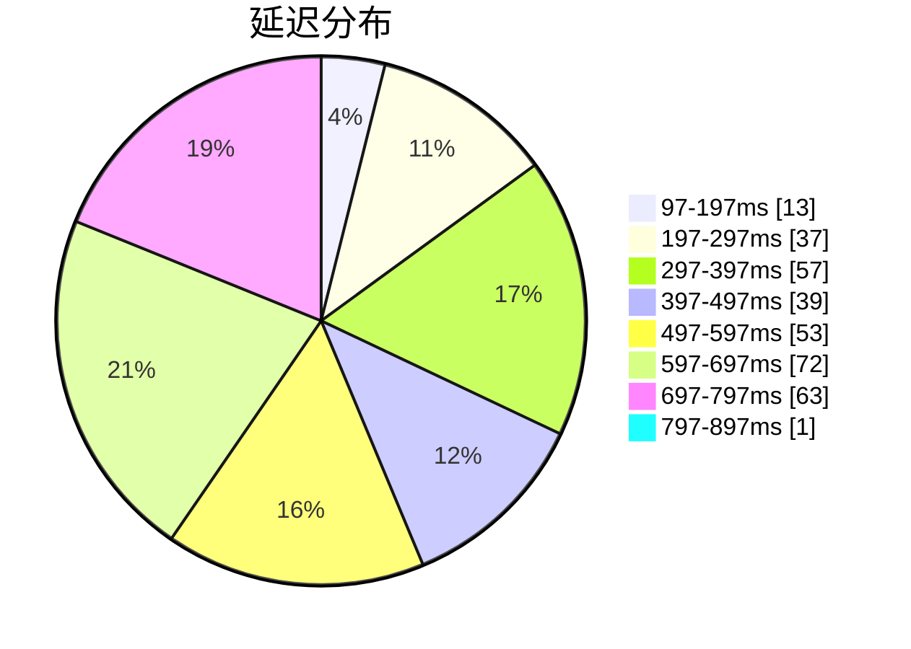
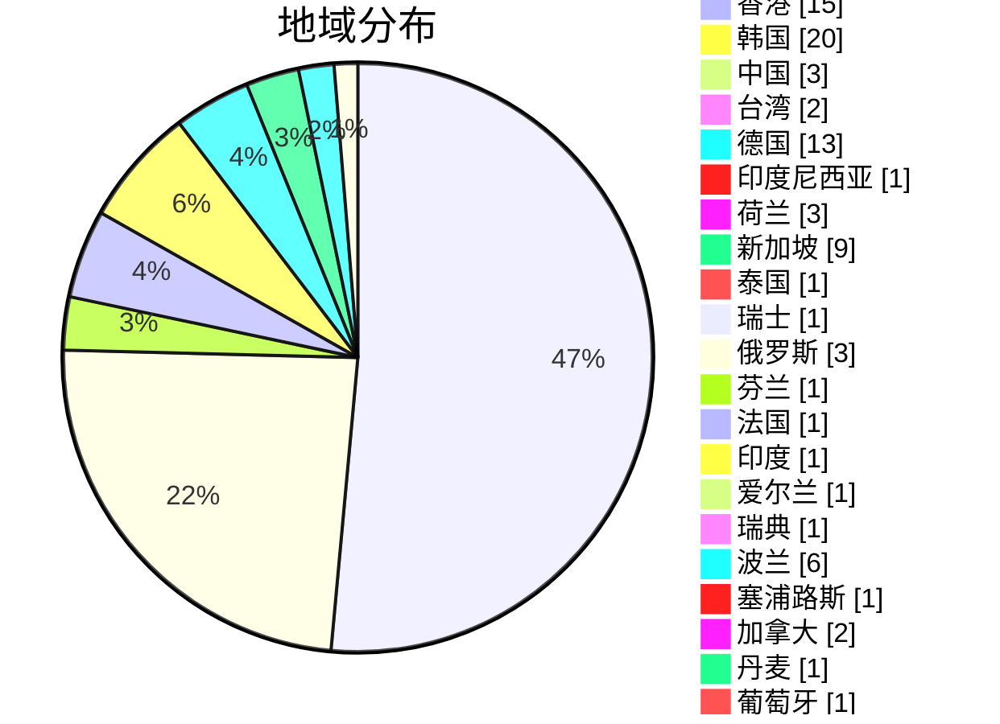
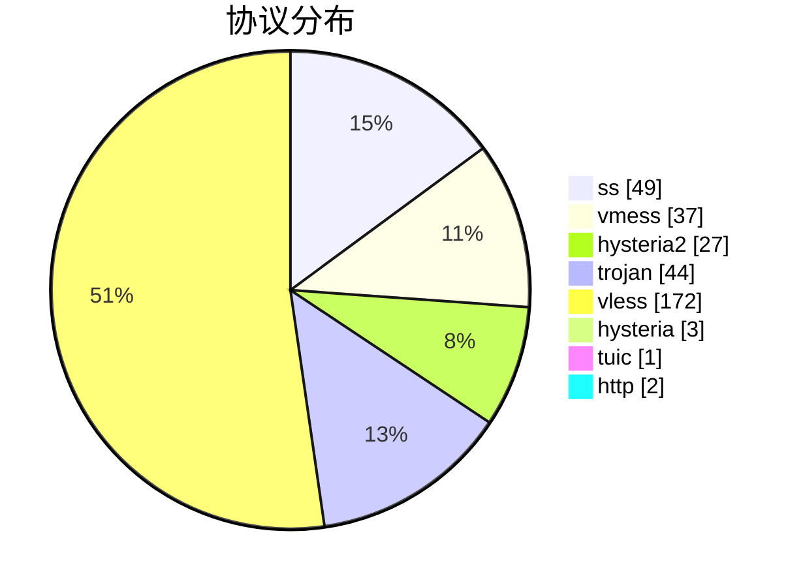

```mermaid
pie showData
title 延迟分布
"97-197ms" : 13
"197-297ms" : 37
"297-397ms" : 57
"397-497ms" : 39
"497-597ms" : 53
"597-697ms" : 72
"697-797ms" : 63
"797-897ms" : 1
```

```mermaid
pie showData
title 地域分布
"未知" : 159
"美国" : 74
"日本" : 9
"香港" : 15
"韩国" : 20
"中国" : 3
"台湾" : 2
"德国" : 13
"印度尼西亚" : 1
"荷兰" : 3
"新加坡" : 9
"泰国" : 1
"瑞士" : 1
"俄罗斯" : 3
"芬兰" : 1
"法国" : 1
"印度" : 1
"爱尔兰" : 1
"瑞典" : 1
"波兰" : 6
"塞浦路斯" : 1
"加拿大" : 2
"丹麦" : 1
"葡萄牙" : 1
"爱沙尼亚" : 1
"孟加拉国" : 4
"越南" : 1
```

```mermaid
pie showData
title 协议分布
"ss" : 49
"vmess" : 37
"hysteria2" : 27
"trojan" : 44
"vless" : 172
"hysteria" : 3
"tuic" : 1
"http" : 2
```