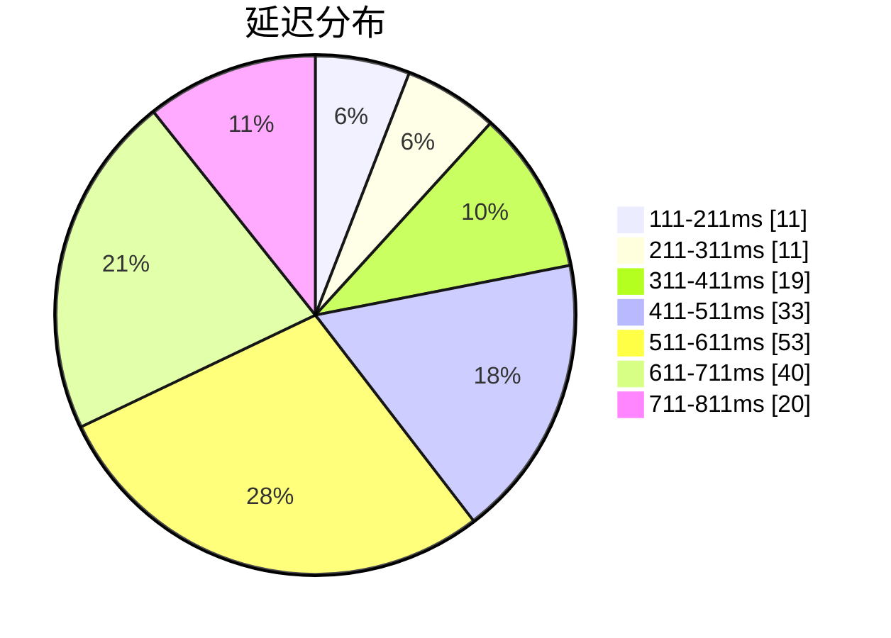
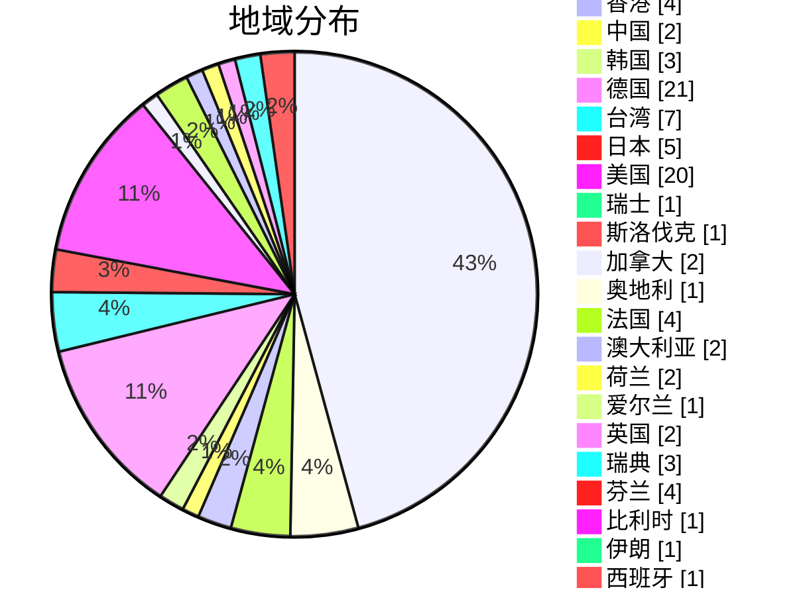
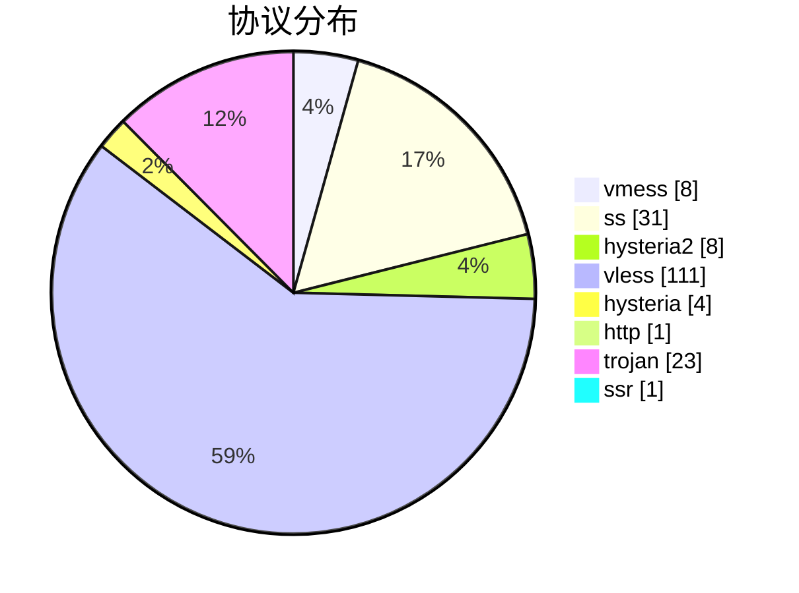

```mermaid
pie showData
title 延迟分布
"111-211ms" : 11
"211-311ms" : 11
"311-411ms" : 19
"411-511ms" : 33
"511-611ms" : 53
"611-711ms" : 40
"711-811ms" : 20
```

```mermaid
pie showData
title 地域分布
"未知" : 81
"俄罗斯" : 8
"新加坡" : 7
"香港" : 4
"中国" : 2
"韩国" : 3
"德国" : 21
"台湾" : 7
"日本" : 5
"美国" : 20
"瑞士" : 1
"斯洛伐克" : 1
"加拿大" : 2
"奥地利" : 1
"法国" : 4
"澳大利亚" : 2
"荷兰" : 2
"爱尔兰" : 1
"英国" : 2
"瑞典" : 3
"芬兰" : 4
"比利时" : 1
"伊朗" : 1
"西班牙" : 1
"墨西哥" : 1
"土耳其" : 1
"乌克兰" : 1
```

```mermaid
pie showData
title 协议分布
"vmess" : 8
"ss" : 31
"hysteria2" : 8
"vless" : 111
"hysteria" : 4
"http" : 1
"trojan" : 23
"ssr" : 1
```