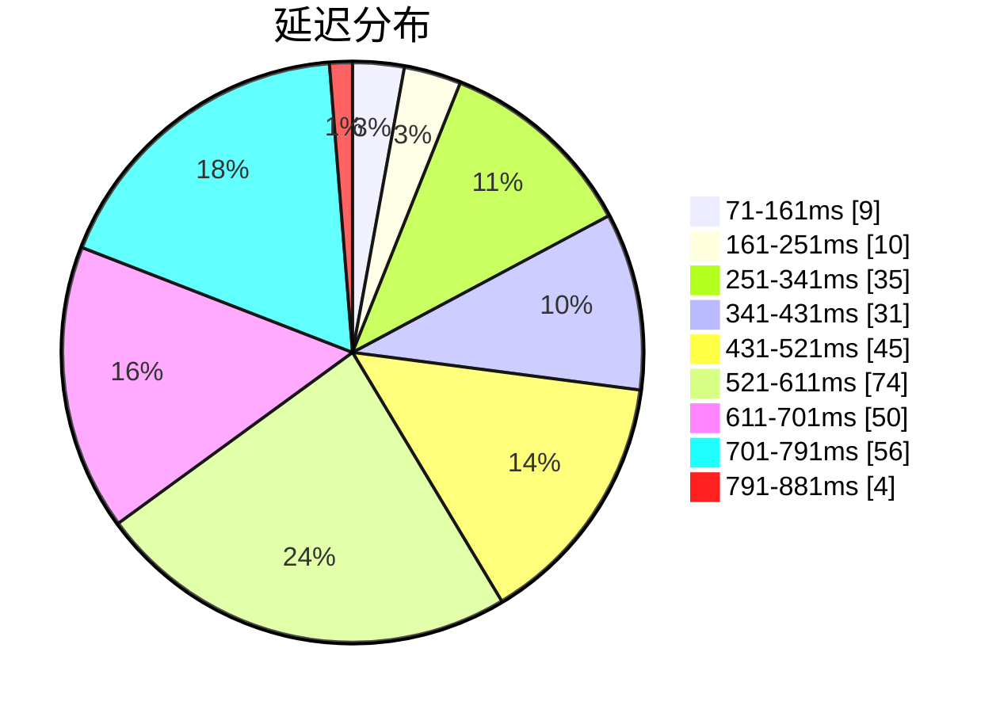
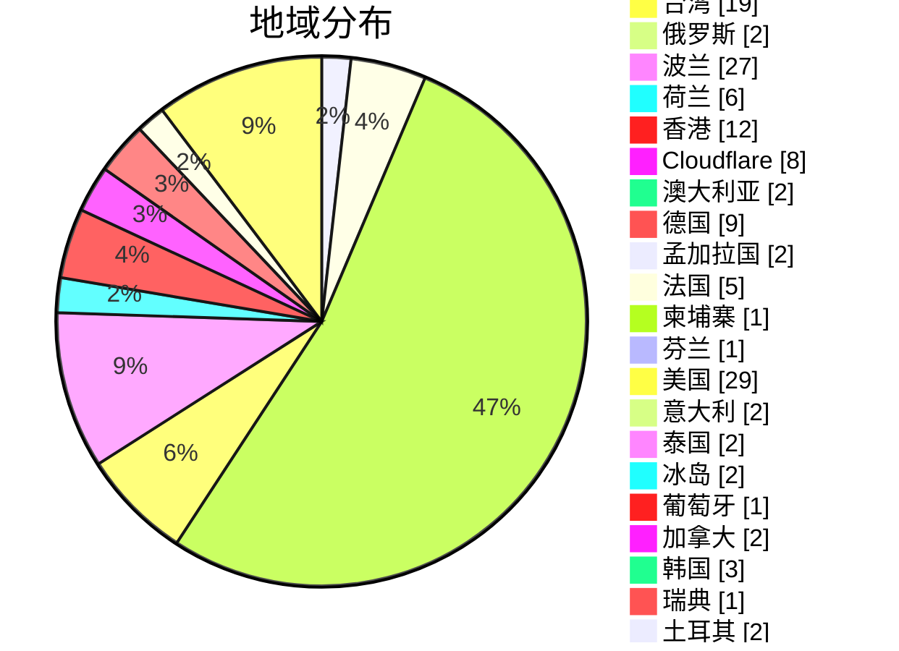
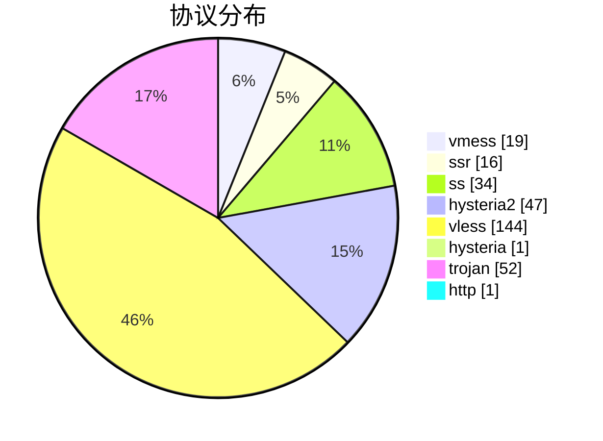

```mermaid
pie showData
title 延迟分布
"71-161ms" : 9
"161-251ms" : 10
"251-341ms" : 35
"341-431ms" : 31
"431-521ms" : 45
"521-611ms" : 74
"611-701ms" : 50
"701-791ms" : 56
"791-881ms" : 4
```

```mermaid
pie showData
title 地域分布
"中国" : 5
"日本" : 13
"未知" : 149
"新加坡" : 2
"台湾" : 19
"俄罗斯" : 2
"波兰" : 27
"荷兰" : 6
"香港" : 12
"Cloudflare" : 8
"澳大利亚" : 2
"德国" : 9
"孟加拉国" : 2
"法国" : 5
"柬埔寨" : 1
"芬兰" : 1
"美国" : 29
"意大利" : 2
"泰国" : 2
"冰岛" : 2
"葡萄牙" : 1
"加拿大" : 2
"韩国" : 3
"瑞典" : 1
"土耳其" : 2
"哈萨克斯坦" : 2
"乌克兰" : 1
"英国" : 3
"多哥" : 1
```

```mermaid
pie showData
title 协议分布
"vmess" : 19
"ssr" : 16
"ss" : 34
"hysteria2" : 47
"vless" : 144
"hysteria" : 1
"trojan" : 52
"http" : 1
```