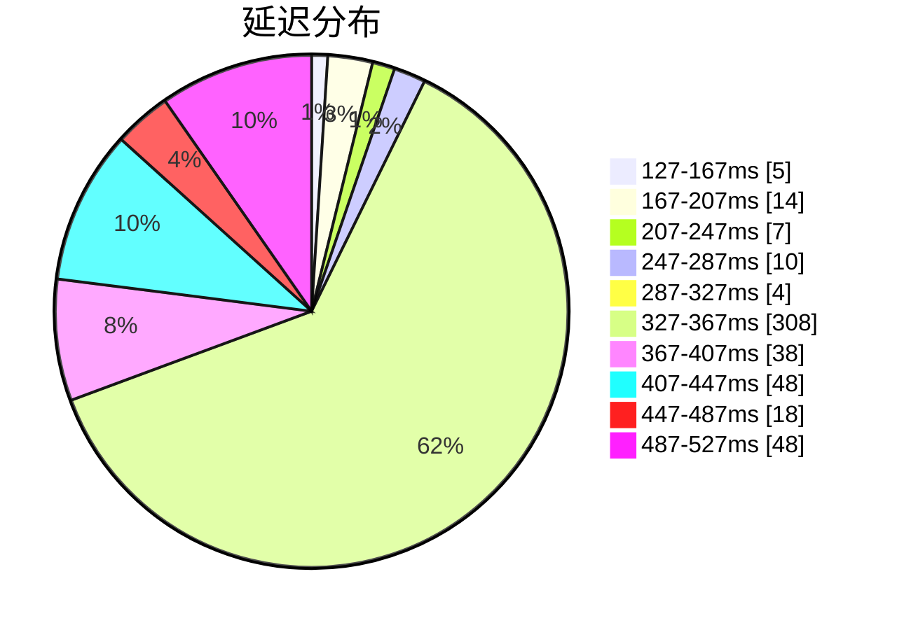
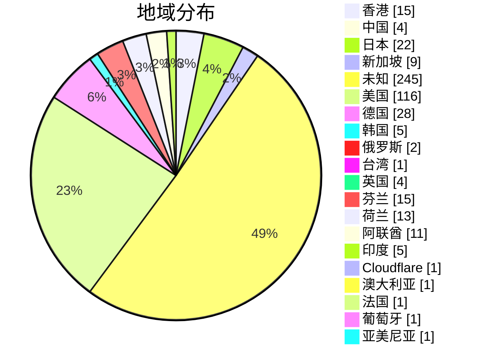

```mermaid
pie showData
title 延迟分布
"127-167ms" : 5
"167-207ms" : 14
"207-247ms" : 7
"247-287ms" : 10
"287-327ms" : 4
"327-367ms" : 308
"367-407ms" : 38
"407-447ms" : 48
"447-487ms" : 18
"487-527ms" : 48
```

```mermaid
pie showData
title 地域分布
"香港" : 15
"中国" : 4
"日本" : 22
"新加坡" : 9
"未知" : 245
"美国" : 116
"德国" : 28
"韩国" : 5
"俄罗斯" : 2
"台湾" : 1
"英国" : 4
"芬兰" : 15
"荷兰" : 13
"阿联酋" : 11
"印度" : 5
"Cloudflare" : 1
"澳大利亚" : 1
"法国" : 1
"葡萄牙" : 1
"亚美尼亚" : 1
```

```mermaid
pie showData
title 协议分布
"ss" : 20
"vmess" : 18
"hysteria2" : 11
"vless" : 444
"trojan" : 3
"hysteria" : 3
"ssr" : 1
```