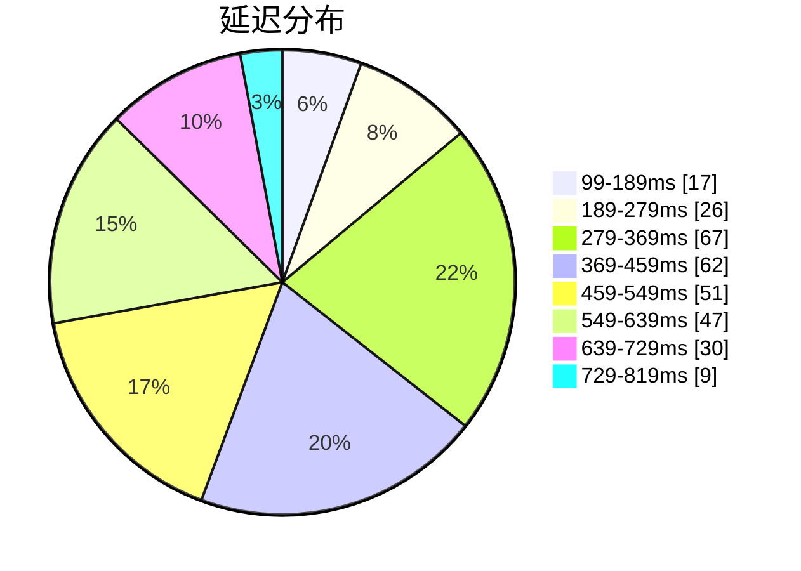
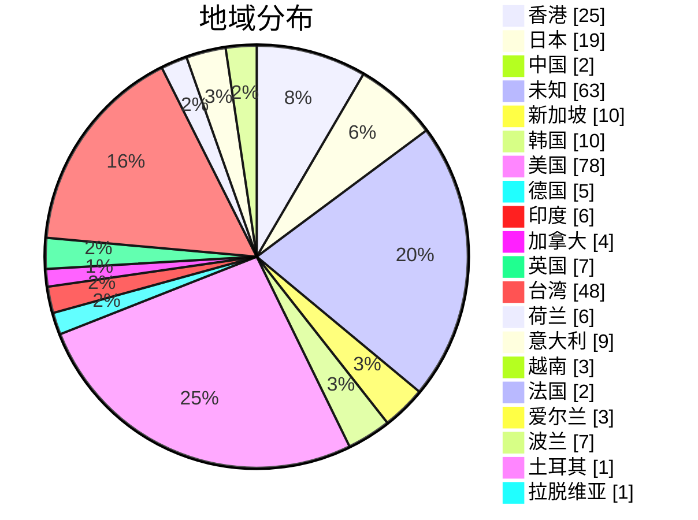
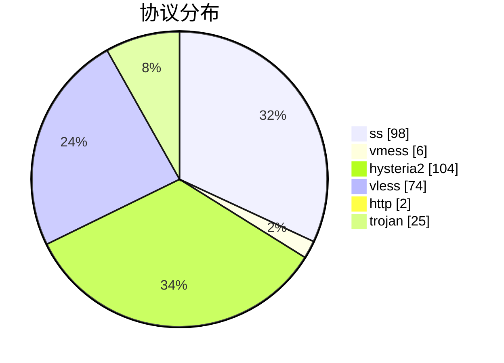

```mermaid
pie showData
title 延迟分布
"99-189ms" : 17
"189-279ms" : 26
"279-369ms" : 67
"369-459ms" : 62
"459-549ms" : 51
"549-639ms" : 47
"639-729ms" : 30
"729-819ms" : 9
```

```mermaid
pie showData
title 地域分布
"香港" : 25
"日本" : 19
"中国" : 2
"未知" : 63
"新加坡" : 10
"韩国" : 10
"美国" : 78
"德国" : 5
"印度" : 6
"加拿大" : 4
"英国" : 7
"台湾" : 48
"荷兰" : 6
"意大利" : 9
"越南" : 3
"法国" : 2
"爱尔兰" : 3
"波兰" : 7
"土耳其" : 1
"拉脱维亚" : 1
```

```mermaid
pie showData
title 协议分布
"ss" : 98
"vmess" : 6
"hysteria2" : 104
"vless" : 74
"http" : 2
"trojan" : 25
```