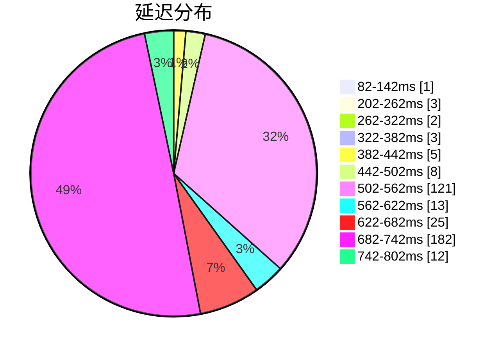
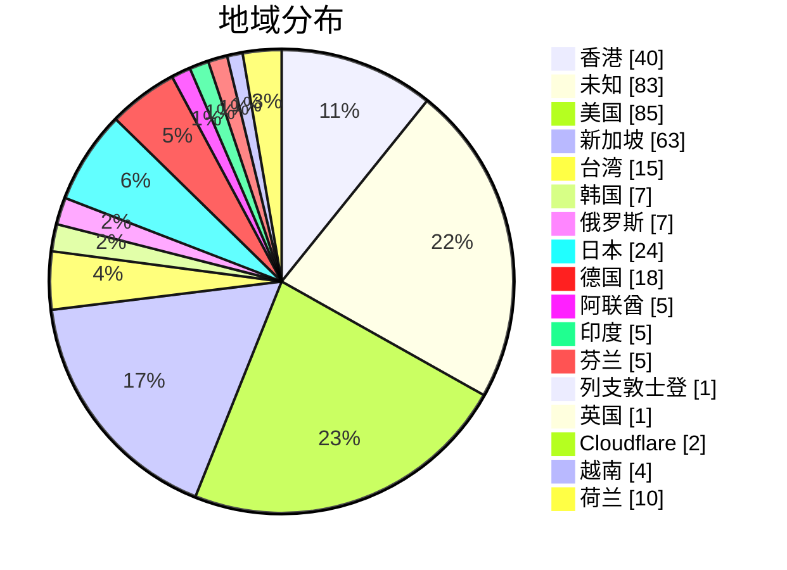
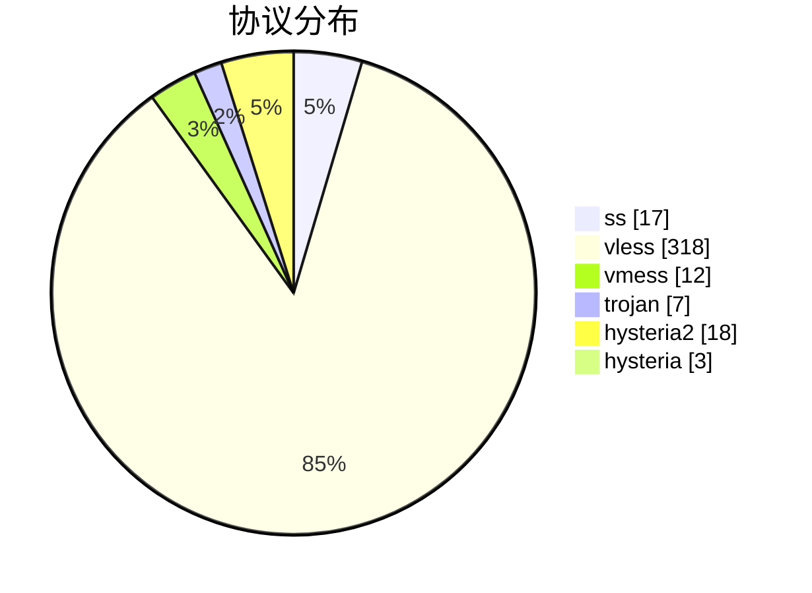

```mermaid
pie showData
title 延迟分布
"82-142ms" : 1
"202-262ms" : 3
"262-322ms" : 2
"322-382ms" : 3
"382-442ms" : 5
"442-502ms" : 8
"502-562ms" : 121
"562-622ms" : 13
"622-682ms" : 25
"682-742ms" : 182
"742-802ms" : 12
```

```mermaid
pie showData
title 地域分布
"香港" : 40
"未知" : 83
"美国" : 85
"新加坡" : 63
"台湾" : 15
"韩国" : 7
"俄罗斯" : 7
"日本" : 24
"德国" : 18
"阿联酋" : 5
"印度" : 5
"芬兰" : 5
"列支敦士登" : 1
"英国" : 1
"Cloudflare" : 2
"越南" : 4
"荷兰" : 10
```

```mermaid
pie showData
title 协议分布
"ss" : 17
"vless" : 318
"vmess" : 12
"trojan" : 7
"hysteria2" : 18
"hysteria" : 3
```