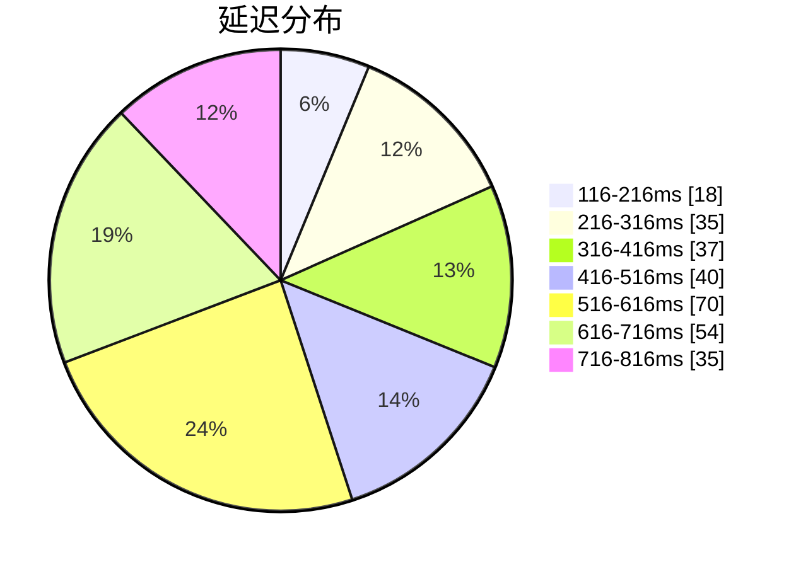
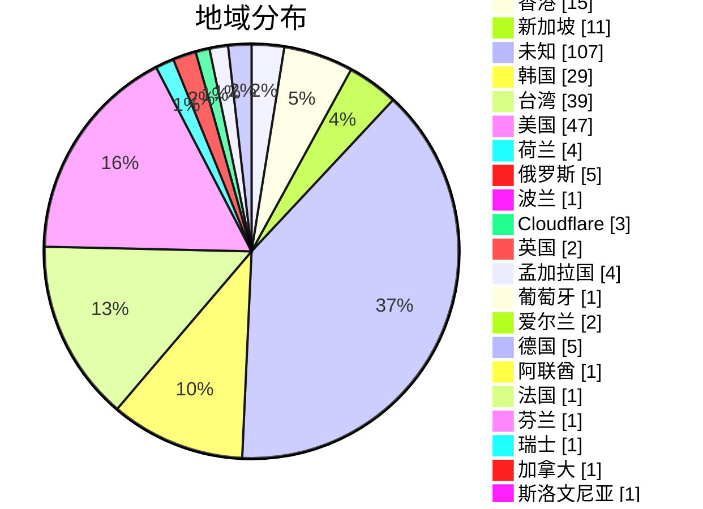
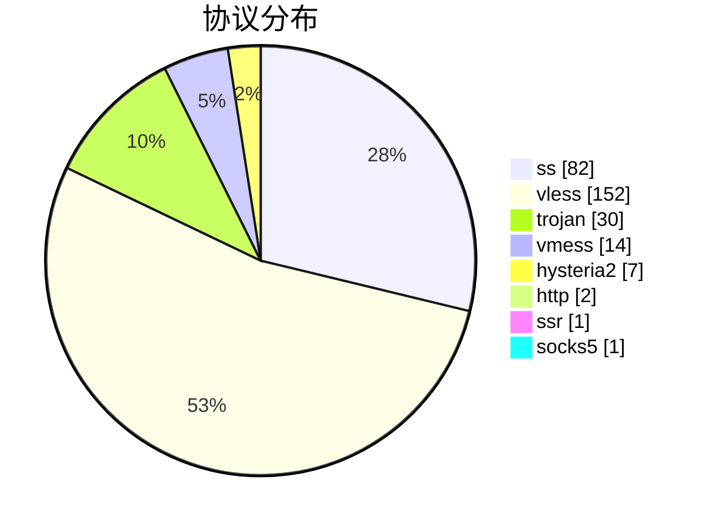

```mermaid
pie showData
title 延迟分布
"116-216ms" : 18
"216-316ms" : 35
"316-416ms" : 37
"416-516ms" : 40
"516-616ms" : 70
"616-716ms" : 54
"716-816ms" : 35
```

```mermaid
pie showData
title 地域分布
"日本" : 7
"香港" : 15
"新加坡" : 11
"未知" : 107
"韩国" : 29
"台湾" : 39
"美国" : 47
"荷兰" : 4
"俄罗斯" : 5
"波兰" : 1
"Cloudflare" : 3
"英国" : 2
"孟加拉国" : 4
"葡萄牙" : 1
"爱尔兰" : 2
"德国" : 5
"阿联酋" : 1
"法国" : 1
"芬兰" : 1
"瑞士" : 1
"加拿大" : 1
"斯洛文尼亚" : 1
"直布罗陀" : 1
```

```mermaid
pie showData
title 协议分布
"ss" : 82
"vless" : 152
"trojan" : 30
"vmess" : 14
"hysteria2" : 7
"http" : 2
"ssr" : 1
"socks5" : 1
```