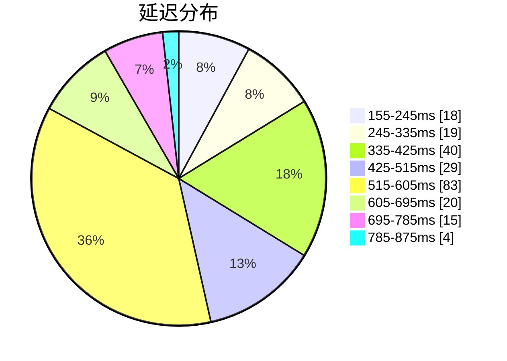
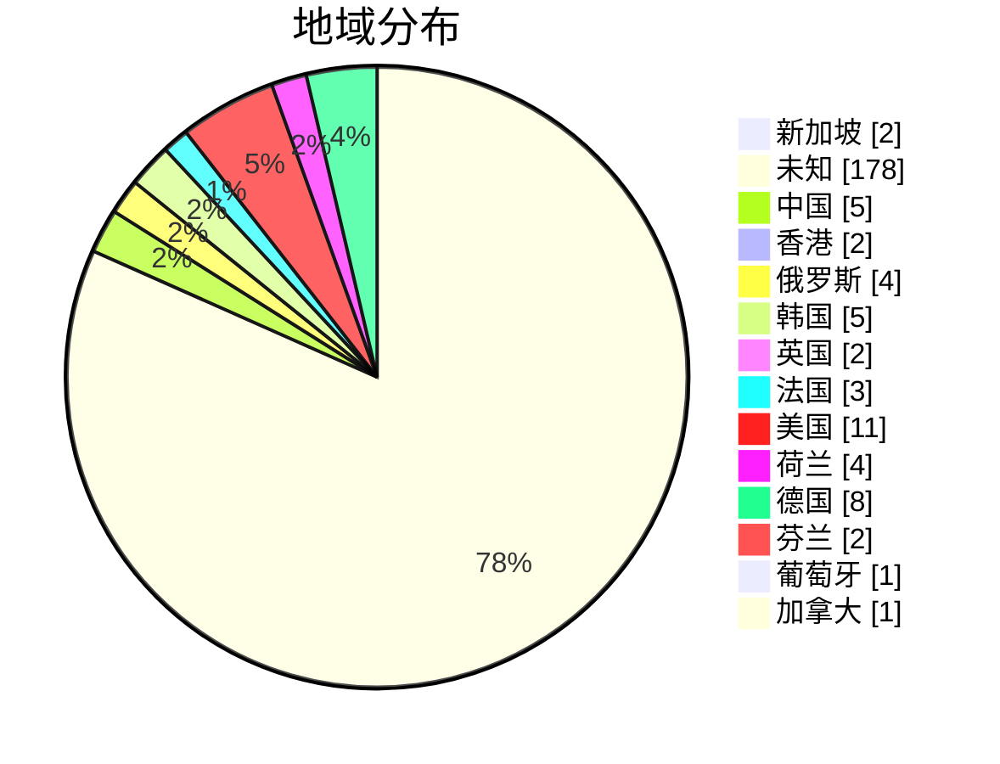
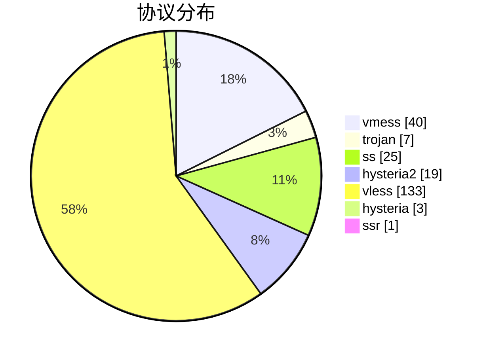

```mermaid
pie showData
title 延迟分布
"155-245ms" : 18
"245-335ms" : 19
"335-425ms" : 40
"425-515ms" : 29
"515-605ms" : 83
"605-695ms" : 20
"695-785ms" : 15
"785-875ms" : 4
```

```mermaid
pie showData
title 地域分布
"新加坡" : 2
"未知" : 178
"中国" : 5
"香港" : 2
"俄罗斯" : 4
"韩国" : 5
"英国" : 2
"法国" : 3
"美国" : 11
"荷兰" : 4
"德国" : 8
"芬兰" : 2
"葡萄牙" : 1
"加拿大" : 1
```

```mermaid
pie showData
title 协议分布
"vmess" : 40
"trojan" : 7
"ss" : 25
"hysteria2" : 19
"vless" : 133
"hysteria" : 3
"ssr" : 1
```