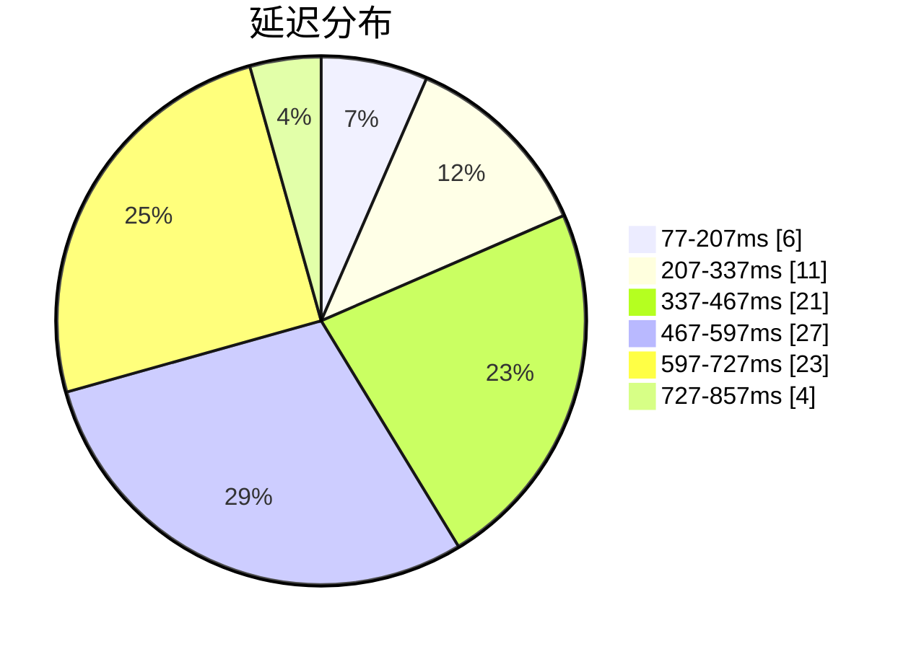
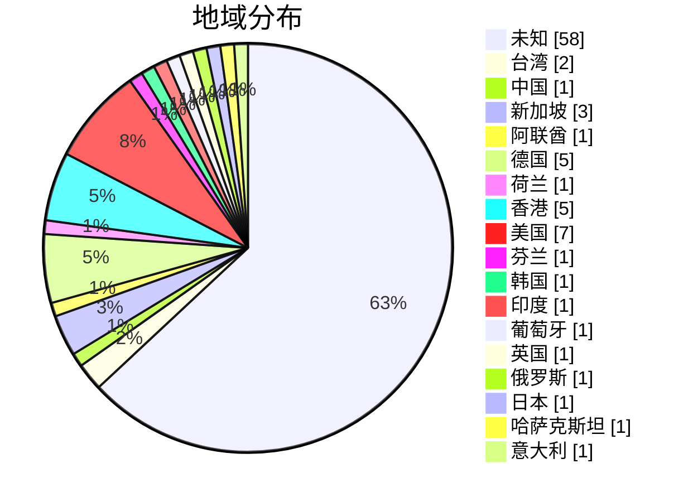
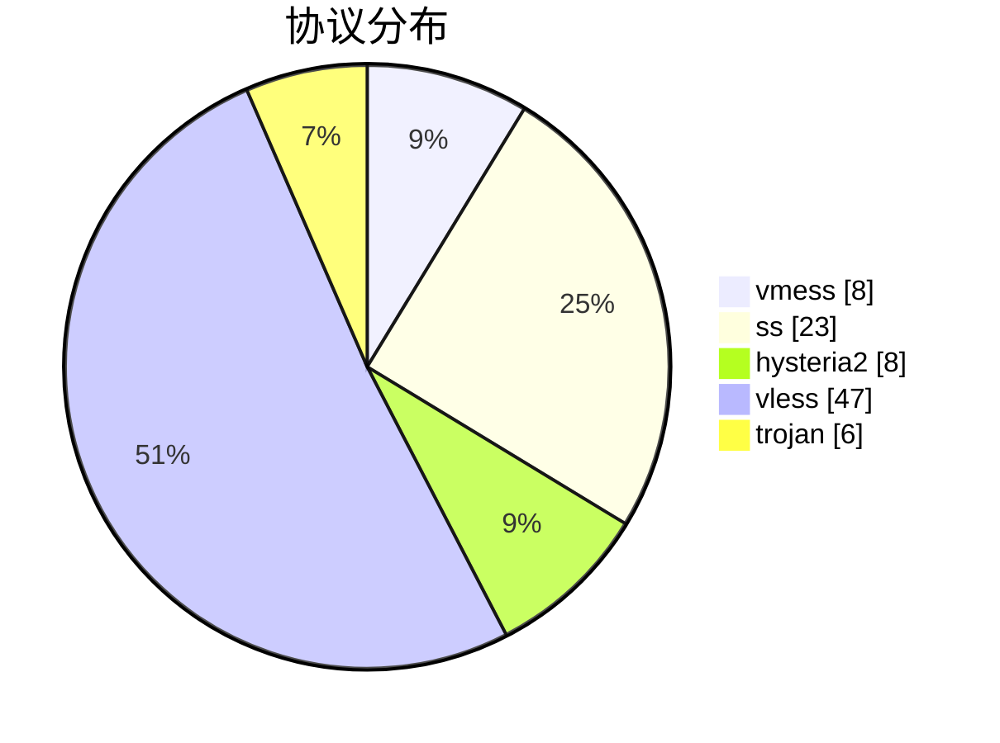

```mermaid
pie showData
title 延迟分布
"77-207ms" : 6
"207-337ms" : 11
"337-467ms" : 21
"467-597ms" : 27
"597-727ms" : 23
"727-857ms" : 4
```

```mermaid
pie showData
title 地域分布
"未知" : 58
"台湾" : 2
"中国" : 1
"新加坡" : 3
"阿联酋" : 1
"德国" : 5
"荷兰" : 1
"香港" : 5
"美国" : 7
"芬兰" : 1
"韩国" : 1
"印度" : 1
"葡萄牙" : 1
"英国" : 1
"俄罗斯" : 1
"日本" : 1
"哈萨克斯坦" : 1
"意大利" : 1
```

```mermaid
pie showData
title 协议分布
"vmess" : 8
"ss" : 23
"hysteria2" : 8
"vless" : 47
"trojan" : 6
```