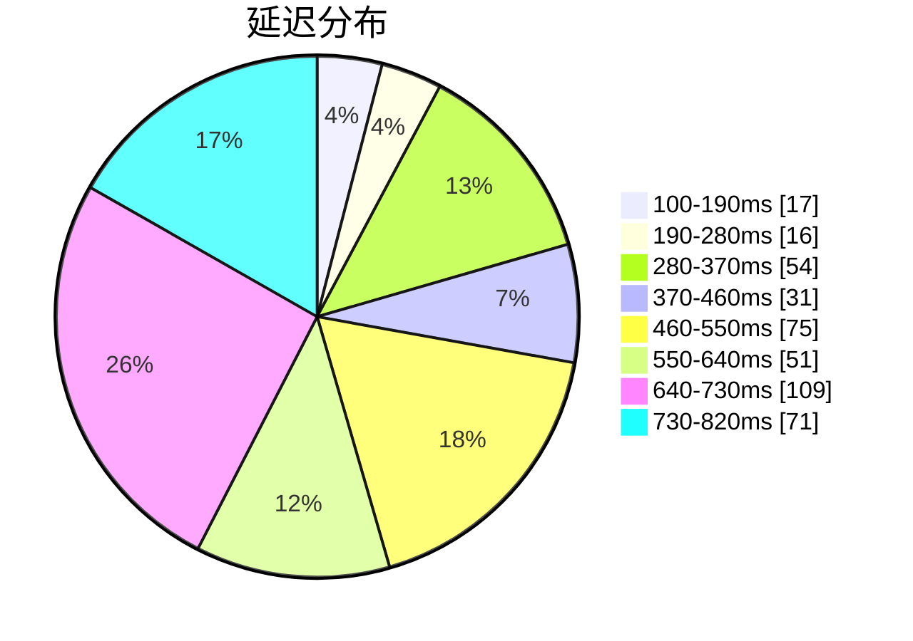
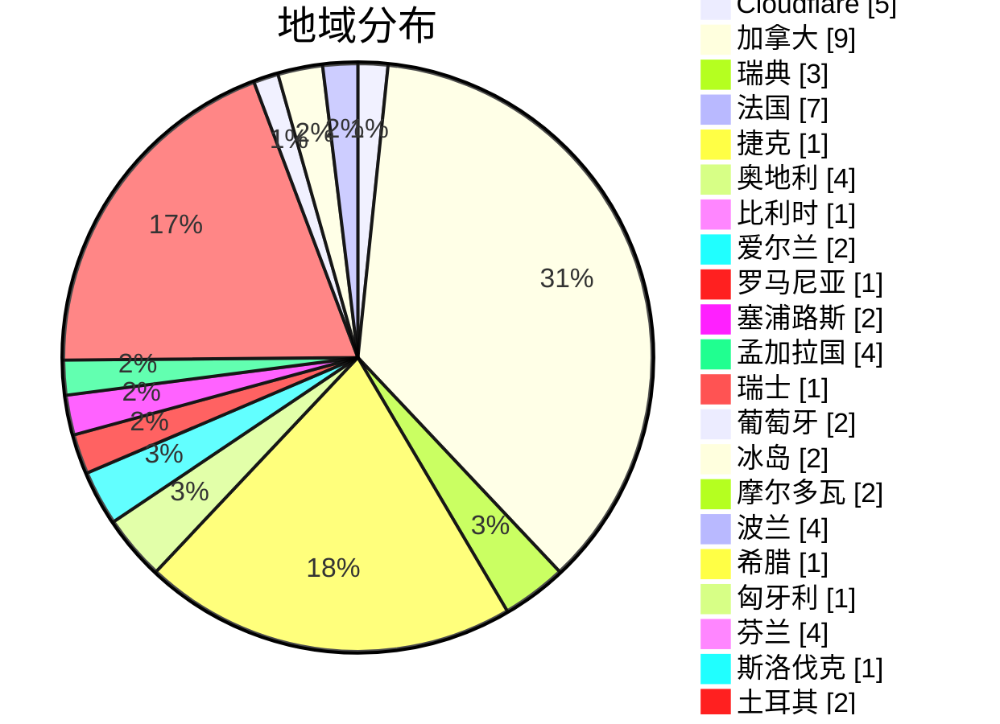
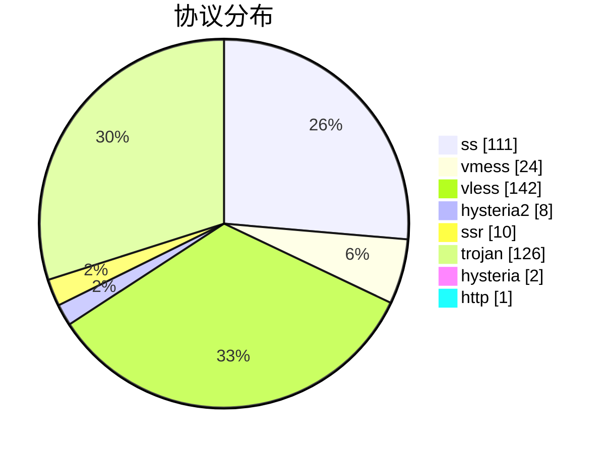

```mermaid
pie showData
title 延迟分布
"100-190ms" : 17
"190-280ms" : 16
"280-370ms" : 54
"370-460ms" : 31
"460-550ms" : 75
"550-640ms" : 51
"640-730ms" : 109
"730-820ms" : 71
```

```mermaid
pie showData
title 地域分布
"香港" : 6
"未知" : 133
"日本" : 13
"中国" : 2
"美国" : 75
"新加坡" : 13
"俄罗斯" : 3
"韩国" : 11
"荷兰" : 8
"英国" : 8
"德国" : 7
"台湾" : 71
"Cloudflare" : 5
"加拿大" : 9
"瑞典" : 3
"法国" : 7
"捷克" : 1
"奥地利" : 4
"比利时" : 1
"爱尔兰" : 2
"罗马尼亚" : 1
"塞浦路斯" : 2
"孟加拉国" : 4
"瑞士" : 1
"葡萄牙" : 2
"冰岛" : 2
"摩尔多瓦" : 2
"波兰" : 4
"希腊" : 1
"匈牙利" : 1
"芬兰" : 4
"斯洛伐克" : 1
"土耳其" : 2
"意大利" : 2
"丹麦" : 1
"爱沙尼亚" : 2
"西班牙" : 2
"斯洛文尼亚" : 1
"保加利亚" : 1
"乌克兰" : 1
"拉脱维亚" : 1
"立陶宛" : 1
"哈萨克斯坦" : 1
"挪威" : 1
"澳大利亚" : 1
```

```mermaid
pie showData
title 协议分布
"ss" : 111
"vmess" : 24
"vless" : 142
"hysteria2" : 8
"ssr" : 10
"trojan" : 126
"hysteria" : 2
"http" : 1
```